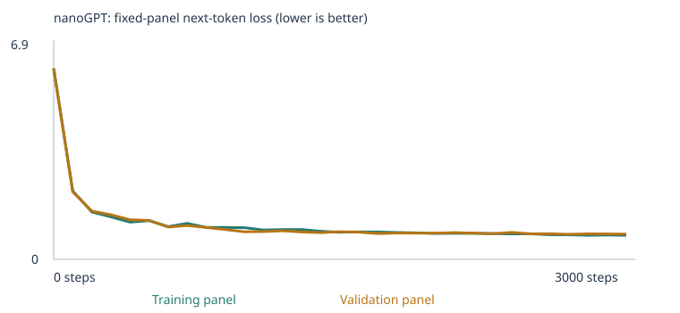
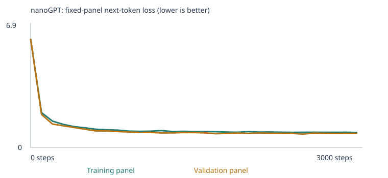
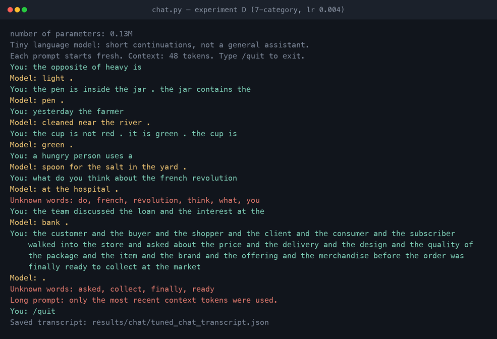

# Building a Custom LLM

Karpathy's nanoGPT trained from scratch at classroom scale, evaluated with the
**unchanged 48-case language eval suite before and after training** in every experiment,
plus a working terminal chat interface.

## One-page summary

**What this is.** nanoGPT (2 blocks, 4 heads, 64-number embeddings, 48-token context) trained from
scratch on a laptop CPU. The two required experiments are **A**, the classroom corpus only, and **B**,
the classroom corpus plus [`corpus/`](corpus): 5,005 new passages I wrote to teach four extension
categories (grammar, opposites, negation, spatial relations). Both use 3,000 steps at learning rate
0.001, so the corpus is the only difference. C, D and E are optional extras. **D is the delivered
model**: seven taught categories, learning rate 0.004.

**The required four-row comparison.** All 48 unchanged cases, before and after training:

| Experiment | Stage | Correct, all cases | Scorable (coverage) | Accuracy among scorable | Full result set |
|---|---|---:|---:|---:|---|
| A starter | untrained | 9/48 (18.8%) | 24/48 (50.0%) | 37.5% | [csv](experiments/starter/llm_run/language_evals/untrained/eval_results.csv) · [json](experiments/starter/llm_run/language_evals/untrained/eval_results.json) · [summary](experiments/starter/llm_run/language_evals/untrained/eval_summary.json) |
| A starter | trained | **20/48 (41.7%)** | 24/48 (50.0%) | 83.3% | [csv](experiments/starter/llm_run/language_evals/final/eval_results.csv) · [json](experiments/starter/llm_run/language_evals/final/eval_results.json) · [summary](experiments/starter/llm_run/language_evals/final/eval_summary.json) |
| B extension | untrained | 7/48 (14.6%) | 35/48 (72.9%) | 20.0% | [csv](experiments/expanded/llm_run/language_evals/untrained/eval_results.csv) · [json](experiments/expanded/llm_run/language_evals/untrained/eval_results.json) · [summary](experiments/expanded/llm_run/language_evals/untrained/eval_summary.json) |
| B extension | trained | **34/48 (70.8%)** | 35/48 (72.9%) | 97.1% | [csv](experiments/expanded/llm_run/language_evals/final/eval_results.csv) · [json](experiments/expanded/llm_run/language_evals/final/eval_results.json) · [summary](experiments/expanded/llm_run/language_evals/final/eval_summary.json) |

The delivered model D scores **40/48** (83.3%), averages 37.4/48 across five seeds, and scores
**12/16** on a held-out suite I wrote after freezing the corpus. The 48 public cases guided my corpus
design, so they are a development benchmark, not evidence of generalisation.

**Where each graded item is**

| Rubric item | Evidence |
|---|---|
| ***Deliverable quality (4)*** | |
| Both executed notebooks, outputs visible | [A](experiments/starter/custom_llm_starter.executed.ipynb) · [B](experiments/expanded/custom_llm_expanded.executed.ipynb) (C, D and E are executed too) |
| Readable source code | The notebook, [`run_evals.py`](run_evals.py) and [`chat.py`](chat.py) are the starter's own. The executed notebooks differ only in [3 changed cells and 1 added results-table cell](#the-three-cells-i-changed-and-why), all documented. My code: [`tools/make_extension_corpus.py`](tools/make_extension_corpus.py) (corpus generator) and [`tools/run_experiment.py`](tools/run_experiment.py) (runner) |
| Corpus sources, permissions, choices | [§2](#2-the-corpus-sources-permissions-and-what-i-added): all text synthetic and self-authored. PDF extraction [checked](results/pdf_extraction_check.json). [§3](#3-my-three-choices-and-my-prediction): the three settings and my prediction before training |
| Why these categories, and how the material fills their gaps | [§2 table](#what-i-added-and-the-categories-it-targets) · [`corpus/README.md`](corpus/README.md) |
| Learning process, from real evidence | [§5](#5-loss-samples-and-temperature): loss curve with its full 31-row table, untrained/halfway/final samples, temperature. [§6](#6-from-a-word-to-a-prediction-tokens-ids-vectors-gradients): one word traced to its ID and 64-number vector, one real gradient and weight update, attention, probabilities |
| The notebook's eight "explain in your own words" questions | [§13](#13-explain-in-your-own-words-the-notebooks-eight-questions): a short answer to each, tied to the evidence |
| ***Testing & evaluation (3)*** | |
| Four complete result sets | The table above. All ten sets (five experiments × two stages) are in [§7](#7-the-48-fixed-language-evals-all-ten-result-sets) |
| Separation checks | `eval_separation.json` for [A](experiments/starter/llm_run/eval_separation.json) · [B](experiments/expanded/llm_run/eval_separation.json), plus five leakage audits with two consecutive clean passes: [§10](#10-keeping-the-exam-out-of-the-textbook) |
| All-case success, scorable accuracy, coverage, group/category results, free continuations | [§7](#7-the-48-fixed-language-evals-all-ten-result-sets), including [actual free continuations](#actual-free-continuations-a-vs-b) |
| Failures explained: missing vocabulary vs. a learned pattern | [Coverage vs. skill](#vocabulary-coverage-is-the-gate-and-it-is-not-the-same-as-skill) · [§11](#11-what-failed-and-why) |
| Beyond the minimum | Five-seed variance: [§8](#8-choosing-the-steps-and-the-learning-rate-and-five-seeds). Held-out suite: [§9](#9-a-held-out-suite-written-after-the-corpus-was-frozen) |
| ***Working result (3)*** | |
| Trained model and run identity | [`experiments/tuned/llm_run/model.pt`](experiments/tuned/llm_run/model.pt), run `20260920T232038_718861Z`, sha256 `26a8cc1215c4a293…` |
| Evals rerun from the saved model | `python run_evals.py --model experiments/tuned/llm_run/model.pt --output results/my-evals`. [`results/rerun/`](results/rerun) reproduces all ten result sets exactly |
| Chat interface, launch, 3+ real interactions | [`chat.py`](chat.py): `python chat.py --model experiments/tuned/llm_run/model.pt`. [Screenshot](results/chat/tuned_terminal_session.png) · [transcript](results/chat/tuned_chat_transcript.json): 8 real prompts, including two that show its limits. See [§12](#12-chat-interface-and-evidence) |
| One limitation, one proposed next experiment | [§11](#11-what-failed-and-why) · [§14](#14-what-i-learned-one-limitation-and-my-next-experiment) |

**Eval separation.** No eval prompt, reference answer, answer key or eval output is in any training
input. The box below explains the five audits that check this.

---

## Overview of all five experiments

**Five experiments.** A and B are the two the assignment requires and differ *only* in the
corpus. C, D and E are optional extras, each changing exactly one more thing.

| | A — starter | B — extension, 4 cat. | C — extension, 7 cat. | D — C at lr 0.004 | E — D with unpaired relations |
|---|---|---|---|---|---|
| Required | ✅ | ✅ | optional | optional | optional |
| Corpus | classroom only | + [`corpus/`](corpus) | + [`corpus_seven/`](corpus_seven) | same as C | + [`corpus_unpaired/`](corpus_unpaired) |
| Steps / LR | 3,000 / 0.001 | 3,000 / 0.001 | 3,000 / 0.001 | 3,000 / **0.004** | 3,000 / 0.004 |
| Executed notebook | [A](experiments/starter/custom_llm_starter.executed.ipynb) | [B](experiments/expanded/custom_llm_expanded.executed.ipynb) | [C](experiments/seven/custom_llm_seven.executed.ipynb) | [D](experiments/tuned/custom_llm_tuned.executed.ipynb) | [E](experiments/unpaired/custom_llm_unpaired.executed.ipynb) |
| Results ZIP | [zip](experiments/starter/starter_results.zip) | [zip](experiments/expanded/expanded_results.zip) | [zip](experiments/seven/seven_results.zip) | [zip](experiments/tuned/tuned_results.zip) | [zip](experiments/unpaired/unpaired_results.zip) |
| Run folder | [`llm_run/`](experiments/starter/llm_run) `20260920T040529_296252Z` | [`llm_run/`](experiments/expanded/llm_run) `20260920T181941_182326Z` | [`llm_run/`](experiments/seven/llm_run) `20260920T185551_271822Z` | [`llm_run/`](experiments/tuned/llm_run) `20260920T232038_718861Z` | [`llm_run/`](experiments/unpaired/llm_run) `20260920T232109_555281Z` |
| Weights sha256 | `bf49f05b14d54178…` | `f4a561d786526619…` | `5420c14291c24398…` | `26a8cc1215c4a293…` | `8702c0e49fad37c9…` |
| **All-case success** | **20 / 48** | **34 / 48** | **36 / 48** | **40 / 48** | **37 / 48** |
| Scorable cases | 24 / 48 | 35 / 48 | 44 / 48 | 44 / 48 | 44 / 48 |
| **Five-seed mean** | **22.2** ± 1.64 | **32.8** ± 1.30 | **36.0** ± 1.41 | **37.4** ± 1.67 | **37.2** ± 1.92 |

**The delivered model is D**: `corpus_seven`, 3,000 steps, learning rate 0.004, batch size 32,
seed 42 — [`experiments/tuned/llm_run/model.pt`](experiments/tuned/llm_run/model.pt). It is the best
configuration found on the public suite (five-seed mean 37.4) *and* the best on a held-out suite that
never guided any choice (12/16). Every setting the assignment allows was explored across successive
rounds — learning rate 0.0005–0.02, steps 1,500–12,000, batch size 16/32/64, four versus seven taught
categories, paired versus unpaired relational material — and a five-seed comparison of the leading
candidates on the final corpus found nothing better
([Section 8](#8-choosing-the-steps-and-the-learning-rate-and-five-seeds)).

> ### Eval separation — read this first
>
> No eval prompt, reference answer, answer key or eval output is in any training input, and
> **five independent audits** enforce that. Three of them found real problems in my own
> corpus, in three successive passes. All are fixed and the corrected numbers are above.
>
> | Pass | What it checks | What it found in **my** material |
> |---|---|---|
> | `reject_eval_leakage` (upstream) | a whole prompt, verbatim | — |
> | `leakage_ngram_audit.py` | longest prompt **suffix** followed by the answer | an 8- and an 11-token run of two spatial prompts, always followed by the answer |
> | `leakage_paraphrase_audit.py` | one passage holding most of a case's **content words** + its answer | a reworded test item in the everyday-knowledge material |
> | `leakage_full_audit.py` | **answer keys**, **eval outputs**, chat text, **ordered-subsequence** copies | a passage reciting 3 of 4 answer choices; a prompt rebuilt *in order with a gap* |
> | `audit_structural.py` | eval **explanations**, longest shared run at **any** position, folder topology, **pipeline integrity**, reverse containment | a 9-token run shared with two prompts — longer than the provided corpus manages |
>
> Current status: **zero findings against the assignment's suite in all five experiments**,
> with every corpus folder proven to rebuild byte-identically from a generator that reads no
> results file. [Section 10](#10-keeping-the-exam-out-of-the-textbook).
>
> Because the 48 cases are public and guided my corpus design they are a **development
> benchmark**. [Section 9](#9-a-held-out-suite-written-after-the-corpus-was-frozen) adds 16
> cases I wrote afterwards and ran once — the only evidence here about unseen generalisation.

---

## Contents

1. [How to run everything](#1-how-to-run-everything)
2. [The corpus: sources, permissions, and what I added](#2-the-corpus-sources-permissions-and-what-i-added)
3. [My three choices and my prediction](#3-my-three-choices-and-my-prediction)
4. [The runs: what actually happened](#4-the-runs-what-actually-happened)
5. [Loss, samples, and temperature](#5-loss-samples-and-temperature)
6. [From a word to a prediction: tokens, IDs, vectors, gradients](#6-from-a-word-to-a-prediction-tokens-ids-vectors-gradients)
7. [The 48 fixed language evals: all ten result sets](#7-the-48-fixed-language-evals-all-ten-result-sets)
8. [Choosing the steps and the learning rate, and five seeds](#8-choosing-the-steps-and-the-learning-rate-and-five-seeds)
9. [A held-out suite, written after the corpus was frozen](#9-a-held-out-suite-written-after-the-corpus-was-frozen)
10. [Keeping the exam out of the textbook](#10-keeping-the-exam-out-of-the-textbook)
11. [What failed, and why](#11-what-failed-and-why)
12. [Chat interface and evidence](#12-chat-interface-and-evidence)
13. [Explain in your own words: the notebook's eight questions](#13-explain-in-your-own-words-the-notebooks-eight-questions)
14. [What I learned, one limitation, and my next experiment](#14-what-i-learned-one-limitation-and-my-next-experiment)
15. [Repository map](#15-repository-map)

---

## 1. How to run everything

**Requirements:** Python 3.12, no GPU, no API key, no pretrained weights. Every command below
finishes in under a minute on an M2 MacBook Air. **The saved models come with the repository:** all five
trained models (`model.pt`, about 0.5 MB each) and their untrained starting points
(`model_untrained.pt`) are committed under `experiments/*/llm_run/`, so rerunning the evals or the
chat needs no retraining and no download beyond the clone.

```bash
git clone https://github.com/easonhanyc/mba290t-custom-llm && cd mba290t-custom-llm
python3 -m venv .venv && source .venv/bin/activate
pip install -r requirements.txt                          # torch, pypdf, jupyter
pip install nbclient nbformat pexpect reportlab pillow   # only needed for tools/
```

| I want to… | Command |
|---|---|
| Reproduce experiment A | `python tools/run_experiment.py --experiment starter` |
| Reproduce experiment B | `python tools/run_experiment.py --experiment expanded --corpus-dir corpus` |
| Reproduce experiment C | `python tools/run_experiment.py --experiment seven --corpus-dir corpus_seven` |
| Reproduce experiment D | `python tools/run_experiment.py --experiment tuned --corpus-dir corpus_seven --lr 0.004` |
| Reproduce experiment E | `python tools/run_experiment.py --experiment unpaired --corpus-dir corpus_unpaired --lr 0.004` |
| Rerun the 48 evals on a saved model | `python run_evals.py --model experiments/seven/llm_run/model.pt --output results/my-evals` |
| … on the saved untrained model | `python run_evals.py --model experiments/seven/llm_run/model_untrained.pt --stage untrained --output results/my-untrained-evals` |
| Run my held-out suite | `python run_evals.py --model experiments/tuned/llm_run/model.pt --suite evals/heldout_language_evals.json --output results/my-heldout` |
| Chat with a trained model | `python chat.py --model experiments/tuned/llm_run/model.pt --transcript results/my-chat.json` |
| **Audit 1 — separation + vocabulary (19 checks)** | `python tools/verify_separation.py` |
| **Audit 2 — answer-recall / n-gram** | `python tools/leakage_ngram_audit.py` |
| **Audit 3 — paraphrase / near-duplicate** | `python tools/leakage_paraphrase_audit.py` |
| **Audit 4 — answer keys, eval outputs, subsequences, provenance** | `python tools/leakage_full_audit.py` |
| **Audit 5 — structural, explanations, pipeline integrity** | `python tools/audit_structural.py` |
| Re-check PDF extraction | `python tools/check_pdf_extraction.py` |
| Rebuild the teaching corpora | `python tools/make_extension_corpus.py [--categories all\|all-unpaired --out …]` |
| Rebuild comparison tables and diagnostics | `python tools/analyze_results.py` |
| Regenerate every numeric table in this README | `python tools/build_readme_tables.py` |
| Rerun the steps / learning-rate sweep | `python tools/hyperparameter_sweep.py` |
| Run the starter's own unit tests | `python -m unittest test_language_evals test_corpus` |

`run_experiment.py` builds a **throwaway workspace per experiment** containing only the pinned
support files and that experiment's corpus, so experiment A provably cannot see `corpus/` and no
run can see another's `llm_runs/`.

**To open the notebook yourself:** `jupyter notebook custom_llm.ipynb` (or upload to Colab) and
Run All. The unexecuted starter notebook is at the repository root; the five executed copies with
all outputs are under `experiments/`. Section 1 holds the three settings. In Colab, run sections
1–2 once to create `/content/corpus`, then upload the files from [`corpus/`](corpus) before Run All.

### The three cells I changed, and why

The notebook is the upstream one. `tools/run_experiment.py` patches exactly three cells, and none
is the model, the eval suite, the scoring code or the corpus pipeline:

| Cell | Change | Why |
|---|---|---|
| Section 1 | the three assignment settings | that is what section 1 is for |
| Section 7 | `milestones` also includes every 100th step | the notebook otherwise measures the fixed loss panels only at step 1,500 and 3,000, giving a three-point curve. This gives 31 rows. |
| Section 10 | the chat cell loops over 8 prompts instead of 1 | one Run All then records more than the three required interactions |

One cell is **added** after section 8b to print the whole 48-case table inside the notebook.

The section 7 change is observation only, and I verified it rather than asserting it: experiment A
run twice with identical settings, once with each version of the line, produced **bit-identical
weights** (`bf49f05b14d5417840f3b551aa61e28c0e521e6d5557f146f3961ffc1afbe84e` both times) and
identical eval results — [`results/measurement_neutrality_check.json`](results/measurement_neutrality_check.json).
`record()` reads the model under `torch.no_grad()` and samples from its own seeded
`torch.Generator`, so it consumes no global RNG state, and dropout is 0.0.

---

## 2. The corpus: sources, permissions, and what I added

### Sources and permission

**Every word of training text in every experiment is synthetic and free of third-party rights.**
Experiment A uses only the notebook's generated classroom sentences. The extension files were
written by me and are produced deterministically by
[`tools/make_extension_corpus.py`](tools/make_extension_corpus.py) (seed 20260919). There is no
copyrighted material, no confidential document and no personal record anywhere, which is why the
corpora, every `corpus.txt` and all five results ZIPs can be published in full.

I chose self-authored text deliberately: it is the only way to *guarantee* the eval suite is absent
from training rather than hope a scraped PDF does not paraphrase it. It also makes the provenance
proof in [Section 10](#10-keeping-the-exam-out-of-the-textbook) possible.

### What I added, and the categories it targets

The suite's 24 extension cases cover eight skills. Experiment B teaches **four** and leaves **four
untaught as a control group**, so the comparison can separate "the model learned what I taught"
from "everything got better". C, D and E teach three more, leaving `reference` as the sole control.

| Category | Why | B | C / D / E |
|---|---|:---:|:---:|
| **grammar** | Pure form, no world knowledge. The starter corpus contains no `is`/`are`/`am` at all. | ✅ | ✅ |
| **opposites** | Tests whether a *frame* learned from one set of word pairs transfers to pairs never shown in it. | ✅ | ✅ |
| **negation** | Requires carrying information across a sentence boundary. | ✅ | ✅ |
| **spatial_relations** | Inverse relations (above↔below) are a clean relational mapping. | ✅ | ✅ |
| **everyday_knowledge** | A lookup rather than an operation; a useful contrast. | control | ✅ |
| **sequence** | Ordering *and* copying — predicted to be hard. | control | ✅ |
| **categories_and_analogies** | Category membership, another lookup. | control | ✅ |
| **reference** | **Never taught.** Its cases hinge on eleven specific first names; the generator bans every proper name in the suite. See [Section 11](#failure-3--the-four-cases-i-chose-not-to-make-scorable). | control | control |

File-by-file: [`corpus/README.md`](corpus/README.md) · [`corpus_seven/README.md`](corpus_seven/README.md).
Manifests: [A](experiments/starter/llm_run/corpus_manifest.json) ·
[B](experiments/expanded/llm_run/corpus_manifest.json) · [C](experiments/seven/llm_run/corpus_manifest.json) ·
[D](experiments/tuned/llm_run/corpus_manifest.json) · [E](experiments/unpaired/llm_run/corpus_manifest.json).

### Four things I found only by reading the training text

**1. The passage splitter breaks multi-clause teaching examples.** `chunk_text()` splits on
`(?<=[.!?])\s+`, so a three-clause example written normally becomes *three separate passages*:

```
'the gate is not open . it is closed . the gate is closed .'
  -> ['the gate is not open .', 'it is closed .', 'the gate is closed .']
```

A model trained only on one-clause passages therefore never sees a `.` with more text after it —
but the negation and spatial eval prompts are full of exactly that. Writing the internal period
tight against the next word keeps the example together and produces the identical token sequence.

**2. The 509-type vocabulary cap evicts the extension's words, not the classroom's.** Retention is
by frequency and the classroom corpus is far more frequent. This bit three times, and each time a
word the extension genuinely teaches was evicted while incidental words survived:

| Build | Evicted | Consequence | Remedy |
|---|---|---|---|
| first | `walk`, `walks`, `walking` | three of four answer choices for a grammar case | 23 verbs → 10, taught more thoroughly |
| 7-category | `carrot`, `goat`, `tool`, `sand`, `shoe` … | the new categories' own words | template each fact across many passages instead of stating it three times |
| after the leak fix | `late`, then `soft` | opposite-pair members, i.e. eval distractors | purge 20 incidental words of mine (`weather`, `walker`, `jars`, `poured`, five unused adjectives …) |

The remedy is always the same and is worth stating explicitly: **remove my own incidental
vocabulary, never add the missing word.** Adding it would be inserting an eval word to make a case
scorable, which the assignment warns against. All five runs now evict **zero** types.

**3. Balance matters more than volume.** Four separate failures were the same bug — the model
leaning on a frequency prior instead of doing the work:

| Symptom | Cause | Fix | Result |
|---|---|---|---|
| any colour correction answered `yellow` | colours paired randomly, so one was commonest in the corrected slot | every object × every ordered colour pair | copy probe **3/16 → 16/16 objects** |
| `a salmon is a` answered `bird`; `an apple is a` answered `vehicle` | `birds` had 6 members, `vehicle` 60 lines, other categories 12 | every group exactly 4 members, equal line budgets | both stopped defaulting to the frequent label |
| `left`/`right` a dead tie | object pairs sampled, leaving the direction words at different frequencies | every relation emitted symmetrically | spatial five-seed mean **1.4 → 1.8/3** |
| `left`/`right` *still* a near-tie | the two words are almost perfectly co-distributed | experiment E: add single-relation passages | **prediction falsified**; the final D no longer has this failure, see [Section 11](#failure-1--spatial-relations-and-a-prediction-i-got-wrong) |

**4. The PDF extraction check.** `08_printed_notes.pdf` exercises the PDF import path in every
extension corpus. Its plain-text original is kept in [`docs/`](docs) — **outside** every corpus
folder — so the PDF is the only training copy of that text while extraction can still be diffed
against a known source ([`results/pdf_extraction_check.json`](results/pdf_extraction_check.json)):

| Property | Value |
|---|---|
| Pages | 2 |
| Pages with no extractable text | none |
| Token sequence identical to the source | **true**, for every corpus's PDF |
| Types only in PDF / only in source | none / none |
| Eval prompts found in the extracted text | none |

The notebook reported **zero warnings** for every imported file in every run. Nothing needed OCR;
the PDFs were generated from text, not scanned. Had one been a scan, `extract_text()` would have
returned empty pages and the notebook would have printed a per-page warning naming the page.

---

## 3. My three choices and my prediction

| Choice | Value | Reason |
|---|---|---|
| **Corpus** | classroom; + 4-category; + 7-category; + 7-category with unpaired relations | The assignment requires the first two. Keeping `CORPUS="classroom"` in the extensions means the extension *adds to* the starter data, so the starter eval groups stay measurable and any damage is visible. |
| **Training steps** | 3,000 | The suggested budget. [Section 8](#8-choosing-the-steps-and-the-learning-rate-and-five-seeds) measures 1,500 to 9,000 steps (12,000 in an earlier round) and finds nothing better than 3,000; beyond it, validation loss and the eval score both get worse. |
| **Learning rate** | 0.001 for A–C, **0.004** for D and E | 0.001 is the suggested default and is what the controlled A/B/C comparison uses. Section 8 measures seven learning rates; D is that one-variable change. |

A, B and C hold steps and learning rate **identical on purpose** — with one variable changed the
comparison is interpretable, with three it is not. D changes one more thing, E one more again.

**Why an extreme learning rate is a problem.** Too large and each update overshoots — the loss
oscillates or becomes `NaN`, and the notebook raises `FloatingPointError` rather than saving a
broken model. Too small and the model crawls: at 1e-6 instead of 1e-3, 3,000 steps would cover
roughly the distance the current run covers in three. Section 8 shows both ends empirically: 0.0005
loses 3 cases against the default, and past 0.006 the score falls away again.

### My prediction, written before training

1. Loss will fall steeply for a few hundred steps and then flatten.
2. A will do well on the 16 `starter_patterns` cases and clearly worse on the 8 `starter_transfer`.
3. All 24 extension cases will be unscorable for A.
4. The extension will fix coverage for the categories I teach, with **partial** credit: agreement
   and opposites should work; negation across sentence boundaries probably will not.
5. Adding thousands of unrelated passages will **dilute** the classroom patterns.

### What actually happened

1. ✅ Correct. A's validation loss reaches 0.71 by step 900 and moves 0.005 after that.
2. ⚠️ Half right. `starter_patterns` → **16/16**; `starter_transfer` only **4/8**.
3. ✅ Correct. 24/24 unscorable for A; held-out unknown-token rate 0.00%.
4. ⚠️ Mostly right, wrong about which parts. Agreement **3/3** and opposites **3/3** as expected.
   **Negation reached 2/3**, better than predicted, but only after rebuilding the material twice.
   Spatial relations, which I expected to be the *easy* one, was the hardest to get honest: my first
   version scored 3/3 by memorisation, and the corrected material reaches five-seed means of 1.4–2.0/3
   (2.0/3 for the delivered model).
5. ❌ **Wrong, and the most surprising result.** `starter_patterns` stayed at 16/16 and
   `starter_transfer` went **4/8 → 7–8/8** in every extension, on every seed. Adding grammar and
   spatial text made the model *better* at rephrasings of the original business sentences. My best
   explanation: A's eight rigid frames let the model solve `starter_patterns` by memorising frames,
   and the extension's more varied sentence shapes force the word embeddings themselves to carry
   the domain association — which is what a rephrasing needs. A hypothesis consistent with the
   evidence, not something these 48 cases establish.

---

## 4. The runs: what actually happened

All five runs completed. **None was interrupted and none errored** (`"interrupted": false` in every `training_summary.json`:
[A](experiments/starter/llm_run/training_summary.json) · [B](experiments/expanded/llm_run/training_summary.json) · [C](experiments/seven/llm_run/training_summary.json) · [D](experiments/tuned/llm_run/training_summary.json) · [E](experiments/unpaired/llm_run/training_summary.json)).

| | A — starter | B — ext. 4 | C — ext. 7 | D — ext. 7, lr .004 | E — unpaired |
|---|---:|---:|---:|---:|---:|
| Completed training steps | 3,000 | 3,000 | 3,000 | 3,000 | 3,000 |
| Training loop elapsed | 10.5 s | 22.7 s | 26.0 s | 21.7 s | 22.2 s |
| Whole notebook, Run All | 15.0 s | 30.5 s | 33.6 s | 29.3 s | 30.0 s |
| Model parameters | 111,872 | 130,432 | 135,808 | 135,808 | 135,808 |
| Vocabulary (incl. specials) | 136 | 426 | 510 | 510 | 510 |
| Unique passages after dedup | 4,592 | 9,597 | 11,032 | 11,032 | 11,535 |
| … new from the corpus folder | 0 | 5,005 | 6,440 | 6,440 | 6,943 |
| Duplicate passages removed | 1,608 | 1,891 | 2,606 | 2,606 | 2,606 |
| Reserved before the split | 160 | 160 | 160 | 160 | 160 |
| Train / validation passages | 4,132 / 460 | 8,637 / 960 | 9,928 / 1,104 | 9,928 / 1,104 | 10,381 / 1,154 |
| Training unknown-token rate | 0.0000% | 0.0000% | 0.0000% | 0.0000% | 0.0000% |
| **Held-out unknown-token rate** | **0.0000%** | **0.0000%** | **0.0000%** | **0.0000%** | **0.0000%** |
| Vocabulary types omitted by the cap | 0 | 0 | 0 | 0 | 0 |

**Hardware for all runs:** Apple M2 MacBook Air, `macOS-26.6.2-arm64`, `device="cpu"`, 4 torch
threads, PyTorch 2.14.0, Python 3.12.14. No GPU or MPS backend was used.

Parameter counts differ only because the embedding and output layers scale with the vocabulary:
(510 − 136) × 64 = 23,936, exactly 135,808 − 111,872. The transformer blocks are identical, and
nanoGPT ties the embedding and output weights, so each extra vocabulary row is counted once. C, D
and E: C and D share a corpus and differ only in learning rate; E differs from D only in
`06_spatial_relations.txt`.

Config and vocabulary reports:
[A](experiments/starter/llm_run/config.json) / [vocab](experiments/starter/llm_run/vocabulary_report.json) ·
[B](experiments/expanded/llm_run/config.json) / [vocab](experiments/expanded/llm_run/vocabulary_report.json) ·
[C](experiments/seven/llm_run/config.json) / [vocab](experiments/seven/llm_run/vocabulary_report.json) ·
[D](experiments/tuned/llm_run/config.json) / [vocab](experiments/tuned/llm_run/vocabulary_report.json) ·
[E](experiments/unpaired/llm_run/config.json) / [vocab](experiments/unpaired/llm_run/vocabulary_report.json).

### Reproducibility

All runs are deterministic, and this is now *verified* rather than asserted:
`tools/leakage_full_audit.py` rebuilds every corpus folder from the generator and diffs it byte for
byte on every invocation. All three folders rebuild identically, and the generator reads no file
under `results/` or `llm_runs/`.

```bash
python tools/make_extension_corpus.py && shasum -a 256 corpus/*
```

### What the 90/10 split can and cannot test

The split is over **deduplicated passages, not source files**, so passages generated from the same
template land on both sides. Validation loss measures *"can the model handle another instance of a
pattern it has seen"*, not *"can it handle an unseen kind of sentence"*. A falling validation loss
is real evidence against memorising individual strings, and **not** evidence of general language
ability. [Section 9](#9-a-held-out-suite-written-after-the-corpus-was-frozen) is the closest thing
here to the latter.

### What stayed fixed, what training changed, and what changed only at inference

- **Fixed everywhere:** the 48-case suite and its scoring, the architecture (2 blocks, 4 heads,
  64-number embeddings, 48-token context), training seed 42, batch size 32, the fixed loss panels
  (20 training and 20 validation documents, sampled with seeds 123 and 456), and the generation
  settings: samples at temperature 0.8, seed 2026, four samples of at most 32 tokens; eval
  continuations at 0.8 with a fixed per-case seed, at most 24 tokens.
- **Fixed within an experiment, changed between them:** the corpus (A → B → C) and the learning rate
  (C → D). Each experiment's 90/10 split, and its vocabulary (built from the training side only), are
  fixed before training starts and never change during it.
- **Changed by training, and only by training:** the weights — 111,872 to 135,808 numbers, each
  updated 3,000 times by AdamW.
- **Changed only at inference:** the prompt, the temperature (0.3 / 0.8 / 1.2), and the chat's sampling
  seed. None of these touches a weight; the eval runner checks the model hash before and after.

---

## 5. Loss, samples, and temperature

### Loss curves

| A — starter | B — ext. 4 | C — ext. 7 | D — lr 0.004 | E — unpaired |
|---|---|---|---|---|
|  |  |  |  |  |

**These are fixed evaluation panels, not full-corpus measurements:** at most 20 training documents
and 20 validation documents, sampled once with fixed seeds (123 and 456) before training and never
resampled, averaging the loss over non-padding next-token targets
(`evaluation_panel_size: {"train": 20, "validation": 20}` in every `config.json`). Against
4,132–10,381 training passages, a 20-document panel is a small estimate and its ±0.01 wobble
between steps is noise, not learning.

Curves from different corpora are **not comparable to each other**: different vocabularies mean
different starting losses. The untrained losses are 4.9263, 6.0616 and 6.2549 against
`ln(136) = 4.913`, `ln(426) = 6.054` and `ln(510) = 6.234` — every untrained model sits within
0.021 of a uniform distribution over its own vocabulary, exactly what an untrained
network should be.

C and D share a corpus and differ only in learning rate, so their curves *are* comparable: D ends
lower on both panels — training 0.9199 vs 0.9611, validation 0.7509 vs 0.8186 — and also scores higher
on the evals. That agreement is not a rule: across learning rates 0.002–0.008 in
[Section 8](#8-choosing-the-steps-and-the-learning-rate-and-five-seeds), validation loss stays within
0.832–0.842 while the mean eval score ranges from 35.0 to 38.3.

Raw values behind the curves and the table below: `history.json` [A](experiments/starter/llm_run/history.json) · [B](experiments/expanded/llm_run/history.json) · [C](experiments/seven/llm_run/history.json) · [D](experiments/tuned/llm_run/history.json) · [E](experiments/unpaired/llm_run/history.json);
`training.csv` [A](experiments/starter/llm_run/training.csv) · [B](experiments/expanded/llm_run/training.csv) · [C](experiments/seven/llm_run/training.csv) · [D](experiments/tuned/llm_run/training.csv) · [E](experiments/unpaired/llm_run/training.csv).

<details>
<summary><b>Full measured loss table — all 31 rows, all five experiments</b> (from history.json / training.csv in each run folder)</summary>

| Step | A train | A val | B train | B val | C train | C val | D train | D val | E train | E val |
|---:|---:|---:|---:|---:|---:|---:|---:|---:|---:|---:|
| 0 | 4.9263 | 4.9275 | 6.0616 | 6.0655 | 6.2549 | 6.2833 | 6.2549 | 6.2833 | 6.2434 | 6.2483 |
| 100 | 2.1043 | 2.0727 | 3.3078 | 3.2876 | 3.8635 | 3.6760 | 2.3973 | 2.1263 | 2.3513 | 1.9872 |
| 200 | 0.9875 | 1.0247 | 1.7017 | 1.7325 | 2.3998 | 2.1953 | 1.5705 | 1.3971 | 1.9402 | 1.3724 |
| 300 | 0.9286 | 0.9707 | 1.4340 | 1.4159 | 1.9287 | 1.7104 | 1.4209 | 1.2405 | 1.4094 | 1.2402 |
| 400 | 0.8360 | 0.8989 | 1.2791 | 1.2680 | 1.7439 | 1.5011 | 1.3895 | 1.1609 | 1.3151 | 1.2483 |
| 500 | 0.7488 | 0.7781 | 1.1938 | 1.2024 | 1.4377 | 1.3298 | 1.1784 | 1.0762 | 1.2148 | 1.0952 |
| 600 | 0.7331 | 0.7347 | 1.1214 | 1.1249 | 1.4006 | 1.2415 | 1.1298 | 0.9924 | 1.1517 | 1.0089 |
| 700 | 0.7048 | 0.7243 | 1.1058 | 1.0612 | 1.2818 | 1.1546 | 1.1409 | 0.9842 | 1.1613 | 1.0286 |
| 800 | 0.7110 | 0.7096 | 1.0499 | 1.0575 | 1.2195 | 1.1236 | 1.1322 | 0.9259 | 0.9560 | 0.9911 |
| 900 | 0.6821 | 0.7105 | 0.9851 | 0.9972 | 1.2266 | 1.0341 | 1.1622 | 0.8606 | 0.9577 | 0.9602 |
| 1000 | 0.6883 | 0.7046 | 0.9378 | 0.9510 | 1.1738 | 1.0085 | 1.0705 | 0.8766 | 0.9956 | 0.9308 |
| 1100 | 0.6835 | 0.7171 | 0.9657 | 0.9477 | 1.1250 | 1.0287 | 1.0735 | 0.8884 | 0.9660 | 0.9079 |
| 1200 | 0.6846 | 0.7121 | 0.8916 | 0.9533 | 1.1439 | 0.9643 | 1.0421 | 0.8314 | 0.9599 | 0.9083 |
| 1300 | 0.6723 | 0.7208 | 0.8879 | 0.8996 | 1.1100 | 0.9603 | 1.0244 | 0.8057 | 1.0401 | 0.8892 |
| 1400 | 0.6836 | 0.7068 | 0.8936 | 0.8991 | 1.1017 | 0.9440 | 1.0128 | 0.8225 | 0.9557 | 0.9492 |
| 1500 | 0.6821 | 0.7182 | 0.8953 | 0.8786 | 1.0521 | 0.9126 | 0.9835 | 0.7936 | 0.9581 | 0.8502 |
| 1600 | 0.6804 | 0.7227 | 0.8871 | 0.9000 | 1.0447 | 0.8853 | 0.9937 | 0.7561 | 0.9211 | 0.8523 |
| 1700 | 0.6778 | 0.7145 | 0.8977 | 0.8728 | 1.0406 | 0.8972 | 1.0100 | 0.7675 | 0.9139 | 0.8813 |
| 1800 | 0.6730 | 0.7123 | 0.9004 | 0.8580 | 1.0072 | 0.8997 | 0.9531 | 0.8090 | 0.8689 | 0.8928 |
| 1900 | 0.6792 | 0.7042 | 0.8771 | 0.8653 | 1.0138 | 0.8678 | 0.9542 | 0.7763 | 0.8584 | 0.8843 |
| 2000 | 0.6768 | 0.7057 | 0.8578 | 0.8606 | 0.9930 | 0.8611 | 0.9585 | 0.7591 | 0.8709 | 0.8469 |
| 2100 | 0.6736 | 0.7067 | 0.8592 | 0.8526 | 0.9693 | 0.8531 | 0.9236 | 0.7569 | 0.8592 | 0.8518 |
| 2200 | 0.6713 | 0.7077 | 0.8525 | 0.8617 | 0.9858 | 0.8498 | 0.9398 | 0.7658 | 0.8547 | 0.8423 |
| 2300 | 0.6761 | 0.7024 | 0.8454 | 0.8534 | 0.9781 | 0.8401 | 0.9531 | 0.7721 | 0.8470 | 0.8662 |
| 2400 | 0.6876 | 0.7117 | 0.8516 | 0.8193 | 0.9594 | 0.8372 | 0.9294 | 0.7554 | 0.8530 | 0.8294 |
| 2500 | 0.6779 | 0.7046 | 0.8489 | 0.8345 | 0.9569 | 0.8380 | 0.9110 | 0.7561 | 0.8446 | 0.8452 |
| 2600 | 0.6749 | 0.7064 | 0.8457 | 0.8374 | 0.9592 | 0.8208 | 0.9214 | 0.7429 | 0.8249 | 0.8403 |
| 2700 | 0.6725 | 0.7024 | 0.8350 | 0.8232 | 0.9654 | 0.8144 | 0.9391 | 0.7400 | 0.8285 | 0.8480 |
| 2800 | 0.6792 | 0.7051 | 0.8312 | 0.8293 | 0.9638 | 0.8061 | 0.9326 | 0.7312 | 0.8292 | 0.8397 |
| 2900 | 0.6793 | 0.7063 | 0.8349 | 0.8252 | 0.9583 | 0.8073 | 0.9245 | 0.7362 | 0.8352 | 0.8240 |
| 3000 | 0.6783 | 0.7061 | 0.8347 | 0.8296 | 0.9611 | 0.8186 | 0.9199 | 0.7509 | 0.8221 | 0.8267 |

</details>

### Untrained → halfway → final samples

Same generation settings throughout: temperature 0.8, seed 2026, 4 samples, max 32 tokens.

**One visible change and one visible lack of change.** The change: at step 0 every model emits
uniformly random vocabulary words with no grammar and no sentence end — a draw from a flat
distribution. By step 1,500 all of them produce well-formed sentences that terminate properly with
` .` and `<EOS>`. The lack of change: experiment A's first two samples are **character-for-character
identical at step 1,500 and step 3,000**, while its validation loss moved from 0.7182 to 0.7061 over
the same interval. Half the training budget produced no visible difference in sampled text — a
concrete reason not to treat "the samples look good" as evidence of learning.

<details>
<summary><b>All saved samples — every experiment, all three stages, all four samples each</b> (full 31-file timelines: <a href="experiments/starter/llm_run/samples">A</a> · <a href="experiments/expanded/llm_run/samples">B</a> · <a href="experiments/seven/llm_run/samples">C</a> · <a href="experiments/tuned/llm_run/samples">D</a> · <a href="experiments/unpaired/llm_run/samples">E</a>)</summary>

*Generation settings identical everywhere: temperature 0.8, seed 2026, four samples,
at most 32 new tokens. Empty and garbled strings shown as saved.*

**A starter**

*untrained, step 0*

```
1. pear professor bond doctor course harvest team physician journey checking buyer delivery traffic report the lecturer item offering and system <UNK> taste recommended mentioned bus question customer at mortgage nurse in instructor
2. kitchen purchase journey product question discussion journey service . nurse local
3. compared and purchase update mortgage question loan taste in market treatment learned another item bicycle product bicycle focused data and dentist recommended mango apple taxi bicycle delivery peach quality update student lesson
4. important hospital juice patient return recommended deposit tutor returned understand kitchen student design ordered hospital treatment important package traffic with yesterday investment important of mentioned store ordered mortgage nurse shopper the station
```

*halfway, step 1500*

```
1. our school has a question about the new educator and lesson .
2. a review of risk helped us understand the different deposit .
3. we learned about the important website during a discussion of data .
4. our school has a question about the different instructor and course .
```

*final, step 3000*

```
1. our school has a question about the new educator and lesson .
2. a review of risk helped us understand the different deposit .
3. the report about the nurse explains the health in detail .
4. the consumer compared the offering after checking the price .
```

**B ext-4**

*untrained, step 0*

```
1. learned pen hen counting recommended rice wet credit on help recommended gate delivery looked they street poster peach loan student fast white be taste peach rice school missing apple journey door bond
2. rabbits at has counts too purchase goats jonas river office report surgeon table during hat cooked office boys health item bottle clock full spoon support returned reviewed face nurse noon crow mat
3. lamb picture owl looks bowl old felt iris help wide under old patient earlier hill while street loud jumped as mug evening ben treatment mug week walk farmer share buy banana under
4. taste service tutor website surgeon he she far purchase sits behind train fox our poster above taste with learning quiet sign wet counted banana holds station patient bright <UNK> cats they jumps
```

*halfway, step 1500*

```
1. our school has a question about the different teacher and student .
2. today the school focused on learning and the different instructor .
3. today the school focused on learning and the important teacher .
4. the card is in front of the table . the map is behind the card .
```

*final, step 3000*

```
1. our school has a question about the different teacher and course .
2. today the kitchen focused on juice and the different orange .
3. today the school focused on student and the important teacher .
4. the card is not black . it is red . the card is red .
```

**C ext-7**

*untrained, step 0*

```
1. hot helps price went software arrived banana counter or lamp customer felt hungry went selected treatment moves recommended hill walks on ledge green bag water evening be nearby ring horse stack south
2. willow in service puppy or street garden quickly one am bright <UNK> holds helping fence lambs dark black orange yard jumped boys three willow tin bread rope poster looking window moved clock
3. mirror
4. slow looked tree lecturer pea discussed slowly hot us carp discussion shopper elm pocket understand pocket onion kitten detail the fabric walking hammer table can north jumping young while cools opened missing
```

*halfway, step 1500*

```
1. the lamb was a young horse was quiet .
2. last night he helped and she helped too .
3. the ledge is over the key . the ring is under the table .
4. a person will stay clean beside the bright .
```

*final, step 3000*

```
1. the lamb was a young horse and a quiet .
2. a hungry person uses a spoon for the water in the hall .
3. when something is not horse are tall .
4. an hour ago he jumped quickly .
```

**D ext-7 lr 0.004**

*untrained, step 0*

```
1. hot helps price went software arrived banana counter or lamp customer felt hungry went selected treatment moves recommended hill walks on ledge green bag water evening be nearby ring horse stack south
2. willow in service puppy or street garden quickly one am bright <UNK> holds helping fence lambs dark black orange yard jumped boys three willow tin bread rope poster looking window moved clock
3. mirror
4. slow looked tree lecturer pea discussed slowly hot us carp discussion shopper elm pocket understand pocket onion kitten detail the fabric walking hammer table can north jumping young while cools opened missing
```

*halfway, step 1500*

```
1. the lamb was a young sheep .
2. we turn the light on and the dark station is quiet .
3. the report about the mango explains the fruit in detail .
4. the mat is north of the spoon . the spoon is south of the mat .
```

*final, step 3000*

```
1. the lamb was a young sheep in the yard .
2. a hungry person uses a spoon for the water in the hall .
3. when something is not small it is loud .
4. the van is not brown . it is yellow . the van is yellow .
```

**E unpaired**

*untrained, step 0*

```
1. hot helps price went software arrived banana counter or lamp customer felt hungry went selected treatment moves recommended hill walks on ledge green bag water evening be nearby ring horse stack south
2. willow in service puppy or street garden quickly one am bright <UNK> holds helping fence lambs dark black orange yard jumped boys three willow tin bread rope poster looking window moved clock
3. mirror
4. slow looked tree lecturer pea discussed slowly hot us carp discussion shopper elm pocket understand pocket onion kitten detail the fabric walking hammer table can north jumping young while cools opened missing
```

*halfway, step 1500*

```
1. the lamb was a young sheep .
2. our school has a question about the new teacher and lesson .
3. the report about the apple explains the harvest in detail .
4. the mat is south of the spoon .
```

*final, step 3000*

```
1. the lamb was a young sheep in the yard .
2. a hungry person uses a spoon for the water in the hall .
3. the clock is in front of the card . the card is behind the clock .
4. the cup is not black . it is grey . the cup is grey .
```

</details>

### Temperature — inference only, no weights change

Lower temperature sharpens the distribution toward the most likely word; higher flattens it. Honest
observation: **for experiment A, T=0.8 and T=1.2 produced byte-identical sample sets.** With 136
words and eight rigid templates the distribution is so peaked that flattening it by 50% does not
change which word wins the draw at this seed. The extension models, with 426–510 words and far more
varied sentence shapes, diversify visibly across all three.

<details>
<summary><b>All temperature samples — every experiment, three temperatures, four samples each</b> (<a href="experiments/starter/llm_run/temperature_comparison.json">A</a> · <a href="experiments/expanded/llm_run/temperature_comparison.json">B</a> · <a href="experiments/seven/llm_run/temperature_comparison.json">C</a> · <a href="experiments/tuned/llm_run/temperature_comparison.json">D</a> · <a href="experiments/unpaired/llm_run/temperature_comparison.json">E</a>)</summary>

*Same trained weights, same starting token, same sampling seed in every row; only the
logit divisor changes. All four saved samples per temperature.*

**A starter**

*T = 0.3*

```
1. our school has a question about the new educator and lesson .
2. a review of risk helped us understand the different investment .
3. the report about the nurse explains the health in detail .
4. the local consumer was mentioned in the purchase report yesterday .
```

*T = 0.8*

```
1. our school has a question about the new educator and lesson .
2. a review of risk helped us understand the different deposit .
3. the report about the nurse explains the health in detail .
4. the consumer compared the offering after checking the price .
```

*T = 1.2*

```
1. our school has a question about the new educator and lesson .
2. a review of risk helped us understand the different deposit .
3. the report about the nurse explains the health in detail .
4. the consumer compared the offering after checking the price .
```

> T=0.8 and T=1.2 are identical.

**B ext-4**

*T = 0.3*

```
1. the pen is right of the jar . the jar is to the left of the pen .
2. the card is not green . it is green . the card is green .
3. the new bus was mentioned in the travel report yesterday .
4. the important system was mentioned in the data report yesterday .
```

*T = 0.8*

```
1. our school has a question about the different teacher and course .
2. today the kitchen focused on juice and the different orange .
3. today the school focused on student and the important teacher .
4. the card is not black . it is red . the card is red .
```

*T = 1.2*

```
1. our school has a question about the different teacher and payment .
2. today they street near the park .
3. we learned about the new customer during a discussion of purchase .
4. the picture is above the table . the report yesterday table is behind the hook .
```

> All three temperatures produced different sample sets.

**C ext-7**

*T = 0.3*

```
1. the report about the software explains the data in detail .
2. the new bus was mentioned in the journey report yesterday .
3. the team discussed the product and the design at the market .
4. the team discussed the program and the code at the office .
```

*T = 0.8*

```
1. the lamb was a young horse and a quiet .
2. a hungry person uses a spoon for the water in the hall .
3. when something is not horse are tall .
4. an hour ago he jumped quickly .
```

*T = 1.2*

```
1. hot water in the street is steam in the room .
2. she went into the hall and she walks to the hall .
3. when it is not grey . it is red . the van is red .
4. the box and the counter are clean .
```

> All three temperatures produced different sample sets.

**D ext-7 lr 0.004**

*T = 0.3*

```
1. the report about the software explains the security in detail .
2. the new bus was mentioned in the traffic report yesterday .
3. the team discussed the product and the design at the market .
4. the team discussed the program and the code at the office .
```

*T = 0.8*

```
1. the lamb was a young sheep in the yard .
2. a hungry person uses a spoon for the water in the hall .
3. when something is not small it is loud .
4. the van is not brown . it is yellow . the van is yellow .
```

*T = 1.2*

```
1. hot water in the software is in the bowl .
2. a hungry person uses a spoon for the water in the hall .
3. when something is not horse it is loud .
4. puppy and a review of one goat are warm .
```

> All three temperatures produced different sample sets.

**E unpaired**

*T = 0.3*

```
1. the important customer was mentioned in the order report yesterday .
2. the new apple was mentioned in the fruit report yesterday .
3. the team discussed the peach and the harvest at the kitchen .
4. the team discussed the merchandise and the delivery at the market .
```

*T = 0.8*

```
1. the lamb was a young sheep in the yard .
2. a hungry person uses a spoon for the water in the hall .
3. the clock is in front of the card . the card is behind the clock .
4. the cup is not black . it is grey . the cup is grey .
```

*T = 1.2*

```
1. hot water in the street is steam in the room .
2. she went into the hall and he went into the hall .
3. when something is not horse are light .
4. an hour ago street near the boy looked too .
```

> All three temperatures produced different sample sets.

</details>

**No weights changed during any of this.** `generate()` runs under `@torch.no_grad()`, and the eval
runner asserts the model hash is unchanged after inference, raising `RuntimeError` if it ever moves.

---

## 6. From a word to a prediction: tokens, IDs, vectors, gradients

Sources: [A tokenization](experiments/starter/llm_run/tokenization.json) ·
[A inspection](experiments/starter/llm_run/inspection.json) ·
[D tokenization](experiments/tuned/llm_run/tokenization.json) ·
[D inspection](experiments/tuned/llm_run/inspection.json).

### Corpus → passage → tokens → IDs

The **corpus** is the pile of text the model may learn from. It is cut into **passages** of at most
47 word tokens, deduplicated, then split 90/10. One real training passage, with experiment D's
vocabulary:

```
text     warm and cool are opposites .
tokens   [warm, and, cool, are, opposites, .]
IDs      [1, 484, 12, 109, 16, 328, 3, 2]
          ▲                            ▲
          <BOS>                    .  <EOS>
```

A **token** is a piece of text (here a whole word or a punctuation mark). A **token ID** is that
token's row number in the vocabulary list — an arbitrary integer with no meaning of its own. Proof:
`customer` is ID **28** in experiment A and a different number in every extension. Same word, same
architecture, different corpus, different number. The model learns nothing from the number; it uses
it only to look up a row.

### The row it looks up: a 64-number vector

That row is the word's **embedding**: 64 numbers, randomly initialised and changed by training. For
`customer` in experiment A, the first four of its 64 coordinates:

| | coord 0 | coord 1 | coord 2 | coord 3 | L2 distance moved |
|---|---:|---:|---:|---:|---:|
| Before training | −0.057592 | −0.004810 | 0.042632 | 0.019339 | |
| After 3,000 steps | 0.036634 | −0.018221 | 0.133030 | 0.105949 | **0.6610** |

A **vector** is just that list of numbers; the **embedding** is the learned vector the model keeps
per vocabulary entry, stored in the `wte` table of shape (136, 64) — 8,704 of experiment A's 111,872
parameters.

The numbers are not readable, but their *geometry* is. Nearest neighbours by cosine similarity over
the full 64 dimensions ([`results/embedding_neighbours.json`](results/embedding_neighbours.json)):

| Word (experiment) | Before training | After training |
|---|---|---|
| `customer` (A) | `bus`, `educator`, `helped`, `bank`, `risk` | **`shopper` 0.978, `client` 0.977, `buyer` 0.977, `subscriber` 0.971, `consumer` 0.970** |
| `walked` (D) | noise | six other past-tense verbs, 0.52–0.64 (`climbed`, `jumped`, `counted`, …) |
| `right` (D) | `yard`, `metal`, `client`, `room`, `nearby` | **`left` 0.762**, then `inside` 0.535 |
| `right` (E) | noise | **`left` 0.730** — the unpaired-relations variant barely moved it |

Before training the neighbours are noise. After training, the five words *interchangeable with
`customer` in the classroom templates* sit at cosine ≈ 0.97 and the sixth falls off a cliff — the
model discovered those words play one role, purely from next-word prediction.

The `right` rows carry a warning. The nearest neighbour of `right` is `left`, far closer than
anything else: the model placed the two direction words almost on top of each other because they fill
the same slot. I once took that as the reason the left/right eval case was a near-tie, and built
experiment E to pull them apart. Yet the final D separates them decisively in context — `right` 0.876
against `left` 0.001 on `lang_42`, and the case passes on all five seeds — with the cosine still at
0.762. Embedding neighbours describe how words are *used*; they do not by themselves say what the
network can tell apart ([Section 11](#failure-1--spatial-relations-and-a-prediction-i-got-wrong)).

### One real gradient and one real weight update

From experiment A's `inspection.json`, coordinate 0 of `customer`'s embedding at step 0:

| | Value |
|---|---|
| Value before | `-0.057591915130615234` |
| Gradient at that step | `+0.000692586530931294` |
| Learning rate at step 0 | `1e-05` |
| Value after | `-0.057601906359195710` |
| Actual change | **−9.99 × 10⁻⁶** |

The **gradient** answers "if I nudge this one number up, does the loss go up or down, and how fast?"
It is positive, so raising this coordinate would raise the loss, so the optimizer lowers it. The
**weight update** is the lowering. Two details the numbers show directly:

- The learning rate is `1e-05`, not `0.001`, because step 0 is the first step of a 100-step warmup:
  `0.001 × (1/100) × 1.0 = 1e-05`. Experiment D's first update is `4e-05`, exactly four times
  larger, because its learning rate is four times larger and the warmup is the same.
- The change is `−9.99e-06 ≈ −lr`, even though the gradient is only `6.9e-04`. That is AdamW, not
  plain gradient descent: it divides the gradient by a running estimate of its own magnitude, and on
  the first step that ratio is ≈ 1, so the step size is ≈ the learning rate regardless of how small
  the raw gradient is. Plain SGD would have moved this number by `1e-5 × 6.9e-4 ≈ 7e-9` — 1,400× less.

Repeat that for all 111,872 parameters, 3,000 times, and the loss falls from 4.93 to 0.68. **That is
the whole of "learning" here**: a loss that scores the prediction, a gradient per parameter, and a
small step downhill.

### What makes it a neural network, and what attention does

The parameters are arranged in layers — an embedding table, two transformer blocks (each with 4
attention heads and a small MLP), and an output layer mapping 64 dimensions back to vocabulary
scores. Non-linearities between layers are what make it more than one matrix multiplication.

**Attention** lets the prediction at each position be a weighted blend of earlier positions. Real
numbers, first head of block 1, on the prefix `the customer` (rows = the position doing the looking):

| Query position | `<BOS>` | `the` | `customer` |
|---|---:|---:|---:|
| 0 (`<BOS>`) | 1.000 | 0.000 | 0.000 |
| 1 (`the`) | 0.606 | 0.394 | 0.000 |
| 2 (`customer`) | 0.485 | 0.423 | 0.092 |

The zeros in the upper triangle are not learned — they are a causal mask that sets future positions
to `-inf` before the softmax. **The model cannot look at future tokens** because during training
every position simultaneously predicts its own next token; if position 1 could see position 2 it
would be reading the answer, and the model would learn nothing that works at generation time.

### How probabilities become words

The output layer produces one score per vocabulary entry; `softmax` turns the scores into
probabilities summing to 1; a word is drawn and appended; the loop repeats until `<EOS>`. Same
prefix `the customer`, experiment A, before and after training:

| Rank | Untrained | Trained |
|---|---|---|
| 1 | `customer` 0.0160 | **`reviewed` 0.1782** |
| 2 | `bus` 0.0107 | **`recommended` 0.1712** |
| 3 | `educator` 0.0104 | **`ordered` 0.1685** |
| 4 | `us` 0.0103 | **`selected` 0.1634** |
| 5 | `application` 0.0101 | **`compared` 0.1597** |

Untrained, the top word carries 1.6% and the top five are within 0.006 of each other — near uniform
over 136 words (1/136 = 0.0074). Trained, the top five carry **84%** between them (with `returned`
at 0.1428 the top six carry 98%), and they are exactly the six verbs from the corpus frame
`the {noun} {verb} the {product} after checking the price .`. The model learned that a person-noun
after `the` is followed by one of six past-tense verbs and spreads its confidence almost evenly
across them — because in the corpus all six really are equally likely there. That is the
distribution being *correct*, not the model being indecisive.

---

## 7. The 48 fixed language evals: all ten result sets

The suite is [`evals/language_evals.json`](evals/language_evals.json), **unchanged** (sha256
`e8affcd72841e3ed…`, byte-identical to the starter repo's file). The runner is
[`run_evals.py`](run_evals.py), also unchanged. All ten result sets recorded the same
`suite_sha256`, which `tools/verify_separation.py` checks.

**Scoring rules, as implemented in `run_evals.py`:** only the prompt enters the model — never the
four choices, the answer or the explanation. The next-token probability is read for each of the four
single-word choices; the highest wins; correct = 1, incorrect = 0, an exact tie = 0. Separately, an
unconstrained continuation is generated at temperature 0.8 with a fixed per-case seed and a 24-token
cap; **that free text is saved and inspected but is not what the score measures.** If any prompt
word or answer choice is outside the model's vocabulary the case is marked `out_of_vocabulary` and
scores 0 in the all-case rate rather than being dropped — so a model cannot raise its all-case
percentage by having a smaller vocabulary. Random guessing would average 25% among scorable cases.

| Experiment | Stage | Correct / 48 | Scorable / 48 | All-case | Accuracy among scorable | Full results |
|---|---|---:|---:|---:|---:|---|
| A starter | untrained | 9 | 24 | 18.8% | 37.5% | [csv](experiments/starter/llm_run/language_evals/untrained/eval_results.csv) · [json](experiments/starter/llm_run/language_evals/untrained/eval_results.json) · [summary](experiments/starter/llm_run/language_evals/untrained/eval_summary.json) |
| A starter | **final** | **20** | 24 | **41.7%** | 83.3% | [csv](experiments/starter/llm_run/language_evals/final/eval_results.csv) · [json](experiments/starter/llm_run/language_evals/final/eval_results.json) · [summary](experiments/starter/llm_run/language_evals/final/eval_summary.json) |
| B ext-4 | untrained | 7 | 35 | 14.6% | 20.0% | [csv](experiments/expanded/llm_run/language_evals/untrained/eval_results.csv) · [json](experiments/expanded/llm_run/language_evals/untrained/eval_results.json) · [summary](experiments/expanded/llm_run/language_evals/untrained/eval_summary.json) |
| B ext-4 | **final** | **34** | 35 | **70.8%** | 97.1% | [csv](experiments/expanded/llm_run/language_evals/final/eval_results.csv) · [json](experiments/expanded/llm_run/language_evals/final/eval_results.json) · [summary](experiments/expanded/llm_run/language_evals/final/eval_summary.json) |
| C ext-7 | untrained | 14 | 44 | 29.2% | 31.8% | [csv](experiments/seven/llm_run/language_evals/untrained/eval_results.csv) · [json](experiments/seven/llm_run/language_evals/untrained/eval_results.json) · [summary](experiments/seven/llm_run/language_evals/untrained/eval_summary.json) |
| C ext-7 | **final** | **36** | 44 | **75.0%** | 81.8% | [csv](experiments/seven/llm_run/language_evals/final/eval_results.csv) · [json](experiments/seven/llm_run/language_evals/final/eval_results.json) · [summary](experiments/seven/llm_run/language_evals/final/eval_summary.json) |
| D ext-7 lr 0.004 | untrained | 14 | 44 | 29.2% | 31.8% | [csv](experiments/tuned/llm_run/language_evals/untrained/eval_results.csv) · [json](experiments/tuned/llm_run/language_evals/untrained/eval_results.json) · [summary](experiments/tuned/llm_run/language_evals/untrained/eval_summary.json) |
| D ext-7 lr 0.004 | **final** | **40** | 44 | **83.3%** | 90.9% | [csv](experiments/tuned/llm_run/language_evals/final/eval_results.csv) · [json](experiments/tuned/llm_run/language_evals/final/eval_results.json) · [summary](experiments/tuned/llm_run/language_evals/final/eval_summary.json) |
| E unpaired lr 0.004 | untrained | 14 | 44 | 29.2% | 31.8% | [csv](experiments/unpaired/llm_run/language_evals/untrained/eval_results.csv) · [json](experiments/unpaired/llm_run/language_evals/untrained/eval_results.json) · [summary](experiments/unpaired/llm_run/language_evals/untrained/eval_summary.json) |
| E unpaired lr 0.004 | **final** | **37** | 44 | **77.1%** | 84.1% | [csv](experiments/unpaired/llm_run/language_evals/final/eval_results.csv) · [json](experiments/unpaired/llm_run/language_evals/final/eval_results.json) · [summary](experiments/unpaired/llm_run/language_evals/final/eval_summary.json) |

Machine-readable: [`results/comparison.json`](results/comparison.json) ·
[`results/comparison.md`](results/comparison.md). The same ten sets, regenerated from the saved
`.pt` files with `run_evals.py` rather than inside the notebook, are in
[`results/rerun/`](results/rerun) and reproduce these numbers exactly.

### By group

| Group | Cases | A untr. | A trained | B untr. | B trained | C untr. | C trained | D untr. | D trained | E untr. | E trained |
|---|---:|---:|---:|---:|---:|---:|---:|---:|---:|---:|---:|
| `starter_patterns` | 16 | 6 | **16** | 6 | **16** | 6 | **16** | 6 | **16** | 6 | **16** |
| `starter_transfer` | 8 | 3 | **4** | 0 | **8** | 2 | **7** | 2 | **8** | 2 | **8** |
| `extend_corpus` | 24 | 0 (s0) | **0 (s0)** | 1 (s11) | **10 (s11)** | 6 (s20) | **13 (s20)** | 6 (s20) | **16 (s20)** | 6 (s20) | **13 (s20)** |

### By category

`s` shown only where it differs from the total. **Bold** marks a category that corpus teaches.

| Category | A untr. | A trained | B untr. | B trained | C untr. | C trained | D untr. | D trained | E untr. | E trained |
|---|---:|---:|---:|---:|---:|---:|---:|---:|---:|---:|
| `domain_context` | 3/8 | 8/8 | 4/8 | 8/8 | 5/8 | 8/8 | 5/8 | 8/8 | 5/8 | 8/8 |
| `domain_place` | 3/8 | 8/8 | 2/8 | 8/8 | 1/8 | 8/8 | 1/8 | 8/8 | 1/8 | 8/8 |
| `new_wording` | 3/8 | 4/8 | 0/8 | 8/8 | 2/8 | 7/8 | 2/8 | 8/8 | 2/8 | 8/8 |
| `grammar` | 0/3 (s0) | 0/3 (s0) | 1/3 | **3/3** | 1/3 | **3/3** | 1/3 | **3/3** | 1/3 | **3/3** |
| `opposites` | 0/3 (s0) | 0/3 (s0) | 0/3 | **3/3** | 1/3 | **3/3** | 1/3 | **3/3** | 1/3 | **2/3** |
| `negation` | 0/3 (s0) | 0/3 (s0) | 0/3 (s2) | **2/3 (s2)** | 1/3 (s2) | **2/3 (s2)** | 1/3 (s2) | **2/3 (s2)** | 1/3 (s2) | **2/3 (s2)** |
| `spatial_relations` | 0/3 (s0) | 0/3 (s0) | 0/3 | **2/3** | 1/3 | **2/3** | 1/3 | **2/3** | 1/3 | **1/3** |
| `everyday_knowledge` | 0/3 (s0) | 0/3 (s0) | 0/3 (s0) | 0/3 (s0) | 0/3 | **2/3** | 0/3 | **3/3** | 0/3 | **2/3** |
| `sequence` | 0/3 (s0) | 0/3 (s0) | 0/3 (s0) | 0/3 (s0) | 1/3 | **0/3** | 1/3 | **0/3** | 1/3 | **1/3** |
| `categories_and_analogies` | 0/3 (s0) | 0/3 (s0) | 0/3 (s0) | 0/3 (s0) | 1/3 | **1/3** | 1/3 | **3/3** | 1/3 | **2/3** |
| `reference` | 0/3 (s0) | 0/3 (s0) | 0/3 (s0) | 0/3 (s0) | 0/3 (s0) | 0/3 (s0) | 0/3 (s0) | 0/3 (s0) | 0/3 (s0) | 0/3 (s0) |

### Actual free continuations, A vs B

The score reads the probability of four candidate words. Separately, the runner lets the model write
freely from the same prompt (temperature 0.8, fixed per-case seed, at most 24 tokens), and saves it in
the `generated_text` column of every result file. Selected cases, trained models, same prompts
([A](experiments/starter/llm_run/language_evals/final/eval_results.csv) ·
[B](experiments/expanded/llm_run/language_evals/final/eval_results.csv) — every case is there):

| Case | Prompt | Answer | A picks → A writes | B picks → B writes |
|---|---|---|---|---|
| `lang_01` | `the report about the customer explains the` | service | service ✓ → `service in detail .` | service ✓ → `purchase in detail .` |
| `lang_19` | `the bank report discussed the bond and the` | return | care ✗ → `new investment .` | return ✓ → `interest and explains the apple .` |
| `lang_26` | `the dogs` | are | unscorable → `the new educator with another educator at the school .` | are ✓ → `are slow .` |
| `lang_28` | `the opposite of hot is` | cold | unscorable → *(empty)* | cold ✓ → `cold .` |
| `lang_30` | `the opposite of noisy is` | quiet | unscorable → *(empty)* | quiet ✓ → `flat .` |
| `lang_31` | `the box is not red . it is blue . the box is` | blue | unscorable → *(empty)* | blue ✓ → `blue .` |
| `lang_41` | `the lamp is above the desk . the desk is` | below | unscorable → *(empty)* | below ✓ → `narrow .` |
| `lang_40` | `the book is inside the bag . the bag contains the` | book | unscorable → `new loan report yesterday .` | shelf ✗ → `coin .` |

Three things the free text shows that the score cannot:

- **A picking the right word is not A writing it.** B scores `lang_30` and `lang_41` correctly and
  then writes `flat .` and `narrow .` — sampling at 0.8 can draw a lower-ranked word, and the score only
  looks at four candidates while the free text chooses from all 426 words.
- **Unknown words leave A with nothing to say.** When the prompt is mostly `<UNK>`, A either ends
  immediately (an empty string) or falls back on one of its business templates.
- **Where B is right and fluent, it is the taught frame.** `are slow .`, `cold .` and `blue .` are the
  shapes its teaching material uses. `lang_40` fails in both views: B never writes `book`, because
  `book` never follows `contains the` in training ([Failure 4](#failure-4--a-gain-that-did-not-transfer-and-what-the-model-will-and-will-not-copy)).

### Vocabulary coverage is the gate, and it is not the same as skill

Coverage goes 24 → 35 → 44 of 48. The cases that become scorable are **exactly** the cases in the
categories each corpus teaches; **zero** untaught-category cases became scorable at any point.
Coverage follows the teaching material precisely.

But coverage alone proves nothing about skill, and the untrained models are the control. D's
untrained model has the same 510-word vocabulary and the same 44 scorable cases as its trained
counterpart, and scores far below it — barely above the 25% random guessing would give. The vocabulary
makes a case *askable*; training is what makes it *answerable*.

---

## 8. Choosing the steps and the learning rate, and five seeds

Steps and learning rate are two of the three choices the assignment asks me to make and justify. I
measured them one at a time from the (3,000 steps, 0.001) baseline on the 7-category corpus, holding
corpus, architecture and eval suite fixed, three seeds per point
([`results/hyperparameter_sweep.json`](results/hyperparameter_sweep.json), reproduce with
`python tools/hyperparameter_sweep.py`).

> **This sweep ran on the 7-category corpus before its last revision** (the young/grown category
> constructions in [Failure 4](#failure-4--a-gain-that-did-not-transfer-and-what-the-model-will-and-will-not-copy)),
> so its absolute numbers are not the final model's: seed 42 at lr 0.004 scores 36 here and 40 on the
> final corpus. The sweep chose which settings to re-measure. The five-seed grid further down
> re-measures them on the final corpus, and that grid is what selected the delivered model.

| Training steps | Learning rate | Changed | Correct / 48 by seed | mean | Final val loss |
|---:|---:|---|---|---:|---:|
| 3,000 | 0.001 | — baseline — | [37, 37, 34] | 36 | 0.8677 |
| 3,000 | 0.002 | learning rate | [34, 35, 36] | 35 | 0.8409 |
| 3,000 | 0.003 | learning rate | [37, 34, 35] | 35.3 | 0.8385 |
| 3,000 | 0.004 | learning rate | [36, 39, 38] | 37.7 | 0.8324 |
| 3,000 | 0.005 | learning rate | [34, 38, 37] | 36.3 | 0.8387 |
| 3,000 | 0.006 | learning rate | [35, 38, 42] | **38.3** | 0.8399 |
| 3,000 | 0.008 | learning rate | [36, 38, 39] | 37.7 | 0.8419 |
| 1,500 | 0.004 | steps | [35, 35, 38] | 36 | 0.8555 |
| 4,500 | 0.004 | steps | [35, 39, 37] | 37 | 0.8403 |
| 6,000 | 0.004 | steps | [36, 38, 36] | 36.7 | 0.8470 |
| 9,000 | 0.004 | steps | [31, 36, 39] | 35.3 | 0.8529 |

**More steps make it worse, not better.** At lr 0.004, going from 3,000 to 9,000 steps raises
validation loss from 0.8324 to 0.8529 and lowers the mean score from 37.7 to 35.3; 1,500 steps is too
few (36.0, 0.8555). An earlier round at lr 0.001 found no gain from 12,000 steps either (35.5 against
35.5 at 3,000, two seeds). Past 3,000 steps the model keeps fitting its training passages while the
held-out panel gets worse, so 3,000 is where I stopped.

**Learning rate mattered more than any other setting**, peaking in a broad 0.004–0.008 band — four
to eight times the suggested default. Three things make this interesting rather than just a number:

- **Validation loss is nearly flat across learning rates 0.002–0.008** (0.832–0.842) while the mean
  eval score moves from 35.0 to 38.3. The loss and the benchmark measure different things, and the loss cannot be used
  to pick this setting. I would not have found it by watching the curve.
- **The same change hurts the starter corpus.** At lr 0.004 experiment A drops from a five-seed mean
  of 22.2 to **19.0**. The 7-category corpus is 2.4× larger, so at a fixed 3,000 steps each passage
  is seen far fewer times and a larger step compensates. An interaction, not a free win.
- **The sweep's own winner did not survive validation.** The table above is three seeds per point,
  and its best row is lr 0.006 at 38.3 — a mean carried by a single 42 (35, 38, 42). Re-measured on
  five seeds, lr 0.006 lands at **36.4** and lr 0.004 at **37.4**. Picking the argmax of a noisy
  sweep is not the same as measuring it, which is why the delivered setting is 0.004 and not the
  number the sweep nominated. The clean five-seed grid that settled it:

| Configuration | seed 42 | seed 7 | seed 123 | seed 2026 | seed 31337 | mean | sd |
|---|---:|---:|---:|---:|---:|---:|---:|
| `corpus_seven` lr 0.001 | 36 | 34 | 36 | 38 | 36 | 36.0 | 1.41 |
| **`corpus_seven` lr 0.004** | **40** | **38** | **36** | **37** | **36** | **37.4** | 1.67 |
| `corpus_seven` lr 0.006 | 34 | 36 | 39 | 36 | 37 | 36.4 | 1.82 |
| `corpus_unpaired` lr 0.004 | 37 | 34 | 38 | 38 | 39 | 37.2 | 1.92 |
| `corpus_unpaired` lr 0.006 | 36 | 37 | 39 | 38 | 36 | 37.2 | 1.30 |

**Batch size, the one remaining setting, is already optimal at the notebook's default.** Three seeds
each, everything else fixed: batch 16 → 36.7, **batch 32 → 38.0**, batch 64 → 37.7. Smaller batches
add gradient noise the model cannot absorb at this scale; larger ones buy nothing.

### Five seeds

Every per-run number in this README comes from seed 42. The notebook's `SEED` controls model
initialisation, the 90/10 passage shuffle **and** the training batch order, so changing it
re-randomises everything except the data itself
([`results/seed_sweep.json`](results/seed_sweep.json)):

| Configuration | seed 42 | seed 7 | seed 123 | seed 2026 | seed 31337 | mean | sd |
|---|---:|---:|---:|---:|---:|---:|---:|
| A starter | 20/48 | 24/48 | 21/48 | 23/48 | 23/48 | 22.2/48 (46.2%) | 1.64 |
| B ext-4 | 34/48 | 32/48 | 31/48 | 34/48 | 33/48 | 32.8/48 (68.3%) | 1.30 |
| C ext-7 | 36/48 | 34/48 | 36/48 | 38/48 | 36/48 | 36.0/48 (75.0%) | 1.41 |
| D ext-7 lr 0.004 | 40/48 | 38/48 | 36/48 | 37/48 | 36/48 | **37.4/48** (77.9%) | 1.67 |
| E unpaired lr 0.004 | 37/48 | 34/48 | 38/48 | 38/48 | 39/48 | 37.2/48 (77.5%) | 1.92 |

**The corpus improvement is robust; the learning-rate improvement is real but small.** A → C is
**+13.8 cases** on average, roughly ten standard errors — not a seed artifact under any reading.
C → D is **+1.4** with an overlap of ranges: worth taking, worth not overselling. E (unpaired
relations) is within 0.2 of D, i.e. indistinguishable.

The honest caution is about my own method. Every setting here was chosen by looking at these 48
public cases, and twice a setting that looked good on a small sweep did not hold up: lr 0.004 looked
worth +3.5 on two seeds early on, and lr 0.006 looked like the winner on three. Both shrank on five.
**A hyperparameter search is a measurement with error bars, and the argmax of a noisy search is
biased upward by construction.** That is why A, B and C — the comparison the assignment asks for —
all stay at the suggested default, and why the delivered model's advantage is stated as +1.4 rather
than the +3.5 an earlier sweep suggested.

Per category, mean and range across the five seeds:

| Category | A starter | B ext-4 | C ext-7 | **D ext-7 lr 0.004** | E unpaired |
|---|---:|---:|---:|---:|---:|
| `domain_context` | 8.0/8 [8–8] | 8.0/8 [8–8] | 8.0/8 [8–8] | 8.0/8 [8–8] | 8.0/8 [8–8] |
| `domain_place` | 8.0/8 [8–8] | 8.0/8 [8–8] | 8.0/8 [8–8] | 8.0/8 [8–8] | 8.0/8 [8–8] |
| `new_wording` | 6.2/8 [4–8] | 8.0/8 [8–8] | 7.8/8 [7–8] | 8.0/8 [8–8] | 7.8/8 [7–8] |
| `grammar` | 0.0/3 [0–0] | 3.0/3 [3–3] | 3.0/3 [3–3] | 2.8/3 [2–3] | 3.0/3 [3–3] |
| `opposites` | 0.0/3 [0–0] | 2.6/3 [2–3] | 2.8/3 [2–3] | 2.4/3 [2–3] | 2.2/3 [1–3] |
| `negation` | 0.0/3 [0–0] | 1.6/3 [1–2] | 1.8/3 [1–2] | 1.8/3 [1–2] | 2.0/3 [2–2] |
| `spatial_relations` | 0.0/3 [0–0] | 1.6/3 [1–2] | 1.6/3 [0–2] | 2.0/3 [2–2] | 1.4/3 [1–2] |
| `everyday_knowledge` | 0.0/3 [0–0] | 0.0/3 [0–0] | 2.0/3 [1–3] | 2.2/3 [1–3] | 2.4/3 [2–3] |
| `sequence` | 0.0/3 [0–0] | 0.0/3 [0–0] | 0.6/3 [0–1] | 0.0/3 [0–0] | 0.6/3 [0–1] |
| `categories_and_analogies` | 0.0/3 [0–0] | 0.0/3 [0–0] | 0.4/3 [0–1] | 2.2/3 [1–3] | 1.8/3 [1–2] |
| `reference` | 0.0/3 [0–0] | 0.0/3 [0–0] | 0.0/3 [0–0] | 0.0/3 [0–0] | 0.0/3 [0–0] |

This corrects claims a single-seed write-up would have made:

- **`spatial_relations` never reaches 3/3 on any seed of any extension** (best 2/3). It is the one
  taught category no setting fully solves, and the spread moves with the setting, not just the seed:
  0–2 for C, 2–2 for D, 1–2 for E.
- **`opposites` is not a flat 3/3.**
- **`new_wording` is where the extension helps most reliably**: 6.2/8 with a 4–8 range for A, against
  a much tighter band for every extension. The extension did not merely raise that score, it removed
  most of its variance.
- `grammar` is the most stable result here, at or near 3/3 on every seed of every extension.

---

## 9. A held-out suite, written after the corpus was frozen

The 48 cases are public and they guided my work: I read the category names, chose categories, wrote
material for them, restructured the verb list so one case would be scorable, and rebalanced four
files after reading per-case output. That makes them a **development benchmark**, and 40/48 cannot
support a claim about unseen generalisation.

So I wrote [`evals/heldout_language_evals.json`](evals/heldout_language_evals.json): **16 new cases,
written after the corpora were first frozen.** Two later corpus revisions — the shared-run leak fix
(check 9, [Section 10](#10-keeping-the-exam-out-of-the-textbook)) and the young/grown category
constructions ([Failure 4](#failure-4--a-gain-that-did-not-transfer-and-what-the-model-will-and-will-not-copy))
— were driven by the leakage audits and the public suite. No corpus, setting or model choice was made
in response to held-out results; the suite was simply re-scored on each rebuilt model.

Each case uses the same *skill* as a public case with different words. For **12 of the 16**, the
answer never follows the prompt's last two words anywhere in D's training text. The other four are
frame words the corpus cannot avoid: `to the right`, `contains the spoon` (16 times), and
`is a vegetable` / `is a fish` (45 times each) — and the last two fail anyway. I took prompt and choice
words from the model's vocabulary, because an out-of-vocabulary case only measures coverage; one word,
`ducklings` in `held_04`, is not in the final vocabulary, so C, D and E can read 15 of the 16.

| Model | Untrained | Trained | Scorable / 16 | Accuracy among scorable |
|---|---:|---:|---:|---:|
| A starter | 0/16 | 0/16 | 0/16 | n/a |
| B ext-4 | 3/16 | 9/16 | 10/16 | 90% |
| C ext-7 | 5/16 | 9/16 | 15/16 | 60% |
| D ext-7 lr 0.004 | 5/16 | 12/16 | 15/16 | 80% |
| E unpaired lr 0.004 | 5/16 | 9/16 | 15/16 | 60% |

**Experiment D answers 12 of 16 — 12 of the 15 it can read — against 5/16 untrained, and it is the
best of all five models on this suite** (B 9/16, C 9/16, E 9/16). That ordering was produced by data
that never influenced any corpus, setting or model choice, and it independently agrees with the
public suite's verdict that D is the configuration to ship. By category D scores **3/3 on negation**
(on objects never colour-corrected in training), **3/3 on opposites**, **3/3 on spatial relations**
and 3/4 on grammar (the fourth is the unreadable `held_04`).

**And one result here contradicts the public suite, which is exactly what a held-out set is for.**
At seed 42, D scores **3/3** on the public `categories_and_analogies` cases after the fix described in
[Section 11](#failure-4--a-gain-that-did-not-transfer-and-what-the-model-will-and-will-not-copy); on
the held-out versions of the same skill it scores **0/2**, and the output shows why.
`a pear is a fruit . an onion is a` → `fruit`, and `an oak is a tree . a trout is a` → `tree`: it
repeats the category from the first clause, although `an onion is a vegetable` and `a trout is a fish`
each appear 15 times in training. I would not have seen this from the 48 cases alone. On the other
side, `held_03` (`yesterday the shopper` → `walked`) passes, though the corpus never follows
`yesterday` with `she` at any distance and my tense material never uses `shopper` at all — it
appears only in the classroom's business templates.

**I ran my separation checks against this suite too**, before running it, and I report the result
rather than quietly fixing it:

| Property | Result |
|---|---|
| Held-out prompts appearing verbatim in training | 1 of 16 — `held_02`'s two-token prompt "the tools" |
| … is its answer ever what follows? | no — training always continues it with `and` or `.` |
| Longest prompt-suffix of any held-out case found in training | 6 tokens, answer follows 0% of the time |
| Maximum share of continuations equal to the answer | 50% — the balanced `left`/`right` floor |

`held_02` passes (`are`) despite that overlap: `tools` appears in training only as a category label,
never followed by its answer, so the overlap could not supply it. I still did not edit the corpus
around it — changing training data in response to my own test would destroy the independence that
makes the suite worth running. The audit reports it as an advisory rather than a failure for the same
reason.

**The limits of this.** I wrote both the corpus and the tests, so I cannot rule out having
unconsciously chosen skills the corpus happens to cover. Sixteen cases is a small sample: at 15
scorable, ±1 is about 7 percentage points. Better evidence than the public suite, not proof.

---

## 10. Keeping the exam out of the textbook

**No eval prompt, reference answer, answer key or eval output appears in any training input of any
experiment.** Six mechanisms. Three of them caught real problems in my own material, across three
successive audit passes, and that history is the part of this section worth reading.

**1. The notebook's own reservation.** Before the split and before the vocabulary is built, every
generated classroom sentence containing a test prefix is withheld. All five runs reserved **160
passages** covering all 16 `starter_patterns` cases
([A](experiments/starter/llm_run/eval_separation.json) · [B](experiments/expanded/llm_run/eval_separation.json) ·
[C](experiments/seven/llm_run/eval_separation.json) · [D](experiments/tuned/llm_run/eval_separation.json) ·
[E](experiments/unpaired/llm_run/eval_separation.json)).

**2. The notebook's import rejection.** `reject_eval_leakage()` runs on every imported file and again
on every final passage; `validate_corpus_location()` refuses a corpus folder that is the project root
or contains `evals/`.

**3. The generator refuses to write leaking material — nine checks.** `make_extension_corpus.py`
aborts unless all pass: the notebook's own matcher; a ban on all twelve eval proper names; a ban on
the reserved phrases `one bird` / `the dogs` / `yesterday she` (each of which *is* an entire eval
prompt); a ban on writing an eval's word pair inside that eval's own frame; and checks 5–9 below.
These fire for real — one build wrote `the dog was old and the dogs were clean .`, containing a whole
eval prompt, and aborted.

**4. Check 5, the answer-continuation guard — and the first mistake it caught.**

The upstream checker only catches a *whole* eval prompt appearing verbatim. An earlier version of my
spatial material contained:

```
the clock is above the desk . the desk is below the clock .
```

Not the eval prompt — the eval uses `lamp` — so every upstream check passed. But it shares an
**8-token suffix** with one prompt, and in 9 of 9 occurrences that suffix was followed by the answer.
A sibling passage shared an **11-token suffix** (85% of the prompt) with another. The model only had
to ignore the first noun. It scored 3/3 on spatial relations, and that 3/3 was recall.

The fix was to exclude the eval's own nouns (`book`, `bag`, `lamp`, `shelf`, `desk`, `ball`, `box`,
`door`) from every relational frame; they still reach the vocabulary through ordinary descriptive
sentences. The same treatment removed `breakfast` from the sequence frame and `train`/`bus` from the
vehicle frame.

**5. Check 6, the paraphrase guard — and the second mistake.**

Both checks above are contiguous. Neither notices a passage carrying the same *content words* in a
different order:

```
eval  lang_44:  "a person uses an umbrella to stay" -> dry
mine:           "a person uses an umbrella and will stay dry near the jar ."
```

All four content words plus the answer — a reworded test item that the n-gram guard passed because
`and will stay` is not `to stay`. The umbrella-to-dry link is now taught without ever combining
`uses` and `stay` in a passage that also contains `dry`.

One honest caveat: a prompt with one or two content words (`the dogs`, `yesterday she`) is matched at
100% by *any* legitimate sentence using those words, so cases with fewer than three content words are
exempt and are protected by the exact-phrase ban instead.

**6. Checks 7 and 8, and the third mistake — two of them.**

The assignment names four things that must stay out: prompts, reference answers, **answer keys**, and
**eval outputs**. Nothing above tested the last two, and nothing tested a prompt rebuilt with gaps.
`tools/leakage_full_audit.py` does, and found:

```
eval  lang_43 choices: [sand, wood, ice, steam], answer ice
mine:           "sand and wood and ice are in the hall ."        <- 3 of 4 choices: an answer list

eval  lang_27 prompt: "yesterday she" -> walked
mine:           "yesterday clara walked and she walked too ."    <- the prompt in order, with a gap
```

The second is the subtler one. I had banned the contiguous phrase `yesterday she`, and this frame was
my device for teaching "she + past tense" without writing it — but it reconstructs the same two tokens
in the same order with a word between them, followed by the answer. **Banning a phrase is not the
same as banning the pattern.** No frame now pairs `yesterday` with `she` at any distance; `she` is
taught under other past-time cues, and the model has to transfer from `yesterday he/they/we`. It still
passes that eval case, and it passes the held-out version too.

Check 7 rejects any passage reciting ≥3 of a case's 4 answer choices. Check 8 rejects any passage
covering >80% of a prompt's tokens *in order, gaps allowed*, while containing the answer.

**How much did these leaks inflate the scores?** Almost nothing, and that is worth stating because it
is the honest answer rather than the flattering one either way. Re-measuring over five seeds after
removing both (measured at the time, before the later rebalancing and learning-rate re-sweep that
produced the final numbers in Section 8): B **32.8 → 33.2**, C **35.8 → 36.0**, D **37.0 → 36.4**.
All within noise. The leaks
were real and had to go, but they were not what was producing the results.

**6b. Check 9, the shared-run guard — and the standard I hold myself to.**

Every check so far asks about the *end* of a prompt, its content words, or its token order.
None asks the simplest question: **how much contiguous text does my material share with an eval
prompt anywhere at all?** `tools/audit_structural.py` measures it, and gave me a yardstick I did
not have before — the **provided** classroom corpus shares runs of up to **7 tokens** with its own
eval prompts (`the team discussed the {noun} and the {context} at the {place} .` against the
`domain_place` cases). That is the assignment's own baseline.

Measured against it, my material was worse. Two negation passages shared **9 tokens**:

```
eval  lang_31:  the box  is not red  . it is blue  . the box  is
mine:           the hat  is not red  . it is blue  . the hat  is blue .
                        └──────────── 9 shared tokens ────────────┘
```

Teaching a frame necessarily shares the frame. It must not also share the frame's specific
fillers — and here the *colours* matched too, because the balance fix enumerates every ordered
colour pair, so `red → blue` appeared with every object. The fix keeps the balance exact while
dropping the eval's own pair: one cyclic successor pair is removed for every colour, so each
colour still appears the same number of times in each slot and `red → blue` is gone. The same
treatment removed `open → closed` from the state corrections and rotated the sequence phrasings.

Generator check 9 now enforces the standard directly: **no passage may share a longer contiguous
run with any eval prompt than the provided classroom corpus already does.** My longest is now
**6 tokens**, below the starter corpus's 7.

The cost was real and is reported rather than hidden: negation's five-seed mean fell from 2.0/3 to
1.8/3, because `red → blue` and `open → closed` were the two pairs the eval actually asks about and
they are no longer drilled.

**Audit 5 also checks four things no text comparison can.** Eval *explanations* (each case's
`reason` field, part of the answer key) appear nowhere; corpus folders are flat, hold only
`.txt`/`.md`/`.pdf`, contain no `evals/` or `docs/`, and pass `validate_corpus_location`; no
training passage is contained inside an eval prompt; and — the one I would want to see as a
grader — **every executed notebook differs from the committed starter notebook in exactly the
three cells the README documents plus the one added cell, and in nothing else.** That last check
is what proves the corpus builder, the tokenizer, the 90/10 split and the eval code are the
upstream ones and were not quietly adjusted.

**7. Provenance — proving direction, not just absence.** String matching cannot tell which way a match
went. `tools/leakage_full_audit.py` therefore rebuilds every corpus folder from the generator and
diffs it byte for byte, and checks that the generator reads no file under `results/` or `llm_runs/`:

```
generator reads any file under results/ or llm_runs/: False
corpus           8 files, byte-identical rebuild: True
corpus_seven    11 files, byte-identical rebuild: True
corpus_unpaired 11 files, byte-identical rebuild: True
=> eval output cannot be inside any corpus: True
```

Each corpus is a pure function of the generator and its seed, so no eval output can be inside it. The
audit does find two saved eval continuations that exactly reproduce a training passage
(`the ring is inside the drawer .`) — with provenance established, that is the **model memorising a
passage**, which is worth knowing about the model, not leakage into it.

**Current audit results**, all four audits, all five experiments, with every finding compared against
the starter-only run to separate inherited from self-inflicted:

| | A | B | C | D | E |
|---|---|---|---|---|---|
| Any eval prompt matched in full | no | no | no | no | no |
| Longest prompt-suffix found in training | 5 tok | 5 tok | 8 tok | 8 tok | 8 tok |
| … followed by the answer? | yes (classroom) | yes (classroom) | **no — 0%** | **no — 0%** | **no — 0%** |
| n-gram flags · **introduced by me** | 14 · **0** | 14 · **0** | 14 · **0** | 14 · **0** | 14 · **0** |
| paraphrase flags · **introduced by me** | 1 · **0** | 1 · **0** | 1 · **0** | 1 · **0** | 1 · **0** |
| answer-key recitations · **by me** | 0 · **0** | 0 · **0** | 0 · **0** | 0 · **0** | 0 · **0** |
| eval outputs in corpus · **by me** | 0 · **0** | 0 · **0** | 0 · **0** | 0 · **0** | 0 · **0** |
| chat replies in corpus · **by me** | 0 · **0** | 0 · **0** | 0 · **0** | 0 · **0** | 0 · **0** |
| ordered-subsequence copies · **by me** | 0 · **0** | 0 · **0** | 0 · **0** | 0 · **0** | 0 · **0** |

**The inherited flags are a property of the assignment's own starter corpus**, not of anything I
wrote, and they are identical in all five runs — which is how the audits prove they are not mine. The
classroom generator emits `the team discussed the {noun} and the {context} at the {place} .` for every
combination and the notebook reserves only the *exact* test prefix, so `and the service at the` →
`store` appears 20 times, and the paraphrase audit finds `the team discussed the nurse and the health
at the hospital .` — every content word of one transfer case's prompt plus its answer. That is a large
part of why `starter_patterns` reaches 16/16 so easily in every experiment, and it is worth knowing
before reading that number as comprehension. I cannot change it without abandoning the required
starter experiment, so I report it.

**8. An independent verifier over the committed artifacts.** `python tools/verify_separation.py` →
[`results/separation_report.json`](results/separation_report.json). All **19 checks pass**, including
per-passage checks over every one of the 6,200–13,713 passages each model actually trained on, and a
check that every vocabulary token occurs in that run's own `corpus.txt` — so nothing was slipped into
the vocabulary from outside the training text.

**The limits of all of this, stated plainly.** Every check is token matching. The corpus shares 100
ordinary words with the suite (`the`, `is`, `blue`, `above`, `quiet`, …), which is expected and
permitted — the suite is written in the same everyday English, and teaching `opposites` without the
word `opposite` is impossible. What must not be shared is a test item, and it is not. Beyond the
automated checks, my defence is that the teaching material was written from the eight **skill names**,
using deliberately different word pairs, objects and people — which is why `hot → cold` had to be
taught as a contextual contrast rather than as `the opposite of hot is cold`.

---

## 11. What failed, and why

Diagnostics: [`results/diagnostics.json`](results/diagnostics.json), regenerate with
`python tools/analyze_results.py`. Every probe is inference only, on prompts appearing nowhere in any
corpus.

### Failure 1 — spatial relations, and a prediction I got wrong

Before the leakage fix this scored 3/3 by recall. After it, the delivered model's five-seed mean is
**2.0/3**, and no seed of any extension reaches 3/3. *What* fails has changed during the project, and
the change is the interesting part.

**What I believed, and the experiment it led to.** In earlier builds D's weak spot was `left`/`right`:
the eval case came out a near-tie, and the embedding geometry seemed to say why — the nearest
neighbour of `right` was `left` at cosine 0.79. Every spatial passage stated a relation *and* its
inverse, so the two words were almost perfectly co-distributed. I predicted that adding
single-relation passages, which mention one without the other, would push the cosine **below 0.6**
and the spatial mean **above 2.4/3**, and I wrote down what the other outcome would mean.

**I ran it as experiment E. The prediction was wrong.** At the final settings (lr 0.004 for both):

| | D (paired) | E (unpaired) |
|---|---:|---:|
| cosine(`right`, `left`) | 0.762 | **0.730** |
| spatial relations, five-seed mean | 2.0/3 | **1.4/3** |
| all-case, five-seed mean | 37.4 | **37.2** |

The cosine moved in the predicted direction, nowhere near far enough, and spatial got worse.

**And the premise did not survive either.** On the final corpus D no longer has the failure E was
built for: it passes the left/right case on **all five seeds** — at seed 42, `right` 0.876 against
`left` 0.001, and 0.978 on the held-out version — while the cosine between the two words is still
0.762. A high cosine between two input embeddings did not stop the network from telling them apart
in context, so the cosine was not the mechanism I took it for. I cannot say which of the final corpus
changes removed the near-tie, because the per-case results of the intermediate builds were not kept.

What D misses now differs by seed: `lang_40` (`the book is inside the bag . the bag contains the` →
`book`) on three seeds and `lang_41` (above/below) on two. `lang_40` is a copy the model cannot make —
`book` never follows `contains the` in training, because the eval's own nouns are kept out of the
spatial frames — and it belongs with the sequence failures in
[Failure 4](#failure-4--a-gain-that-did-not-transfer-and-what-the-model-will-and-will-not-copy).
Five-seed per-case data for D:
[seed 42](experiments/tuned/llm_run/language_evals/final/eval_results.csv) is committed; seeds 7, 123,
2026 and 31337 were re-run deterministically to read their per-case output (each reproduced its
recorded total exactly).

### Failure 2 — negation: the model learned the frame, then learned the copy

In the first build, the box/colour case answered `yellow` over `blue`, while the door/open case
succeeded at 0.745. A probe over 16 objects taught identically —

> `the {object} is not red . it is blue . the {object} is`

— showed the corrected colour winning for only **3 of 16**. The model had learned *"after this frame,
emit a colour, and prefer the most frequent one"*, not *"copy the colour from four tokens back"*. The
door case only looked like copying: `open` was always corrected to `closed`, so association sufficed.

A previous README proposed the fix as its next experiment: make every colour equally frequent in the
corrected slot and pair every object with every colour, so association becomes useless and only
copying works. **I ran it, and that prediction held.** The same probe now reports the correction copied
for **16 of 16** objects, and the held-out suite's three negation cases — on objects never
colour-corrected in training — all pass.

Two proposed experiments, two runs, one prediction confirmed and one falsified. Both are reported.

### Failure 3 — the four cases I chose not to make scorable

`lang_32` and all three `reference` cases are unscorable in every experiment. They need the names
`ava`, `maya`, `leo`, `nora`, `omar`, `ella`, `finn`, `sara`, `noah`, `nina`, `emma`, `luca`. I could
make them scorable in one line.

**I deliberately did not.** The eval guide says not to insert eval words into the vocabulary just to
make cases scorable, and the generator hard-bans all twelve names, using a disjoint set (`ben`,
`clara`, `diego`, …). That costs four of 48 and I would do it again: a coverage number bought by
copying the exam's vocabulary would not measure anything. The same rule is why the vocabulary-cap
remedy in [Section 2](#2-the-corpus-sources-permissions-and-what-i-added) is always "remove my own
incidental words", never "add the missing one".

### Failure 4 — a gain that did not transfer, and what the model will and will not copy

`categories_and_analogies` is the clearest case in this project of a benchmark gain that is narrower
than it looks, and the held-out suite is the only reason I know.

The diagnosis was precise. The eval asks the model to continue `a robin is a bird . a salmon is a` and
`a puppy grows into a dog . a kitten grows into a`, and the corpus never showed either construction:
`is a` was followed by `young` 60 times out of 110 and never by a category name, and `grows into` did
not appear at all. Teaching both — with the eval's own members (`robin`, `salmon`, `apple`, `carrot`,
and the `puppy`/`kitten` pairs) deliberately excluded from those frames — took D to **3/3** on the
public cases at seed 42 (`lang_46` → `fish` at 0.59), a five-seed mean of 2.2/3.

Then the held-out suite scored the same skill on fresh members and got **0/2**, and the per-case
output shows how. `a pear is a fruit . an onion is a` → `fruit`; `an oak is a tree . a trout is a` →
`tree`. Both times the model answered with the category named in the first clause, although
`an onion is a vegetable` and `a trout is a fish` each appear 15 times in training. It had the
membership and copied the context instead. The same slip appears on the public suite on other seeds:
`lang_46` → `bird` on seeds 7 and 31337. At seed 42, on the benchmark I tuned against, this looks like
mastery. It is not.

**`sequence` shows the opposite problem: the model will not copy a word it has never seen in the
answer slot.** D gets all three sequence cases wrong on all five seeds, and confidently:
`first wash the cup . then dry it . the last action is` → `fill` (0.18, with `dry` at 0.006);
`the earlier meal is` → `lunch`; `the vehicle that arrived later was the` → `car`. The sequence
material is balanced — each of its eight actions fills the answer slot exactly 7 times — but the
eval's answers (`dry`, `breakfast`, `bus`) never appear in that slot, because the eval's own words are
kept out of those frames. So the model picks one of the slot's familiar fillers. `lang_40` is the same
failure in spatial relations: `book` never follows `contains the` and the case fails on three of five
seeds, while its held-out twin, whose answer `spoon` does follow `contains the` 16 times, passes at
0.977.

**Negation is the case that works, and the contrast ties the three together.** There the answers are
colours, which *do* fill the answer slot in training, and every object is paired with every colour so
that association is useless. The model copies the corrected colour for 16 of 16 probe objects and
passes all three held-out negation cases. What it learned is a copy **among words it has already seen
in that slot**. Copying a word into a slot where it has never appeared — what `sequence` and `lang_40`
ask — it mostly cannot do, and that is the experiment I would run next
([Section 14](#one-proposed-next-experiment)).

---

## 12. Chat interface and evidence

The interface is the starter's [`chat.py`](chat.py), unmodified (sha256 `6152c8b7780f3b46…`). It loads
`model.pt` and its saved vocabulary, so it is a separate process from the notebook, not a notebook
variable. Section 10 of each executed notebook is a second interface using the in-memory model.

```bash
python chat.py --model experiments/tuned/llm_run/model.pt --transcript results/my-chat.json
```

Type prompts, `/quit` to exit. Dependencies: `torch` and `pypdf` from `requirements.txt`; no other
service is contacted. **Model used below:** experiment D — the delivered model — run
`20260920T232038_718861Z`, weights sha256 `26a8cc1215c4a293…`, 3,000 completed steps at
lr 0.004 on the 7-category corpus. It is the same file the eval table in Section 7 scores at 40/48
and the held-out suite in Section 9 scores at 12/16.

This is a tiny language model: it continues a sentence, it does not answer questions. Each prompt
starts a fresh context with no conversation memory, the context is 48 tokens, and unknown words are
mapped to `<UNK>` and reported.



Recorded live through a pseudo-terminal with
[`tools/record_chat_session.py`](tools/record_chat_session.py); the image is a rendering of the
verbatim capture, and the raw log and JSON transcript are committed so they can be compared character
by character: [session log](results/chat/tuned_terminal_session.txt) ·
[transcript](results/chat/tuned_chat_transcript.json).

Eight real interactions, of which five are worth calling out:

| # | Prompt | What it shows |
|---|---|---|
| 1 | `the opposite of heavy is` | the taught frame working in free generation |
| 2 | `the pen is inside the jar . the jar contains the` | the inverse relation across a sentence boundary |
| 4 | `the cup is not red . it is green . the cup is` | the rebuilt negation material copying the correction |
| 6 | `what do you think about the french revolution` | **limitation:** 6 of its 8 words unknown; not a question-answerer |
| 8 | a 61-token prompt | **limitation:** truncated to the last 48 tokens, then answered with a full stop |

**The chat limitation I would highlight**, beyond unknown words: this model has no notion of a
question. Prompt 6 is ordinary English and the reply is a fragment, because every content word is
`<UNK>` and the model falls back on frequent continuations. A subtler one: a reply can be well-formed and still not make sense. `yesterday the farmer` →
`counted near the park .` has the right tense and no object, and `a hungry person uses a` →
`spoon for the salt in the garden .` stitches two taught frames together, because nothing checks that a
reply means anything.

For comparison, the **same prompts against experiment A**
([log](results/chat/starter_terminal_session.txt) · [transcript](results/chat/starter_chat_transcript.json) ·
[image](results/chat/starter_terminal_session.png)) return `[empty response]` repeatedly, because with
136 words in vocabulary the prompts are almost entirely `<UNK>` and `<EOS>` is drawn immediately.
Sessions for B, C and E are also committed ([B](results/chat/expanded_terminal_session.txt) ·
[C](results/chat/seven_terminal_session.txt) · [E](results/chat/unpaired_terminal_session.txt)).

---

## 13. Explain in your own words: the notebook's eight questions

The notebook ends (its section 11) with eight questions. A short answer to each, pointing to the
evidence above.

**1. What can my corpus teach? What does this particular held-out split test?**
Only which word tends to follow which words, inside the sentence shapes the corpus contains. A's
classroom corpus is a set of business templates (`the {noun} {verb} the {product} after checking the
price .`), so A learns those slots and nothing else, and 24 of the 48 evals contain words it has never
seen. B adds 5,005 passages I wrote for grammar, opposites, negation and spatial relations; D adds 6,440
across seven categories. None of it is knowledge about the world: `umbrella → dry` is a word
association, not an understanding of rain. The 90/10 split holds out *passages*, not source files or
templates (D: 9,928 training, 1,104 validation), so a validation passage is a new sentence of a
familiar shape. Validation loss therefore tests "can it handle another instance of a pattern it has
seen", not "can it handle a new kind of sentence" — and it is measured on a fixed panel of only 20
documents. The held-out eval suite in [Section 9](#9-a-held-out-suite-written-after-the-corpus-was-frozen)
is my closer test of the second question.

**2. Trace one word through token, ID and 64-number embedding.**
In experiment A, `customer` is one token. It is entry **28** of A's 136-entry vocabulary, so wherever
the text says `customer` the model receives the integer 28
([tokenization.json](experiments/starter/llm_run/tokenization.json)); in D's 510-entry vocabulary the
same word is 123, which shows the number is only a row index. The model uses 28 to look up row 28 of
its embedding table: 64 numbers. Before training that row began `−0.0576, −0.0048, 0.0426, 0.0193, …`
(random); after 3,000 steps it began `0.0366, −0.0182, 0.1330, 0.1059, …`, a total move of 0.661
([inspection.json](experiments/starter/llm_run/inspection.json)). A whole passage goes the same way:
`warm and cool are opposites .` becomes `[1, 484, 12, 109, 16, 328, 3, 2]` in D, where 1 and 2 mark its
start and end.

**3. Connect a prediction, loss, gradient and the saved parameter update.**
Given `the customer`, trained A gives a probability to every word that could come next: `reviewed`
0.178, `recommended` 0.171, `ordered` 0.169, and so on. The loss for that one prediction is minus the
log of the probability it gave the word that actually came next: if that was `reviewed`, the loss is
−ln 0.178 = 1.73, whereas an untrained model spreading its bets evenly pays about ln 136 = 4.91. The
fixed training panel averaged 4.93 at step 0 and 0.68 at step 3,000. The gradient says, for each of
the 111,872 numbers in the model, which way to move it to lower the loss. The saved example is
coordinate 0 of `customer`: gradient +0.000693, so the optimizer lowered it, from −0.0575919 to
−0.0576019. That change of −9.99 × 10⁻⁶ equals the learning rate at step 0 (1e-05, still in warm-up),
because AdamW scales each step by the gradient's own typical size. Training is that one update,
repeated for every number, 3,000 times.

**4. Which neighbours changed? Why is 3D proximity imperfect?**
By cosine similarity over all 64 numbers, `customer`'s nearest words before training were noise
(`bus`, `educator`, `helped`, `bank`, `risk`). After training they are `shopper`, `client`, `buyer`,
`subscriber` and `consumer`, all at 0.97–0.98: the words that fill the same slot in the classroom
templates. In D, `walked` moved next to other past-tense verbs (`climbed` and `jumped`, 0.64) and
`right` next to `left` (0.76). The embedding viewer's 3D map is a PCA projection that keeps only the
three directions of greatest spread, and that throws most of the geometry away. For D those three
directions keep **23.2%** of the variance (40.7% for A). A word's 5 nearest dots in D's 3D map share on
average only **17%** with its 5 true neighbours in 64 dimensions, and its single nearest dot is the
true nearest neighbour just 8% of the time. `walked` sits among `bread`, `rice` and `data` in the 3D
map while its real neighbours are verbs
([`results/pca_neighbour_check.json`](results/pca_neighbour_check.json)). Close in the picture does
not mean close in the model.

**5. What changed in samples and validation loss? What remains unconvincing?**
At step 0 every model writes random words that never end (D: `hot helps price went software arrived
banana …`). By step 1,500 every model writes complete sentences ending in ` .` (D:
`the lamb was a young sheep .`), and at 3,000 they are similar (D: `the lamb was a young sheep in the
yard .`). D's validation loss fell from 6.28 to 0.79 by step 1,500 and to 0.75 by step 3,000 (A: 4.93 →
0.72 → 0.71). What remains unconvincing: validation passages share templates with training, so a low
validation loss is not evidence of handling new sentence shapes; the panel is 20 documents and wobbles
±0.01 between steps from noise alone; and good-looking samples can hide memorisation. **All four of A's
final samples, and two of D's four, are sentences copied verbatim from the training text**, and A's
first two samples are identical at step 1,500 and 3,000. D's `when something is not small it is loud .`
is fluent and wrong.

**6. Attention, temperature, and one next experiment.**
Attention lets each position take a weighted average of what came before it, with weights the model
computes from the words themselves. On `the customer` in A, the first head of block 1, predicting what
follows `customer`, puts 0.485 of its weight on `<BOS>`, 0.423 on `the` and 0.092 on `customer`; later
positions are masked, so it can never peek at the word it is predicting. Temperature divides the
model's scores before they become probabilities: 0.3 lets the top word dominate, 1.2 flattens the
choice. It changes sampling only, never weights. D at 0.3 writes classroom sentences
(`the report about the software explains the security in detail .`), and at 1.2
`puppy and a review of one goat are warm .`. More training is not automatically better: from 3,000 to
9,000 steps validation loss rose (0.8324 → 0.8529) and the mean eval score fell (37.7 → 35.3). And a
synthetic corpus is not general knowledge: asked about the French revolution, D knows 2 of the 8 words
and replies `brown and discussion of risk .`. My next experiment is in
[Section 14](#one-proposed-next-experiment): give the sequence material an open answer slot, to test
whether the model can learn to copy a word it has never seen there.

**7. Which eval skills improved, and which lacked vocabulary or examples?**
The same 48 tests, starter A against extension B, both trained:

| Category | A | B | What changed |
|---|---:|---:|---|
| `domain_context`, `domain_place` | 16/16 | 16/16 | nothing to gain; both models learned the classroom frames |
| `new_wording` | 4/8 | **8/8** | the more varied extension text made rephrasings work (Section 3, point 5) |
| `grammar` | 0/3, unreadable | **3/3** | vocabulary *and* pattern: B can read the cases and learned agreement |
| `opposites` | 0/3, unreadable | **3/3** | the `opposite of` frame, transferred to pairs never shown in it |
| `negation` | 0/3, unreadable | **2/3** | learned the correction; `lang_32` stays unreadable (a banned eval name) |
| `spatial_relations` | 0/3, unreadable | **2/3** | inverses learned; `lang_40` needs a copy B never learned |
| `everyday_knowledge`, `sequence`, `categories_and_analogies` | 0/9, unreadable | 0/9, unreadable | untaught in B: missing vocabulary and missing examples |
| `reference` | 0/3, unreadable | 0/3, unreadable | never taught; needs eleven banned first names |

A lacked vocabulary for all 24 extension cases (coverage 24/48). B reads 35/48: the four taught
categories became readable, and nothing untaught did. Coverage alone did not produce the gain: B's
untrained model can read the same 35 cases and scores 7/48, and training takes it to 34/48. The
vocabulary made the cases askable; training made them answerable. The seven-category models (C, D, E)
also read the everyday-knowledge, sequence and category cases, and D answers most of them — except
`sequence`, which has vocabulary and examples but asks for a copy the model does not learn
([Failure 4](#failure-4--a-gain-that-did-not-transfer-and-what-the-model-will-and-will-not-copy)).

**8. Actual chat interactions, and one failure.**
From [`chat.py`](chat.py) with the delivered model D
([transcript](results/chat/tuned_chat_transcript.json) · [screenshot](results/chat/tuned_terminal_session.png)):

| Prompt | Reply |
|---|---|
| `the opposite of heavy is` | `light .` |
| `the pen is inside the jar . the jar contains the` | `pen .` |
| `the cup is not red . it is green . the cup is` | `green .` |
| `the team discussed the loan and the interest at the` | `bank .` |
| `what do you think about the french revolution` | `brown and discussion of risk .` (6 of 8 words unknown) |
| a 61-token prompt | `.` (only the last 48 tokens were used) |

The failure: this is a sentence-continuer, not a question-answerer. The French-revolution prompt is
ordinary English, but `what`, `do`, `you`, `think`, `french` and `revolution` are all `<UNK>`, so the
model falls back on words it saw often and produces a fragment. Every prompt starts a fresh context,
nothing is remembered between turns, and chatting never changes the weights.

---

## 14. What I learned, one limitation, and my next experiment

**What the corpus is and why data is held out.** The corpus is everything the model may learn from;
it defines both the vocabulary and every pattern available. Holding out 10% of passages gives a
number that cannot be improved by memorising training strings. But because the split is by passage
and not by source file, held-out passages share templates with training, so a low validation loss
shows generalisation *within* a pattern, not across patterns — which is why Section 9 exists.

**Token vs ID vs vector vs embedding.** A token is a piece of text; an ID is its arbitrary row number;
a vector is 64 numbers; the embedding is the *learned* vector for that row. Only the last carries
meaning, and only after training — `customer`'s neighbours went from noise to
`shopper`/`client`/`buyer` at cosine 0.97.

**What makes it a neural network.** Layers of weights with non-linearities, trained by gradient
descent. The loss scores each next-token prediction; the gradient says which way each parameter should
move; AdamW takes the step. I can point at one: `-0.057591915` with gradient `+0.000693` became
`-0.057601906` at learning rate `1e-05`.

**What attention combines, and why it cannot look ahead.** It blends earlier positions into the
current one — 0.485/0.423/0.092 across `<BOS>`/`the`/`customer` at position 2. Future positions are
masked to `-inf` before the softmax because every position predicts its own next token during
training; seeing ahead would be reading the answer.

**How probabilities become text, and what temperature does.** Softmax over vocabulary scores, draw,
append, repeat until `<EOS>`. Temperature divides the scores before the softmax, so it changes only
sampling — **no weights change**, confirmed by the model hash being identical before and after, and by
experiment A's T=0.8 and T=1.2 samples coming out byte-identical.

**What I can honestly conclude.** A 136k-parameter model trained for 22 seconds on self-authored
teaching text learned several narrow, checkable patterns — subject-verb agreement, an `opposite of`
frame that transfers to pairs never shown in it, a negation correction it can copy to objects it never
saw corrected, and everyday-knowledge lookups. The held-out suite says the first three transferred
rather than being recalled; it has no everyday-knowledge cases, so that one is unverified. It did not
learn to place a new member in a category when the context names a different one, and it did not
learn to copy a word into a slot where it has never seen that word.

### One observed limitation

**A four-choice score cannot tell a learned operation from a memorised continuation, and I proved that
on my own work three times.** Spatial relations scored 3/3 until an n-gram audit showed the model only
had to ignore one noun. An everyday-knowledge case was backed by a sentence that was the test item
reworded. A grammar case was backed by a passage that rebuilt the prompt with a word inserted in the
middle. Nothing in the eval output distinguished any of those from real learning — same prompts, same
scoring, same high confidence. Only looking at the *training data around each prompt* did.

The same caution applies to my own tuning: two seeds once said a learning-rate change was worth +3.5
cases; on the final corpus five seeds say +1.4, and the three-seed sweep's own favourite (lr 0.006)
fell to +0.4 when re-measured.

### One proposed next experiment

**Change one thing: open up the answer slot of the sequence material.** Failure 4 shows the model
copies from context only among words it has already seen in the answer slot. Every sequence answer
slot in the corpus is filled from a short fixed list — eight actions, four meals, four vehicles — and
the eval's answers are deliberately never on it, so the model answers with a familiar filler: 0/3 on
all five seeds. Negation was fixed by making association useless; here association is already useless
(the eight actions are perfectly balanced), so what is missing is variety — the slot has never held an
unfamiliar word.

The experiment: rebuild `09_sequence_order.txt` so its answer slots draw from a large, open set —
every verb and noun already in the vocabulary that is not an eval word, each used only a few times —
keeping the eval's own words (`dry`, `breakfast`, `bus`, …) excluded exactly as now and every leakage
audit unchanged. Same supplied nanoGPT, 3,000 steps, lr 0.004, five seeds, plus a copy probe like the
negation one over 16 words never used in the slot. It is a data-only change, so it stays inside the
assignment's architecture. I have not run it.

**Prediction:** if the model can learn a genuine copy, the sequence five-seed mean rises from 0.0 to at
least 1.5/3 and the probe copies at least 12 of 16 unseen words. If the probe stays near zero, copying
an unseen word is beyond this model at this size, and the next thing to change would be the
architecture (the embedding width, for example), not the data.

---

## 15. Repository map

```
custom_llm.ipynb                    the starter notebook, unexecuted (run it yourself)
nanogpt_model.py                    Karpathy's nanoGPT, pinned commit 3adf61e, unmodified
run_evals.py  chat.py               the starter's eval runner and chat interface, unmodified
evals/language_evals.json           the 48 fixed cases, unmodified (sha256 e8affcd7…)
evals/heldout_language_evals.json   my 16 held-out cases, written after the corpus was first frozen
corpus/                             experiment B's teaching material - 4 categories
corpus_seven/                       experiments C and D - 7 categories
corpus_unpaired/                    experiment E - 7 categories, unpaired relations
docs/                               the PDFs' source text, kept OUTSIDE every training input

experiments/starter/   A: classroom corpus
experiments/expanded/  B: classroom + corpus/
experiments/seven/     C: classroom + corpus_seven/
experiments/tuned/     D: same as C at lr 0.004
experiments/unpaired/  E: same as D with corpus_unpaired/
  custom_llm_*.executed.ipynb         executed notebook, all outputs kept
  llm_run/                            config, corpus.txt, history, samples/, model.pt,
                                      model_untrained.pt, checkpoint.json, language_evals/…
  *_results.zip                       the complete results ZIP
experiments/sweep_*/   the five-seed sweeps (summaries only)
experiments/hp_*/      the steps / learning-rate sweeps (summaries only; hp2_* is the latest)

results/
  comparison.md / .json             every result set and the category breakdowns
  separation_report.json            audit 1 - separation and vocabulary checks
  leakage_ngram_audit.json          audit 2 - answer-recall     <- found the spatial leak
  leakage_paraphrase_audit.json     audit 3 - near-duplicate    <- found the reworded item
  leakage_full_audit.json           audit 4 - answer keys, eval outputs, subsequences, provenance
                                              <- found the answer list and the gapped prompt
  audit_structural.json             audit 5 - explanations, shared runs, topology, pipeline integrity
                                              <- found the over-long shared run
  readme_tables/                    every numeric table and sample block in this README, regenerated
  seed_sweep.json                   five seeds x six configurations
  hyperparameter_sweep.json         one-variable steps and learning-rate study (three seeds)
  heldout/                          the held-out suite's results for all five models
  diagnostics.json                  the failure probes from Section 11
  embedding_neighbours.json         cosine neighbours before/after training
  pca_neighbour_check.json          how much of the 64D geometry the viewer's 3D map keeps
  pdf_extraction_check.json         PDF extraction fidelity
  measurement_neutrality_check.json proof the section-7 change did not alter training
  rerun/                            all ten eval sets regenerated from the saved .pt files
  chat/                             terminal session logs, transcripts and images

tools/                              everything above is reproducible from these scripts
embedding-viewer.html               the offline 3D viewer; load a run's checkpoint.json
```

### Inspecting embeddings in the viewer

Open [`embedding-viewer.html`](embedding-viewer.html) in a browser (no server, no network) and load
[`experiments/tuned/llm_run/checkpoint.json`](experiments/tuned/llm_run/checkpoint.json).
`checkpoint.json` holds the initial and final embedding tables for the viewer; `model.pt` holds the
full network for inference — different files for different jobs, and neither is an exact
training-resume checkpoint. The viewer's map is a PCA projection down to 3 dimensions; the neighbour
lists in [`results/embedding_neighbours.json`](results/embedding_neighbours.json) are cosine
similarities in the **full 64 dimensions**, which is why a word can look far away on the map and still
be a near neighbour.

---

### Attribution

nanoGPT is by Andrej Karpathy, MIT licensed ([`NANOGPT_LICENSE`](NANOGPT_LICENSE)), used at pinned
commit `3adf61e154c3fe3fca428ad6bc3818b27a3b8291` and unmodified. The notebook, eval suite, runner,
chat interface and embedding viewer come from the course starter repository
[`pepealonso95/custom-llm`](https://github.com/pepealonso95/custom-llm). The corpus extensions, the
held-out suite, the tooling in `tools/`, all five experiments and this write-up are my own work for
MBA 290T.
