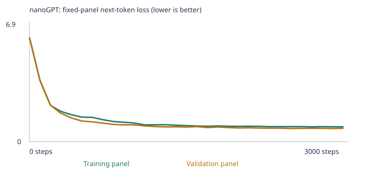
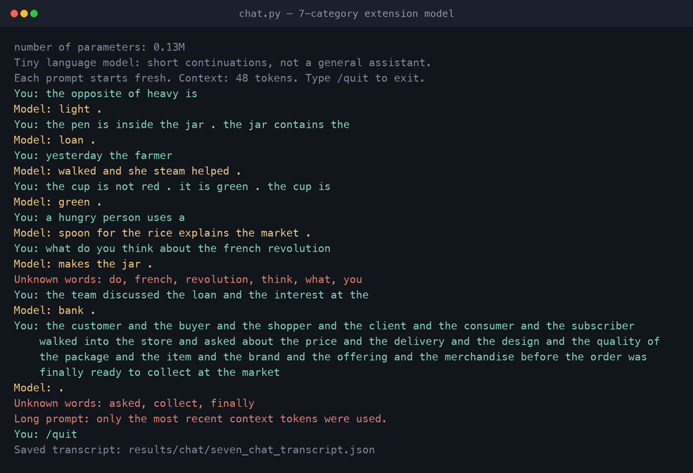

# Building a Custom LLM — MBA 290T Class 4

Karpathy's nanoGPT trained from scratch at classroom scale on three corpora, each
evaluated with the **unchanged 48-case language eval suite before and after training**,
plus a working terminal chat interface.

Steps (3,000), learning rate (0.001), seed (42), architecture and every evaluation
setting are held fixed across all three experiments. **Only the corpus changes.**

| | A — starter corpus | B — extension, 4 categories | C — extension, 7 categories |
|---|---|---|---|
| Required by the assignment | ✅ | ✅ | optional extra experiment |
| Executed notebook | [starter](experiments/starter/custom_llm_starter.executed.ipynb) | [expanded](experiments/expanded/custom_llm_expanded.executed.ipynb) | [seven](experiments/seven/custom_llm_seven.executed.ipynb) |
| Results ZIP | [zip](experiments/starter/starter_results.zip) | [zip](experiments/expanded/expanded_results.zip) | [zip](experiments/seven/seven_results.zip) |
| Run folder | [`llm_run/`](experiments/starter/llm_run) `20260920T040529_296252Z` | [`llm_run/`](experiments/expanded/llm_run) `20260920T044037_798463Z` | [`llm_run/`](experiments/seven/llm_run) `20260920T044056_309447Z` |
| Trained weights sha256 | `bf49f05b14d54178…` | `3fef787718bc1f57…` | `124b10dc2433c0b7…` |
| **All-case success** | **20 / 48** (41.7%) | **32 / 48** (66.7%) | **35 / 48** (72.9%) |
| Scorable cases | 24 / 48 | 35 / 48 | 44 / 48 |

Across five random seeds the means are **22.2 → 33.2 → 35.4** correct out of 48
(Section 8). The gain is roughly eight times the seed-to-seed standard deviation.

> ### Eval separation — the headline
>
> No eval prompt, answer choice, answer key or model output is in any training input.
> Beyond the starter's own check, this repo enforces a **stricter** property: for every
> one of the 48 cases, the training text must not contain a run of tokens ending the
> prompt that is reliably followed by the answer.
>
> **That check found a real problem in my own first attempt** — two spatial cases were
> answerable from an 8- and an 11-token memorised context. Fixing it cost me three
> correct answers, and the corrected number is the one reported above.
> [Section 9](#9-keeping-the-exam-out-of-the-textbook) · `python tools/verify_separation.py` ·
> `python tools/leakage_ngram_audit.py`

---

## Contents

1. [How to run everything](#1-how-to-run-everything)
2. [The corpus: sources, permissions, and what I added](#2-the-corpus-sources-permissions-and-what-i-added)
3. [My three choices and my prediction](#3-my-three-choices-and-my-prediction)
4. [The runs: what actually happened](#4-the-runs-what-actually-happened)
5. [Loss, samples, and temperature](#5-loss-samples-and-temperature)
6. [From a word to a prediction: tokens, IDs, vectors, gradients](#6-from-a-word-to-a-prediction-tokens-ids-vectors-gradients)
7. [The 48 fixed language evals: all six result sets](#7-the-48-fixed-language-evals-all-six-result-sets)
8. [Is it real? Five seeds](#8-is-it-real-five-seeds)
9. [Keeping the exam out of the textbook](#9-keeping-the-exam-out-of-the-textbook)
10. [What failed, and why](#10-what-failed-and-why)
11. [Chat interface and evidence](#11-chat-interface-and-evidence)
12. [What I learned, one limitation, and my next experiment](#12-what-i-learned-one-limitation-and-my-next-experiment)
13. [Repository map](#13-repository-map)

---

## 1. How to run everything

**Requirements:** Python 3.12, no GPU, no API key, no pretrained weights. Every command
below finishes in under a minute on an M2 MacBook Air.

```bash
python3 -m venv .venv && source .venv/bin/activate
pip install -r requirements.txt                          # torch, pypdf, jupyter
pip install nbclient nbformat pexpect reportlab pillow   # only needed for tools/
```

| I want to… | Command |
|---|---|
| Reproduce experiment A | `python tools/run_experiment.py --experiment starter` |
| Reproduce experiment B | `python tools/run_experiment.py --experiment expanded --corpus-dir corpus` |
| Reproduce experiment C | `python tools/run_experiment.py --experiment seven --corpus-dir corpus_seven` |
| Rerun the 48 evals on a saved trained model | `python run_evals.py --model experiments/seven/llm_run/model.pt --output results/my-evals` |
| … on the saved untrained model | `python run_evals.py --model experiments/seven/llm_run/model_untrained.pt --stage untrained --output results/my-untrained-evals` |
| Chat with the trained model | `python chat.py --model experiments/seven/llm_run/model.pt --transcript results/my-chat.json` |
| **Verify eval separation (10 checks)** | `python tools/verify_separation.py` |
| **Run the n-gram / answer-recall audit** | `python tools/leakage_ngram_audit.py` |
| Re-check PDF extraction | `python tools/check_pdf_extraction.py` |
| Rebuild the teaching corpora | `python tools/make_extension_corpus.py` and `… --categories all --out corpus_seven` |
| Rebuild the comparison tables and diagnostics | `python tools/analyze_results.py` |
| Reproduce the five-seed sweep | `python tools/run_experiment.py … --seed N --label … --summary-only` |
| Run the starter's own unit tests | `python -m unittest test_language_evals test_corpus` |

`run_experiment.py` builds a **throwaway workspace per experiment** containing only the
pinned support files and that experiment's corpus, so experiment A provably cannot see
`corpus/` and no run can see another's `llm_runs/`.

**To open the notebook yourself:** `jupyter notebook custom_llm.ipynb` (or upload it to
Colab) and Run All. The unexecuted starter notebook is at the repository root; the three
executed copies with all outputs are under `experiments/`. Section 1 holds the three
settings. In Colab, run sections 1–2 once to create `/content/corpus`, then upload the
files from [`corpus/`](corpus) into it before Run All.

### The three cells I changed, and why

The notebook is the upstream one. `tools/run_experiment.py` patches exactly three cells,
and none of them is the model, the eval suite, the scoring code or the corpus pipeline:

| Cell | Change | Why |
|---|---|---|
| Section 1 | the three assignment settings | that is what section 1 is for |
| Section 7 | `milestones` also includes every 100th step | the notebook otherwise measures the fixed loss panels only at step 1,500 and 3,000, giving a three-point curve. This gives 31 rows. |
| Section 10 | the chat cell loops over 8 prompts instead of 1 | one Run All then records more than the three required interactions |

One cell is **added** after section 8b to print the whole 48-case table inside the notebook.

The section 7 change is observation only, and I verified that rather than asserting it: I
ran experiment A twice with identical settings, once with each version of the line, and the
**final weights are bit-identical** (`bf49f05b14d5417840f3b551aa61e28c0e521e6d5557f146f3961ffc1afbe84e`
both times), as are all eval results —
[`results/measurement_neutrality_check.json`](results/measurement_neutrality_check.json).
`record()` reads the model under `torch.no_grad()` and samples from its own seeded
`torch.Generator`, so it consumes no global RNG state, and dropout is 0.0, so toggling
`eval()`/`train()` is a no-op.

---

## 2. The corpus: sources, permissions, and what I added

### Sources and permission

**Every word of training text in all three experiments is synthetic and free of
third-party rights.** Experiment A uses only the notebook's generated classroom sentences.
The extension files were written by me and are produced deterministically by
[`tools/make_extension_corpus.py`](tools/make_extension_corpus.py) (seed 20260919). There
is no copyrighted material, no confidential document and no personal record anywhere, which
is why the corpora, every `corpus.txt` and all three results ZIPs can be published in full.

I chose self-authored text deliberately: it is the only way to *guarantee* the eval suite is
absent from training rather than hope a scraped PDF does not paraphrase it.

### What I added, and the categories it targets

The suite's 24 extension cases cover eight skills. Experiment B teaches **four** and leaves
**four untaught as a control group**, so the comparison can separate "the model learned what
I taught" from "everything got better". Experiment C then teaches three more, leaving
`reference` as the sole control.

| Category | Why | Taught in B | Taught in C |
|---|---|:---:|:---:|
| **grammar** | Pure form, no world knowledge — the cleanest test of whether two layers can learn an agreement rule. The starter corpus contains no `is`/`are`/`am` at all. | ✅ | ✅ |
| **opposites** | Tests whether a *frame* learned from one set of word pairs transfers to pairs never shown in that frame. | ✅ | ✅ |
| **negation** | Requires carrying information across a sentence boundary — the hardest thing here for a 48-token, 2-layer model. | ✅ | ✅ |
| **spatial_relations** | Inverse relations (above↔below) are a clean relational mapping. | ✅ | ✅ |
| **everyday_knowledge** | A lookup rather than an operation; a good contrast with the three above. | control | ✅ |
| **sequence** | Ordering *and* copying — predicted to be hard. | control | ✅ |
| **categories_and_analogies** | Category membership, another lookup. | control | ✅ |
| **reference** | **Never taught, in either.** Its cases hinge on eleven specific first names. See [Section 10](#failure-3--the-thirteen-cases-i-chose-not-to-make-scorable). | control | control |

File-by-file: [`corpus/README.md`](corpus/README.md) and [`corpus_seven/README.md`](corpus_seven/README.md).
Manifests: [A](experiments/starter/llm_run/corpus_manifest.json) ·
[B](experiments/expanded/llm_run/corpus_manifest.json) ·
[C](experiments/seven/llm_run/corpus_manifest.json).

### Two things I found only by reading the training text

**1. The passage splitter breaks multi-clause teaching examples.** `chunk_text()` splits on
`(?<=[.!?])\s+`, so a three-clause example written normally becomes *three separate
passages*:

```
'the gate is not open . it is closed . the gate is closed .'
  -> ['the gate is not open .', 'it is closed .', 'the gate is closed .']
```

A model trained only on one-clause passages therefore never sees a `.` with more text after
it — but the negation and spatial eval prompts are full of exactly that. Writing the
internal period tight against the next word keeps the example together and produces the
identical token sequence:

```
'the gate is not open .it is closed .the gate is closed .'
  -> ['the gate is not open . it is closed . the gate is closed .']
```

**2. The 509-type vocabulary cap evicts the extension's words, not the classroom's.**
Retention is by frequency, and the classroom corpus is far more frequent. A first build used
23 verbs; four forms each pushed the training vocabulary to 566 types, and the 57 evicted
types included `walk`, `walks` and `walking` — three of the four answer choices for one
grammar case, which would have made it unscorable. Ten verbs taught more thoroughly fixed
it. Building experiment C's corpus was a running fight with this cap: the material for the
three new categories first appeared in only ~28 distinct passages each, so its words were
the rarest in the corpus and were evicted. Templating those facts across many distinct
passages — rather than stating each fact three times — is what made them survive.

### PDF extraction check

`08_printed_notes.pdf` exercises the PDF import path. Its plain-text original is kept in
[`docs/`](docs) — **outside** every corpus folder — so the PDF is the only training copy of
that text while extraction can still be diffed against a known source.

`python tools/check_pdf_extraction.py` re-extracts it page by page
([`results/pdf_extraction_check.json`](results/pdf_extraction_check.json)):

| Property | Value |
|---|---|
| Pages | 2 |
| Pages with no extractable text | none |
| Tokens in source / extracted | 657 / 657, for both corpora's PDFs |
| Token sequence identical | **true** |
| Types only in PDF / only in source | none / none |
| Eval prompts found in the extracted text | none |

The notebook reported **zero warnings** for every imported file in all three runs. Nothing
needed OCR; the PDF was generated from text, not scanned. Had it been a scan,
`extract_text()` would have returned empty pages and the notebook would have printed a
per-page warning naming the page.

---

## 3. My three choices and my prediction

| Choice | Value | Reason |
|---|---|---|
| **Corpus** | classroom; classroom + 4-category extension; classroom + 7-category extension | The assignment requires the first two. Keeping `CORPUS="classroom"` in the extensions (rather than folder-only) means the extension *adds to* the starter data, so the starter eval groups stay measurable and any damage to them is visible. |
| **Training steps** | 3,000 | The suggested budget, and the loss table shows it is enough: experiment A's validation loss is flat from about step 900, and the extensions' from about step 2,200. Holding it fixed keeps the three experiments comparable. |
| **Learning rate** | 0.001 | The suggested default, with the notebook's 100-step warmup and cosine decay. |

Steps and learning rate are **identical across all three experiments on purpose**. With one
variable changed the comparison is interpretable; with three it would not be.

**Why an extreme learning rate is a problem.** Too large and each update overshoots — the
loss oscillates or becomes `NaN`, and the notebook raises `FloatingPointError` rather than
saving a broken model. Too small and the model crawls: at 1e-6 instead of 1e-3, 3,000 steps
would cover roughly the distance the current run covers in three, and the 4.93 → 0.68 drop
would not happen.

### My prediction, written before training

1. Loss will fall steeply for a few hundred steps and then flatten — the classroom corpus is
   eight templates over a small word list.
2. Experiment A will do well on the 16 `starter_patterns` cases and clearly worse on the 8
   `starter_transfer` cases.
3. All 24 extension cases will be unscorable for A, because words like `is`, `not` and
   `above` are not in a 133-word classroom vocabulary.
4. The extension will fix coverage for the categories I teach. I expect **partial** credit:
   agreement and opposites should work; negation across sentence boundaries probably will
   not, at ~130k parameters and two layers.
5. Adding thousands of unrelated passages will **dilute** the classroom patterns and cost me
   a little on the starter groups.

### What actually happened

1. ✅ Correct. A's validation loss reaches 0.71 by step 900 and moves 0.005 after that.
2. ⚠️ Half right. `starter_patterns` went to **16/16**, but `starter_transfer` only reached
   **4/8** — a sharper split between memorised templates and rephrasings than I expected.
3. ✅ Correct. 24/24 extension cases unscorable; held-out unknown-token rate 0.00%.
4. ⚠️ Mostly right, and wrong in an instructive way. Agreement went **3/3** and opposites
   **3/3**. Negation reached **2/3** — better than I predicted, but only after I rebuilt the
   material (Section 10). Spatial relations, which I expected to be the *easy* one, is the
   worst of the four at a five-seed mean of **1.4/3**, and my first 3/3 there turned out to
   be memorisation rather than learning.
5. ❌ **Wrong, and this is the most surprising result.** `starter_patterns` stayed at 16/16
   and `starter_transfer` went **4/8 → 8/8** in both extensions, on every seed tested. Adding
   grammar and spatial text made the model *better* at rephrasings of the original business
   sentences. My best explanation: A's eight rigid frames let the model solve
   `starter_patterns` by memorising frames, and the extension's much more varied sentence
   shapes force the word embeddings themselves to carry the domain association — which is
   what a rephrasing needs. This is a hypothesis consistent with the evidence, not something
   these 48 cases establish.

---

## 4. The runs: what actually happened

All three runs completed. **None was interrupted and none errored**
(`"interrupted": false` in every
[`training_summary.json`](experiments/seven/llm_run/training_summary.json)).

| | A — starter | B — ext. 4 cat. | C — ext. 7 cat. |
|---|---:|---:|---:|
| Completed training steps | 3,000 / 3,000 | 3,000 / 3,000 | 3,000 / 3,000 |
| Training loop elapsed | 10.5 s | 12.8 s | 13.0 s |
| Whole notebook, Run All | 15.0 s | 17.6 s | 17.8 s |
| Model parameters | 111,872 | 131,392 | 135,936 |
| Vocabulary (incl. `<UNK> <BOS> <EOS>`) | 136 | 441 | 512 |
| Unique passages after dedup | 4,592 | 9,090 | 10,403 |
| … of which new from the corpus folder | 0 | 4,498 | 5,811 |
| Duplicate passages removed | 1,608 | 1,897 | 2,312 |
| Reserved before the split (contained a test prefix) | 160 | 160 | 160 |
| Train / validation passages | 4,132 / 460 | 8,181 / 909 | 9,362 / 1,041 |
| Training unknown-token rate | 0.0000% | 0.0000% | 0.0443% |
| **Held-out unknown-token rate** | **0.0000%** | **0.0000%** | **0.1284%** |
| Vocabulary types omitted by the 509 cap | 0 | 0 | 10 |

**Hardware for all runs:** Apple M2 MacBook Air, `macOS-26.6.2-arm64`, `device="cpu"`,
4 torch threads, PyTorch 2.14.0, Python 3.12.14. No GPU or MPS backend was used.

Parameter counts differ only because the embedding and output layers scale with the
vocabulary: (512 − 136) × 64 = 24,064, which is exactly 135,936 − 111,872. The transformer
blocks are identical, and nanoGPT ties the embedding and output weights, so each extra
vocabulary row is counted once.

Config and vocabulary reports:
[A config](experiments/starter/llm_run/config.json) · [A vocab](experiments/starter/llm_run/vocabulary_report.json) ·
[B config](experiments/expanded/llm_run/config.json) · [B vocab](experiments/expanded/llm_run/vocabulary_report.json) ·
[C config](experiments/seven/llm_run/config.json) · [C vocab](experiments/seven/llm_run/vocabulary_report.json).

Experiment C is the only run where the 509-type cap bites, dropping ten types
(`button`, `drink`, `field`, `helps`, `jars`, `other`, `rain`, `rest`, `turns`, `weather`).
None appears in any eval case, and the resulting unknown-token rates — 0.04% in training and
0.13% held out — are small but no longer zero. That is the visible price of teaching seven
categories inside a fixed vocabulary budget.

### Reproducibility

All runs are deterministic. After making the PDF generator emit an invariant timestamp, I
rebuilt the corpus from scratch and re-ran an experiment end to end in a fresh workspace: the
corpus files came back byte-identical and so did the trained weights. The sha256 of every
corpus file recorded in `corpus_manifest.json` matches the file committed here:

```bash
python tools/make_extension_corpus.py && shasum -a 256 corpus/*
```

### What the 90/10 split can and cannot test

The split is over **deduplicated passages, not source files**, so passages generated from the
same template land on both sides. A held-out passage therefore shares its template with
training passages. Validation loss measures *"can the model handle another instance of a
pattern it has seen"*, not *"can it handle an unseen kind of sentence"*. A falling validation
loss is real evidence against memorising individual strings, and **not** evidence of general
language ability. The `starter_transfer` group is the closer test of that.

---

## 5. Loss, samples, and temperature

### Loss curves

| A — starter | B — extension, 4 categories | C — extension, 7 categories |
|---|---|---|
|  |  |  |

**These are fixed evaluation panels, not full-corpus measurements:** at most 20 training
documents and 20 validation documents, sampled once with fixed seeds (123 and 456) before
training and never resampled, averaging the loss over non-padding next-token targets
(`evaluation_panel_size: {"train": 20, "validation": 20}` in every `config.json`). Against
4,132–9,362 training passages, a 20-document panel is a small estimate and its ±0.01 wobble
between steps is noise, not learning.

The three curves are **not comparable to each other**: different corpora mean different
vocabularies (136 / 441 / 512), and a uniform guess over 512 words starts at a higher loss
than over 136. The untrained losses are 4.9263, 6.0927 and 6.2497 against
`ln(136) = 4.913`, `ln(441) = 6.089` and `ln(512) = 6.238` — every untrained model is within
0.02 of a uniform distribution over its own vocabulary, which is exactly what an untrained
network should be.

<details>
<summary><b>Full measured loss table — all 31 rows, all three experiments</b> (from history.json / training.csv in each run folder)</summary>

| Step | starter train | starter val | ext-4 train | ext-4 val | ext-7 train | ext-7 val |
|---:|---:|---:|---:|---:|---:|---:|
| 0 | 4.9263 | 4.9275 | 6.0927 | 6.0961 | 6.2497 | 6.2162 |
| 100 | 2.1043 | 2.0727 | 3.4824 | 3.3882 | 3.6089 | 3.6079 |
| 200 | 0.9875 | 1.0247 | 2.0059 | 1.7373 | 2.0699 | 2.0089 |
| 300 | 0.9286 | 0.9707 | 1.6273 | 1.3531 | 1.6989 | 1.5789 |
| 400 | 0.8360 | 0.8989 | 1.4273 | 1.1968 | 1.5564 | 1.4418 |
| 500 | 0.7488 | 0.7781 | 1.3384 | 1.1135 | 1.4372 | 1.2933 |
| 600 | 0.7331 | 0.7347 | 1.2085 | 1.0589 | 1.3435 | 1.2386 |
| 700 | 0.7048 | 0.7243 | 1.2077 | 1.0552 | 1.2602 | 1.1841 |
| 800 | 0.7110 | 0.7096 | 1.1543 | 1.0445 | 1.1725 | 1.1083 |
| 900 | 0.6821 | 0.7105 | 1.0533 | 0.9788 | 1.1042 | 1.0636 |
| 1000 | 0.6883 | 0.7046 | 0.9852 | 0.9206 | 1.0683 | 1.0679 |
| 1100 | 0.6835 | 0.7171 | 1.0126 | 0.9085 | 0.9999 | 1.0432 |
| 1200 | 0.6846 | 0.7121 | 0.9911 | 0.8695 | 0.9872 | 1.0349 |
| 1300 | 0.6723 | 0.7208 | 0.9442 | 0.8981 | 1.0050 | 1.0215 |
| 1400 | 0.6836 | 0.7068 | 0.9102 | 0.8754 | 0.9462 | 1.0204 |
| 1500 | 0.6821 | 0.7182 | 0.9236 | 0.8723 | 0.9269 | 0.9923 |
| 1600 | 0.6804 | 0.7227 | 0.8875 | 0.8396 | 0.8729 | 0.9885 |
| 1700 | 0.6778 | 0.7145 | 0.8989 | 0.8190 | 0.8829 | 0.9694 |
| 1800 | 0.6730 | 0.7123 | 0.8775 | 0.8411 | 0.8821 | 0.9558 |
| 1900 | 0.6792 | 0.7042 | 0.8840 | 0.8415 | 0.8716 | 0.9518 |
| 2000 | 0.6768 | 0.7057 | 0.8544 | 0.8302 | 0.8841 | 0.9518 |
| 2100 | 0.6736 | 0.7067 | 0.8376 | 0.8192 | 0.8696 | 0.9561 |
| 2200 | 0.6713 | 0.7077 | 0.8398 | 0.8311 | 0.8623 | 0.9394 |
| 2300 | 0.6761 | 0.7024 | 0.8397 | 0.8311 | 0.8663 | 0.9537 |
| 2400 | 0.6876 | 0.7117 | 0.8237 | 0.8230 | 0.8766 | 0.9472 |
| 2500 | 0.6779 | 0.7046 | 0.8312 | 0.8222 | 0.8717 | 0.9402 |
| 2600 | 0.6749 | 0.7064 | 0.8342 | 0.8134 | 0.8704 | 0.9293 |
| 2700 | 0.6725 | 0.7024 | 0.8230 | 0.8164 | 0.8651 | 0.9372 |
| 2800 | 0.6792 | 0.7051 | 0.8212 | 0.8147 | 0.8704 | 0.9482 |
| 2900 | 0.6793 | 0.7063 | 0.8192 | 0.8109 | 0.8633 | 0.9359 |
| 3000 | 0.6783 | 0.7061 | 0.8146 | 0.8056 | 0.8668 | 0.9218 |

</details>

Experiment C is the only run whose validation loss ends **above** its training loss
(0.9218 vs 0.8668); A and B end the other way round. With two 20-document panels drawn from
corpora of mixed passage difficulty, neither ordering is meaningful on its own. No run shows
the classic overfitting signature of training loss falling while validation climbs.

### Untrained → halfway → final samples

Same generation settings throughout: temperature 0.8, seed 2026, 4 samples, max 32 tokens.
Full files, 31 per run: [A](experiments/starter/llm_run/samples) ·
[B](experiments/expanded/llm_run/samples) · [C](experiments/seven/llm_run/samples).

| Stage | A — starter | C — 7-category extension |
|---|---|---|
| **Untrained** (step 0) | `pear professor bond doctor course harvest team physician journey checking buye…` | `hungry helping poster was short sits another cold walked jonas cook duck happe…` |
| **Halfway** (step 1500) | `our school has a question about the new educator and lesson .` | `that flag is not green . it is yellow .` |
| **Final** (step 3000) | `our school has a question about the new educator and lesson .` | `that mug is not green . it is yellow .` |

**One visible change and one visible lack of change.** The change: at step 0 both models emit
uniformly random vocabulary words with no grammar and no sentence end — `pear professor bond
doctor` is a draw from a flat distribution. By step 1,500 both produce well-formed sentences
that terminate properly with ` .` and `<EOS>`, and C's sample is a *correctly formed negation
correction*, a pattern that exists nowhere in the starter corpus. The lack of change:
experiment A's first two samples are **character-for-character identical at step 1,500 and
step 3,000**, while its validation loss moved from 0.7182 to 0.7061 over the same interval.
Half the training budget produced no visible difference in sampled text — a concrete reason
not to treat "the samples look good" as evidence of learning.

### Temperature — inference only, no weights change

[A](experiments/starter/llm_run/temperature_comparison.json) ·
[B](experiments/expanded/llm_run/temperature_comparison.json) ·
[C](experiments/seven/llm_run/temperature_comparison.json). Same trained weights, same
starting token, same sampling seed; only the divisor applied to the logits before `softmax`
changes.

| T | A — starter (sample 1) | C — 7-category (sample 1) |
|---|---|---|
| 0.3 | `our school has a question about the new educator and lesson .` | `the important therapist was mentioned in the treatment report yesterday` |
| 0.8 | `our school has a question about the new educator and lesson .` | `that mug is not green . it is yellow .` |
| 1.2 | `our school has a question about the new educator and lesson .` | `clean and willow are opposites .` |

Lower temperature sharpens the distribution toward the most likely word; higher flattens it.
Honest observation: **for experiment A, T=0.8 and T=1.2 produced byte-identical sample
sets.** With 136 words and eight rigid templates the distribution is so peaked that flattening
it by 50% does not change which word wins the draw at this seed. Experiment C, with 512 words
and far more varied sentence shapes, diversifies visibly across all three — and at 1.2 it
produces `clean and willow are opposites .`, which is the opposites frame filled with a tree
name: a grammatical sentence that is semantically wrong, exactly the failure mode a flatter
distribution produces.

**No weights changed during any of this.** `generate()` runs under `@torch.no_grad()`, and the
eval runner asserts the model hash is unchanged after inference, raising `RuntimeError` if it
ever moves.

---

## 6. From a word to a prediction: tokens, IDs, vectors, gradients

Sources: [A tokenization](experiments/starter/llm_run/tokenization.json) ·
[A inspection](experiments/starter/llm_run/inspection.json) ·
[C tokenization](experiments/seven/llm_run/tokenization.json) ·
[C inspection](experiments/seven/llm_run/inspection.json).

### Corpus → passage → tokens → IDs

The **corpus** is the pile of text the model may learn from. It is cut into **passages** of at
most 47 word tokens, deduplicated, then split 90/10. One real training passage from
experiment C:

```
text     warm and cool are opposites .
tokens   [warm, and, cool, are, opposites, .]
IDs      [1, 485, 12, 107, 16, 325, 3, 2]
          ▲                            ▲
          <BOS>                    .  <EOS>
```

A **token** is a piece of text (here a whole word or a punctuation mark). A **token ID** is
that token's row number in the vocabulary list — an arbitrary integer with no meaning of its
own. Proof that it is arbitrary: `customer` is ID **28** in experiment A and ID **121** in
experiment C. Same word, same architecture, different corpus, different number. The model
learns nothing from the number; it uses it only to look up a row.

### The row it looks up: a 64-number vector

That row is the word's **embedding**: 64 numbers, randomly initialised and changed by
training. For `customer` in experiment A, the first four of its 64 coordinates:

| | coord 0 | coord 1 | coord 2 | coord 3 | L2 distance moved |
|---|---:|---:|---:|---:|---:|
| Before training | −0.057592 | −0.004810 | 0.042632 | 0.019339 | |
| After 3,000 steps | 0.036634 | −0.018221 | 0.133030 | 0.105949 | **0.6610** |

A **vector** is just that list of numbers; the **embedding** is the learned vector the model
keeps per vocabulary entry, stored in the `wte` table of shape (136, 64) — 8,704 of
experiment A's 111,872 parameters.

The numbers are not readable, but their *geometry* is. Nearest neighbours by cosine
similarity over the full 64 dimensions
([`results/embedding_neighbours.json`](results/embedding_neighbours.json)):

| Word (experiment) | Before training | After training |
|---|---|---|
| `customer` (A) | `bus`, `educator`, `helped`, `bank`, `risk` | **`shopper` 0.978, `client` 0.977, `buyer` 0.977, `subscriber` 0.971, `consumer` 0.970**, then `team` 0.503 |
| `walked` (C) | `far`, `flag`, `focused`, `traffic`, `taste` | **`jumped` 0.906, `cleaned` 0.879, `opened` 0.870, `cooked` 0.869, `looked` 0.855** |
| `below` (C) | `opened`, `hard`, `review`, `seal`, `quick` | `above` 0.550, `over` 0.467, `beside` 0.373 |
| `cold` (C) | `umbrella`, `today`, `pocket`, `opening`, `winter` | `hot` 0.438, `empty` 0.436, `far` 0.387, `water` 0.378 |

Before training the neighbours are noise. After training, the five words *interchangeable with
`customer` in the classroom templates* sit at cosine ≈ 0.97 and the sixth-nearest falls off a
cliff to 0.50 — the model discovered those six words play one role, purely from next-word
prediction. `walked`'s neighbours are five other past-tense verbs at 0.85–0.91, which is the
grammar material showing up in the geometry. `below`'s nearest neighbour is its own opposite,
`above`: relational terms cluster by role, not by meaning.

### One real gradient and one real weight update

From experiment A's `inspection.json`, coordinate 0 of `customer`'s embedding at step 0:

| | Value |
|---|---|
| Value before | `-0.057591915130615234` |
| Gradient at that step | `+0.000692586530931294` |
| Learning rate at step 0 | `1e-05` |
| Value after | `-0.057601906359195710` |
| Actual change | **−9.99 × 10⁻⁶** |

The **gradient** answers "if I nudge this one number up, does the loss go up or down, and how
fast?" It is positive, so raising this coordinate would raise the loss, so the optimizer lowers
it. The **weight update** is the lowering. Two details the numbers show directly:

- The learning rate is `1e-05`, not `0.001`, because step 0 is the first step of a 100-step
  warmup: `0.001 × (1/100) × 1.0 = 1e-05`.
- The change is `−9.99e-06 ≈ −lr`, even though the gradient is only `6.9e-04`. That is AdamW,
  not plain gradient descent: it divides the gradient by a running estimate of its own
  magnitude, and on the first step that ratio is ≈ 1, so the step size is ≈ the learning rate
  regardless of how small the raw gradient is. Plain SGD would have moved this number by
  `1e-5 × 6.9e-4 ≈ 7e-9` — about 1,400× less.

Repeat that for all 111,872 parameters, 3,000 times, and the loss falls from 4.93 to 0.68.
**That is the whole of "learning" here**: a loss that scores the prediction, a gradient per
parameter, and a small step downhill.

### What makes it a neural network, and what attention does

The parameters are arranged in layers — an embedding table, two transformer blocks (each with
4 attention heads and a small MLP), and an output layer mapping 64 dimensions back to
vocabulary scores. Non-linearities between layers are what make it more than one big matrix
multiplication.

**Attention** lets the prediction at each position be a weighted blend of earlier positions.
Real numbers, first head of block 1, on the prefix `the customer` (rows = the position doing
the looking, columns = `<BOS>`, `the`, `customer`):

| Query position | `<BOS>` | `the` | `customer` |
|---|---:|---:|---:|
| 0 (`<BOS>`) | 1.000 | 0.000 | 0.000 |
| 1 (`the`) | 0.606 | 0.394 | 0.000 |
| 2 (`customer`) | 0.485 | 0.423 | 0.092 |

The zeros in the upper triangle are not learned — they are a causal mask that sets future
positions to `-inf` before the softmax. **The model cannot look at future tokens** because
during training every position simultaneously predicts its own next token; if position 1 could
see position 2 it would be reading the answer, and the model would learn nothing that works at
generation time, when the future does not exist yet.

### How probabilities become words

The output layer produces one score per vocabulary entry; `softmax` turns the scores into
probabilities summing to 1; a word is drawn from that distribution and appended; the loop
repeats until `<EOS>`. Same prefix `the customer`, experiment A, before and after training:

| Rank | Untrained | Trained |
|---|---|---|
| 1 | `customer` 0.0160 | **`reviewed` 0.1782** |
| 2 | `bus` 0.0107 | **`recommended` 0.1712** |
| 3 | `educator` 0.0104 | **`ordered` 0.1685** |
| 4 | `us` 0.0103 | **`selected` 0.1634** |
| 5 | `application` 0.0101 | **`compared` 0.1597** |

Untrained, the top word carries 1.6% and the top five are within 0.006 of each other — near
uniform over 136 words (1/136 = 0.0074). Trained, the top five carry **84%** between them
(with `returned` at 0.1428 the top six carry 98%), and they are exactly the six verbs from the
corpus frame `the {noun} {verb} the {product} after checking the price .`. The model learned
that a person-noun after `the` is followed by one of six past-tense verbs, and spreads its
confidence almost evenly across them — because in the corpus all six really are equally likely
there. That is the distribution being *correct*, not the model being indecisive.

---

## 7. The 48 fixed language evals: all six result sets

The suite is [`evals/language_evals.json`](evals/language_evals.json), **unchanged** (sha256
`e8affcd72841e3ed…`, byte-identical to the starter repo's file). The runner is
[`run_evals.py`](run_evals.py), also unchanged. All six result sets recorded the same
`suite_sha256`, which `tools/verify_separation.py` checks.

**Scoring rules, as implemented in `run_evals.py`:** only the prompt enters the model — never
the four choices, the answer or the explanation. The next-token probability is read for each
of the four single-word choices; the highest wins; correct = 1, incorrect = 0, an exact tie =
0. Separately, an unconstrained continuation is generated at temperature 0.8 with a fixed
per-case seed and a 24-token cap; **that free text is saved and inspected but is not what the
score measures.** If any prompt word or any answer choice is outside the model's vocabulary
the case is marked `out_of_vocabulary` and scores 0 in the all-case rate rather than being
dropped — so a model cannot raise its all-case percentage by having a smaller vocabulary.
Random guessing would average 25% among scorable cases.

### The six result sets

| Experiment | Stage | Correct / 48 | Scorable / 48 | All-case | Accuracy among scorable | Vocab | Full results |
|---|---|---:|---:|---:|---:|---:|---|
| A starter | untrained | 9 | 24 | 18.8% | 37.5% | 136 | [csv](experiments/starter/llm_run/language_evals/untrained/eval_results.csv) · [json](experiments/starter/llm_run/language_evals/untrained/eval_results.json) · [summary](experiments/starter/llm_run/language_evals/untrained/eval_summary.json) |
| A starter | **trained** | **20** | 24 | **41.7%** | 83.3% | 136 | [csv](experiments/starter/llm_run/language_evals/final/eval_results.csv) · [json](experiments/starter/llm_run/language_evals/final/eval_results.json) · [summary](experiments/starter/llm_run/language_evals/final/eval_summary.json) |
| B ext. 4 cat. | untrained | 11 | 35 | 22.9% | 31.4% | 441 | [csv](experiments/expanded/llm_run/language_evals/untrained/eval_results.csv) · [json](experiments/expanded/llm_run/language_evals/untrained/eval_results.json) · [summary](experiments/expanded/llm_run/language_evals/untrained/eval_summary.json) |
| B ext. 4 cat. | **trained** | **32** | 35 | **66.7%** | 91.4% | 441 | [csv](experiments/expanded/llm_run/language_evals/final/eval_results.csv) · [json](experiments/expanded/llm_run/language_evals/final/eval_results.json) · [summary](experiments/expanded/llm_run/language_evals/final/eval_summary.json) |
| C ext. 7 cat. | untrained | 7 | 44 | 14.6% | 15.9% | 512 | [csv](experiments/seven/llm_run/language_evals/untrained/eval_results.csv) · [json](experiments/seven/llm_run/language_evals/untrained/eval_results.json) · [summary](experiments/seven/llm_run/language_evals/untrained/eval_summary.json) |
| C ext. 7 cat. | **trained** | **35** | 44 | **72.9%** | 79.5% | 512 | [csv](experiments/seven/llm_run/language_evals/final/eval_results.csv) · [json](experiments/seven/llm_run/language_evals/final/eval_results.json) · [summary](experiments/seven/llm_run/language_evals/final/eval_summary.json) |

Machine-readable: [`results/comparison.json`](results/comparison.json) ·
[`results/comparison.md`](results/comparison.md). The same six sets, regenerated from the saved
`.pt` files with `run_evals.py` rather than inside the notebook, are in
[`results/rerun/`](results/rerun) and reproduce these numbers exactly.

**Read the last two columns together.** Accuracy among scorable cases *falls* from 91.4% (B)
to 79.5% (C) while all-case success *rises* from 66.7% to 72.9%. Nothing got worse: C simply
made nine harder cases scorable, and answered two of them. Accuracy over a changing
denominator is not a like-for-like comparison, which is why the all-case rate is the headline.

### By group

| Group | Cases | A untr. | A trained | B untr. | B trained | C untr. | C trained |
|---|---:|---:|---:|---:|---:|---:|---:|
| `starter_patterns` | 16 | 6 | **16** | 3 | **16** | 1 | **16** |
| `starter_transfer` | 8 | 3 | 4 | 5 | **8** | 4 | **8** |
| `extend_corpus` | 24 | 0 (s0) | 0 (s0) | 3 (s11) | **8** (s11) | 2 (s20) | **11** (s20) |

### By category

`s` = scorable. **Bold** marks a category that corpus actually teaches.

| Category | A untr. | A trained | B untr. | B trained | C untr. | C trained |
|---|---:|---:|---:|---:|---:|---:|
| `domain_context` | 3/8 | 8/8 | 1/8 | 8/8 | 0/8 | 8/8 |
| `domain_place` | 3/8 | 8/8 | 2/8 | 8/8 | 1/8 | 8/8 |
| `new_wording` | 3/8 | 4/8 | 5/8 | 8/8 | 4/8 | 8/8 |
| `grammar` | 0/3 (s0) | 0/3 (s0) | 1/3 (s3) | **3/3** | 1/3 (s3) | **3/3** |
| `opposites` | 0/3 (s0) | 0/3 (s0) | 1/3 (s3) | **3/3** | 1/3 (s3) | **3/3** |
| `negation` | 0/3 (s0) | 0/3 (s0) | 0/3 (s2) | **2/3** (s2) | 0/3 (s2) | **2/3** (s2) |
| `spatial_relations` | 0/3 (s0) | 0/3 (s0) | 1/3 (s3) | **0/3** (s3) | 0/3 (s3) | **1/3** (s3) |
| `everyday_knowledge` | 0/3 (s0) | 0/3 (s0) | 0/3 (s0) | 0/3 (s0) | 0/3 (s3) | **2/3** (s3) |
| `sequence` | 0/3 (s0) | 0/3 (s0) | 0/3 (s0) | 0/3 (s0) | 0/3 (s3) | **0/3** (s3) |
| `categories_and_analogies` | 0/3 (s0) | 0/3 (s0) | 0/3 (s0) | 0/3 (s0) | 0/3 (s3) | **0/3** (s3) |
| `reference` | 0/3 (s0) | 0/3 (s0) | 0/3 (s0) | 0/3 (s0) | 0/3 (s0) | 0/3 (s0) |

### Vocabulary coverage is the gate, and it is not the same as skill

Coverage goes 24 → 35 → 44 of 48. The cases that become scorable are **exactly** the cases in
the categories each corpus teaches; **zero** untaught-category cases became scorable at any
point. Coverage follows the teaching material precisely.

But coverage alone proves nothing about skill, and the untrained models are the control that
shows it. Experiment C's untrained model has the same 512-word vocabulary and the same 44
scorable cases as its trained counterpart, and scores **7/48 — 15.9% among scorable**, below
the 25% a coin flip would give. The vocabulary makes a case *askable*; training on the
teaching material is what makes it *answerable*.

### The 4-choice score is coarse: what the decision margins show

Comparing the gap between the winning choice and the runner-up, for experiment C:

| Case | Category | Untrained pick | Untrained margin | Trained pick | Trained margin |
|---|---|---|---:|---|---:|
| `lang_25` | grammar | `am` ✗ | 0.000236 | `is` ✓ | **0.712** |
| `lang_26` | grammar | `am` ✗ | 0.000461 | `are` ✓ | **0.994** |
| `lang_27` | grammar | `walked` ✓ (luck) | 0.000643 | `walked` ✓ | **0.143** |
| `lang_28` | opposites | `fast` ✗ | 0.000052 | `cold` ✓ | **0.167** |
| `lang_30` | opposites | `late` ✗ | 0.000513 | `quiet` ✓ | **0.379** |
| `lang_31` | negation | `yellow` ✗ | 0.000685 | `blue` ✓ | **0.472** |
| `lang_42` | spatial | `south` ✗ | 0.000828 | `left` ✗ | **0.000057** |

Every untrained margin sits between 0.00005 and 0.0009 — the untrained network is choosing at
random, and `lang_27` "getting it right" untrained is luck, not knowledge. After training the
same margins are 0.14–0.99. `lang_42` is the exception that proves the point: even trained, it
is a near-tie at the fifth decimal between `left` and `right` — the model learned the
*vocabulary* of the relation and nothing about its direction.

### Actual free continuations

The multiple-choice score and the free text are different measurements:

| Case | Prompt | C's free continuation (T=0.8) | Choice score |
|---|---|---|---|
| `lang_41` | `the lamp is above the desk . the desk is` | `below .` | 1 |
| `lang_33` | `the door is not open . it is closed . the door is` | `closed .` | 1 |
| `lang_31` | `the box is not red . it is blue . the box is` | `blue .` | 1 |
| `lang_25` | `one bird` | `was tall .` | 1 |
| `lang_44` | `a person uses an umbrella to stay` | `warm near the street .` | 1 |
| `lang_42` | `the ball is left of the box . the box is to the` | `light .` | **0** |
| `lang_48` | `a carrot is a vegetable . an apple is a` | `person vehicle and a flat .` | **0** |
| `lang_34` | `maya lent a book to leo . leo thanked` | `.` *(unscorable — unknown names)* | 0 |

`lang_41` is the one to look at: `the desk is below the lamp` was never written, because the
generator bans the eval's own nouns from that frame entirely (Section 9), so the model composed
it. The rest show how different the two measurements are. `lang_44` **scores 1** — its
multiple-choice pick is `dry` — while its free continuation says `warm`, which is a different
(and wrong) word from the same "things an umbrella helps you stay" cluster. `lang_25` scores 1
on `is` but its continuation begins `was`. A correct choice and a correct sentence are not the
same event, and only the four-choice number is the score.

---

## 8. Is it real? Five seeds

Every number above comes from seed 42. The notebook's `SEED` controls model initialisation,
the 90/10 passage shuffle **and** the training batch order, so changing it re-randomises
everything except the data itself. I reran all three experiments at five seeds with the corpus,
steps, learning rate and eval suite untouched
([`results/seed_sweep.json`](results/seed_sweep.json)).

| Corpus | seed 42 | seed 7 | seed 123 | seed 2026 | seed 31337 | mean | sd |
|---|---:|---:|---:|---:|---:|---:|---:|
| starter | 20/48 | 24/48 | 21/48 | 23/48 | 23/48 | **22.2/48** (46.2%) | 1.64 |
| extension (4 cat.) | 32/48 | 32/48 | 34/48 | 34/48 | 34/48 | **33.2/48** (69.2%) | 1.10 |
| extension (7 cat.) | 35/48 | 36/48 | 34/48 | 36/48 | 36/48 | **35.4/48** (73.8%) | 0.89 |

The improvement is **roughly eight standard deviations of seed noise**, so the ranking
A < B < C is not a seed artifact. Per category, mean and range across the five seeds:

| Category | starter | extension (4 cat.) | extension (7 cat.) |
|---|---:|---:|---:|
| `domain_context` | 8.0/8 [8–8] | 8.0/8 [8–8] | 8.0/8 [8–8] |
| `domain_place` | 8.0/8 [8–8] | 8.0/8 [8–8] | 8.0/8 [8–8] |
| `new_wording` | 6.2/8 [4–8] | 8.0/8 [8–8] | 7.8/8 [7–8] |
| `grammar` | 0.0/3 [0–0] | 3.0/3 [3–3] | 3.0/3 [3–3] |
| `opposites` | 0.0/3 [0–0] | 2.8/3 [2–3] | 2.8/3 [2–3] |
| `negation` | 0.0/3 [0–0] | 2.0/3 [2–2] | 2.0/3 [2–2] |
| `spatial_relations` | 0.0/3 [0–0] | 1.4/3 [0–3] | 1.0/3 [0–2] |
| `everyday_knowledge` | 0.0/3 [0–0] | 0.0/3 [0–0] | 2.2/3 [2–3] |
| `sequence` | 0.0/3 [0–0] | 0.0/3 [0–0] | 0.2/3 [0–1] |
| `categories_and_analogies` | 0.0/3 [0–0] | 0.0/3 [0–0] | 0.4/3 [0–1] |
| `reference` | 0.0/3 [0–0] | 0.0/3 [0–0] | 0.0/3 [0–0] |

This table corrects two claims I would otherwise have made from seed 42 alone:

- **`opposites` is not a solid 3/3** — it is 2.8/3, dropping to 2 on one seed.
- **`spatial_relations` is the least stable category in the suite**: 1.4/3 across seeds for B
  with a full 0–3 range, and 1.0/3 for C. My seed-42 run of B happens to be its worst case
  (0/3) and my seed-42 run of C its second-worst. Reporting either single number as "the"
  spatial result would be misleading in opposite directions.
- **`new_wording` is where the extension helps most reliably**: 6.2/8 with a 4–8 range for A,
  versus a flat 8/8 on every seed for B. The extension did not just raise that score, it
  removed its variance.

`grammar` (3/3 on every seed) and `negation` (exactly 2/3 on every seed) are the most stable
results here.

---

## 9. Keeping the exam out of the textbook

**No eval prompt, answer choice, answer key or model output appears in any training input of
any experiment.** Five mechanisms, and evidence for each.

**1. The notebook's own reservation.** Before the split and before the vocabulary is built,
every generated classroom sentence containing a test prefix is withheld. All three runs
reserved **160 passages** covering all 16 `starter_patterns` cases
([A](experiments/starter/llm_run/eval_separation.json) ·
[B](experiments/expanded/llm_run/eval_separation.json) ·
[C](experiments/seven/llm_run/eval_separation.json)).

**2. The notebook's import rejection.** `reject_eval_leakage()` runs on every imported file and
again on every final passage; `validate_corpus_location()` refuses a corpus folder that is the
project root or contains `evals/`.

**3. The generator refuses to write leaking material.** `tools/make_extension_corpus.py` aborts
unless five checks pass — the notebook's own matcher, a ban on all twelve eval proper names, a
ban on the reserved phrases `one bird` / `the dogs` / `yesterday she` (each of which *is* an
entire eval prompt), a ban on writing an eval's word pair inside that eval's own frame, and the
answer-continuation guard below. These fire for real: one build wrote
`the dog was old and the dogs were clean .`, which contains a whole eval prompt, and aborted.

**4. The answer-continuation guard — and the mistake it caught.**

The upstream checker only catches a *whole* eval prompt appearing verbatim. That is not
enough. An earlier version of my spatial material contained:

```
the clock is above the desk . the desk is below the clock .
```

This is **not** the eval prompt — the eval uses `lamp`, not `clock` — so every upstream check
passed. But it shares an **8-token suffix** with `lang_41`'s prompt, and in 9 out of 9
occurrences that suffix was followed by the answer. A sibling passage shared an **11-token
suffix** (85% of the prompt) with `lang_42`, again always followed by the answer. The model
only had to ignore the first noun. It scored 3/3 on spatial relations, and that 3/3 was recall.

`tools/leakage_ngram_audit.py` finds this automatically: for each case it takes the longest run
of tokens *ending the prompt* that also appears in the training passages, and reports what
followed it. The generator now enforces the same property, failing the build when a suffix of
≥ 3 tokens is followed by the answer more than 50% of the time.

The fix was to exclude the eval's own nouns (`book`, `bag`, `lamp`, `shelf`, `desk`, `ball`,
`box`, `door`) from every relational frame, so the model has to transfer the relation to them.
Those words still reach the vocabulary through ordinary descriptive sentences. The same
treatment removed `breakfast` from the sequence frame and `train`/`bus` from the vehicle frame.
This is necessary specifically where the answer is a *relation word* that does not change when
the nouns change — for `lang_40`, where the answer is one of the nouns, the answer already
varied across 13 different continuations and no fix was needed.

**The cost of fixing it was three correct answers.** Spatial relations went from 3/3 to 0/3 on
seed 42 (a five-seed mean of 1.4/3). The lower number is the honest one and it is what this
README reports.

Current audit result, with `tools/leakage_ngram_audit.py` comparing each run against the
starter run to separate inherited from self-inflicted:

| | A starter | B ext. 4 | C ext. 7 |
|---|---|---|---|
| Any eval prompt matched in full | no | no | no |
| Longest prompt-suffix found in training | 5 tokens | 5 tokens | 8 tokens |
| … is it followed by the answer? | yes (classroom) | yes (classroom) | **no — 0%** |
| Cases flagged (≥5-token suffix → answer) | 14 | 14 | 14 |
| … inherited from the provided classroom corpus | 14 | 14 | 14 |
| **… introduced by my teaching material** | **0** | **0** | **0** |

**The 14 inherited flags are a property of the assignment's own starter corpus**, not of
anything I wrote, and they are identical in all three runs — which is how the audit proves
they are not mine. The classroom generator emits
`the team discussed the {noun} and the {context} at the {place} .` for every combination, and
the notebook's reservation removes only the *exact* test prefix. So
`and the service at the` → `store` appears 20 times in the starter corpus, and the eight
`domain_place` cases are largely solvable by recalling a 5-token context. That is a large part
of why `starter_patterns` reaches 16/16 so easily in every experiment, and it is worth knowing
before reading that number as comprehension. I cannot change it without abandoning the required
starter experiment, so I report it instead.

**5. An independent verifier over the committed artifacts.** `python tools/verify_separation.py`
→ [`results/separation_report.json`](results/separation_report.json). All 13 checks pass, including
per-passage checks over every one of the 6,200–12,715 passages each model actually trained on,
and a check that every vocabulary token occurs in that run's own `corpus.txt` — so nothing was
slipped into the vocabulary from outside the training text.

Eval **outputs** are equally separated: results, summaries and chat transcripts are written to
`llm_runs/` and `results/`, never to a corpus folder, and the corpora are regenerated from a
script that reads no result file. Generating a chat reply does not retrain the model and does
not add the conversation to the corpus.

**The limits of these checks, stated plainly.** Everything above is contiguous token matching.
It cannot detect paraphrase or semantic contamination. The corpus shares 100 ordinary words with
the suite (`the`, `is`, `blue`, `above`, `quiet`, …), which is expected and permitted — the
suite is written in the same everyday English, and teaching `opposites` without the word
`opposite` is impossible. What must not be shared is a test item, and it is not. Beyond the
automated checks, my defence is that the teaching material was written from the eight **skill
names**, using deliberately different word pairs, objects and people, which is why `hot → cold`
had to be taught as a contextual contrast rather than as `the opposite of hot is cold`.

**These 48 cases are public and they guided my work.** I read the category names, chose
categories, wrote material for them, and restructured the verb list specifically so that
`lang_27` would be scorable. That is development against a benchmark. It is a **fixed
development benchmark, not an unseen final test**, and 35/48 is not evidence that this model
would handle a 49th case of a kind it has never met.

---

## 10. What failed, and why

Diagnostics: [`results/diagnostics.json`](results/diagnostics.json), regenerate with
`python tools/analyze_results.py`. Every probe below is inference only, on prompts that appear
nowhere in any corpus.

### Failure 1 — spatial relations, the category I was most confident about

Experiment B scores **0/3** on seed 42 and a five-seed mean of 1.4/3; C scores 1/3 and a mean
of 1.0/3. Before the leakage fix this category scored 3/3 — and Section 9 shows that score was
recall of an 8- and 11-token context.

The probability probe says what the model actually learned. On `lang_42`
(`the ball is left of the box . the box is to the`), experiment C gives `left` 0.056 and
`right` 0.056 — a tie at the fifth decimal, which the runner scores as 0. The model learned
that this frame is answered with a left/right word, and nothing about which. `lang_41`
(`above` → `below`) does succeed in C at a margin of 0.28, so the relation *can* transfer to
unseen nouns; it just does not do so reliably at this scale. The five-seed range of 0–3 says
the same thing: this is a capability sitting right at the edge of what 136k parameters and two
layers can hold.

### Failure 2 — negation: the model learned the frame, then learned the copy

In the first build, `lang_31` (`the box is not red . it is blue . the box is`) answered
`yellow` (0.353) over `blue` (0.158), while `lang_33` (`open` → `closed`) succeeded at 0.745.
A probe over 16 objects taught identically —

> `the {object} is not red . it is blue . the {object} is`

— showed the corrected colour winning for only **3 of 16** objects. The model had learned
*"after this frame, emit a colour, and prefer the most frequent one"*, not *"copy the colour
from four tokens back"*. `lang_33` only looked like copying: in that corpus `open` was always
corrected to `closed`, so it was solvable by association.

The README's previous version proposed a specific fix as its "next experiment": make every
colour equally frequent in the corrected slot and pair every object with every colour, so no
object→colour association can help and only copying works. **I have now run it.** The negation
file pairs all 14 objects with all 56 ordered colour pairs. The same probe now reports the
correction copied for **16 of 16** objects, and `lang_31` scores 1 with `blue` at 0.589.
The prediction held.

`lang_32` remains unscorable and `negation` sits at exactly 2/3 on every seed.

### Failure 3 — the thirteen cases I chose not to make scorable

Four cases are unscorable even in experiment C: `lang_32` and all three `reference` cases. They
need the names `ava`, `maya`, `leo`, `nora`, `omar`, `ella`, `finn`, `sara`, `noah`, `nina`,
`emma`, `luca`. I could make them scorable in one line.

**I deliberately did not.** The eval guide says not to insert eval words into the vocabulary
just to make cases scorable, and the generator hard-bans all twelve names, using a disjoint set
(`ben`, `clara`, `diego`, …). That costs me four of 48 and I would do it again: a coverage
number bought by copying the exam's vocabulary would not measure anything.

### Failure 4 — two categories that gained coverage and nothing else

Experiment C made `sequence` and `categories_and_analogies` scorable and still scores 0/3 and
0/3 (five-seed means 0.2 and 0.4). Both are **copy or lookup tasks over items the corpus
deliberately never pairs**: `lang_39` asks which vehicle arrived later when `train` and `bus`
are excluded from that frame; `lang_47` asks what a kitten grows into when `grows into` is
never written. The margins show near-ties — `lang_39` picks `taxi` 0.257 over `car` 0.251
(answer `bus`), `lang_47` picks `horse` 0.149 over `cat` 0.146. The model has the right *kind*
of word and no way to choose within it.

By contrast `everyday_knowledge` reached 2/3 (five-seed mean 2.2/3), because those cases are
one-step lookups — `umbrella` → `dry` — rather than operations over the prompt. **The split is
not "new categories don't work"; it is "lookups transfer, copies do not."** That is the single
most useful thing these three experiments taught me.

---

## 11. Chat interface and evidence

The interface is the starter's [`chat.py`](chat.py), unmodified (sha256 `6152c8b7780f3b46…`).
It loads `model.pt` and its saved vocabulary, so it is a separate process from the notebook,
not a notebook variable. Section 10 of each executed notebook is a second interface using the
in-memory model.

```bash
python chat.py --model experiments/seven/llm_run/model.pt --transcript results/my-chat.json
```

Type prompts, `/quit` to exit. Dependencies: `torch` and `pypdf` from `requirements.txt`; no
other service is contacted. **Model used below:** experiment C, run `20260920T044056_309447Z`,
weights sha256 `124b10dc2433c0b7…`, 3,000 completed steps — the same file the eval table in
Section 7 scores.

This is a tiny language model: it continues a sentence, it does not answer questions. Each
prompt starts a fresh context with no conversation memory, the context is 48 tokens, and
unknown words are mapped to `<UNK>` and reported.



Recorded live through a pseudo-terminal with
[`tools/record_chat_session.py`](tools/record_chat_session.py); the image is a rendering of the
verbatim capture, and the raw log and JSON transcript are committed so they can be compared
character by character: [session log](results/chat/seven_terminal_session.txt) ·
[transcript](results/chat/seven_chat_transcript.json).

Eight real interactions, of which five are worth calling out:

| # | Prompt | Reply | What it shows |
|---|---|---|---|
| 1 | `the opposite of heavy is` | `light .` | the taught frame works in free generation |
| 4 | `the cup is not red . it is green . the cup is` | `green .` | the rebuilt negation material copying the correction |
| 5 | `a hungry person uses a` | `spoon for the rice explains the market .` | starts correct, then drifts into a classroom frame mid-sentence |
| 6 | `what do you think about the french revolution` | `makes the jar .` | **limitation:** 6 of its 8 words unknown; not a question-answerer |
| 8 | a 61-token prompt | `.` | **limitation:** truncated to the last 48 tokens, then answered with a full stop |

**The chat limitation I would highlight**, beyond unknown words: this model has no notion of a
question. Prompt 6 is ordinary English and the reply is a fragment, because every content word
is `<UNK>` and the model falls back on frequent continuations. Prompt 5 shows a subtler failure
— it produces the right answer (`spoon`) and then keeps generating, sliding from the everyday
material into a classroom sentence frame within the same reply, because nothing in the model
enforces topical consistency across 24 tokens.

For comparison, the **same prompts against the experiment A model**
([log](results/chat/starter_terminal_session.txt) ·
[transcript](results/chat/starter_chat_transcript.json) ·
[image](results/chat/starter_terminal_session.png)) return `[empty response]` repeatedly,
because with 136 words in vocabulary the prompts are almost entirely `<UNK>` and `<EOS>` is
drawn immediately:

| Prompt | A — starter | C — 7-category |
|---|---|---|
| `the opposite of heavy is` | `[empty response]` (3 unknown words) | `light .` |
| `the cup is not red . it is green . the cup is` | `[empty response]` (6 unknown words) | `green .` |
| `the team discussed the loan and the interest at the` | `bank .` | `bank .` |

Both models answer the classroom-domain prompt identically and correctly. Everything else is a
vocabulary story. Experiment B's session is also committed
([log](results/chat/expanded_terminal_session.txt) ·
[image](results/chat/expanded_terminal_session.png)).

---

## 12. What I learned, one limitation, and my next experiment

**What the corpus is and why data is held out.** The corpus is everything the model may learn
from; it defines both the vocabulary and every pattern available. Holding out 10% of passages
gives a number that cannot be improved by memorising training strings. But because the split is
by passage and not by source file, held-out passages share templates with training, so a low
validation loss shows generalisation *within* a pattern, not across patterns.

**Token vs ID vs vector vs embedding.** A token is a piece of text; an ID is its arbitrary row
number (`customer` = 28 in A, 121 in C); a vector is 64 numbers; the embedding is the *learned*
vector for that row. Only the last carries meaning, and only after training — `customer`'s
neighbours went from noise to `buyer`/`consumer`/`client` at cosine 0.98, and `walked`'s to five
other past-tense verbs at 0.85–0.91.

**What makes it a neural network.** Layers of weights with non-linearities, trained by gradient
descent. The loss scores each next-token prediction; the gradient says which way each parameter
should move; AdamW takes the step. I can point at one: `-0.057591915` with gradient `+0.000693`
became `-0.057601906` at learning rate `1e-05`.

**What attention combines, and why it cannot look ahead.** It blends earlier positions into the
current one — 0.485/0.423/0.092 across `<BOS>`/`the`/`customer` at position 2. Future positions
are masked to `-inf` before the softmax because every position predicts its own next token
during training; seeing ahead would be reading the answer.

**How probabilities become text, and what temperature does.** Softmax over vocabulary scores,
draw, append, repeat until `<EOS>`. Temperature divides the scores before the softmax, so it
changes only sampling — **no weights change**, confirmed by the model hash being identical
before and after, and by experiment A's T=0.8 and T=1.2 samples coming out byte-identical.

**What I can honestly conclude.** A 136k-parameter model trained for 13 seconds on
self-authored teaching text learned several narrow, checkable patterns: subject-verb agreement,
an `opposite of` frame that transfers to pairs never shown in it, a negation correction it can
copy, and one everyday-knowledge lookup. It did not learn to choose a direction within a
relation it knows the vocabulary for, it has no world knowledge outside its 512 words, and the
one category I was most confident about was the one where I caught myself measuring
memorisation instead of learning.

### One observed limitation

**A four-choice score cannot tell a learned operation from a memorised continuation, and I
proved that on my own work.** Spatial relations scored 3/3 until an n-gram audit showed the
model only had to ignore one noun; after the fix, the same category scores a five-seed mean of
1.4/3. Nothing in the eval output distinguished those two situations — same prompts, same
scoring, same high confidence. Only looking at the *training data* around each prompt did. Any
score in this README should be read with that in mind, including the ones I am pleased with.

### One proposed next experiment

**Change one thing: give the relational frames the same treatment that fixed negation.**
Negation went from 3/16 to 16/16 on the copy probe when I made every colour equally frequent in
the corrected slot and paired every object with every colour, so association became useless and
only the operation worked. Spatial relations still has the structural weakness negation had:
`left` and `right` appear in the corpus at different rates and in unbalanced object pairings, so
the model can lean on a prior instead of resolving the direction.

The experiment: rebuild `06_spatial_relations.txt` so that (a) each direction word appears
exactly as often as its inverse, and (b) every object appears on both sides of every relation an
equal number of times, keeping the eval's own nouns excluded. Hold corpus size, steps (3,000),
learning rate (0.001) and the suite fixed, and run all five seeds.

**Prediction:** `lang_42`'s tie breaks toward `right` and the spatial five-seed mean rises from
1.4/3 toward 2.5/3, while `lang_40` (already solved by a varying answer) is unaffected.
**If instead the mean stays near 1.4 with balanced data**, the conclusion is much stronger and
more interesting: two layers and 64 dimensions cannot hold a directional relation at this scale,
and the fix is architectural rather than data — which would be the first result in this project
that data alone could not move.

---

## 13. Repository map

```
custom_llm.ipynb                    the starter notebook, unexecuted (run it yourself)
nanogpt_model.py                    Karpathy's nanoGPT, pinned commit 3adf61e, unmodified
run_evals.py  chat.py               the starter's eval runner and chat interface, unmodified
evals/language_evals.json           the 48 fixed cases, unmodified (sha256 e8affcd7…)
corpus/                             experiment B's teaching material - 4 categories
corpus_seven/                       experiment C's teaching material - 7 categories
docs/                               the PDFs' source text, kept OUTSIDE every training input

experiments/starter/                A: classroom corpus
experiments/expanded/               B: classroom + corpus/
experiments/seven/                  C: classroom + corpus_seven/
  custom_llm_*.executed.ipynb         executed notebook, all outputs kept
  llm_run/                            config, corpus.txt, history, samples/, model.pt,
                                      model_untrained.pt, checkpoint.json, language_evals/…
  *_results.zip                       the complete results ZIP
experiments/sweep_*/                 the five-seed sweep (summaries only)

results/
  comparison.md / .json             every result set and the category breakdowns
  separation_report.json            the eval-separation checks
  leakage_ngram_audit.json          the n-gram / answer-recall audit  <- the important one
  seed_sweep.json                   five seeds x three corpora
  diagnostics.json                  the failure probes from Section 10
  embedding_neighbours.json         cosine neighbours before/after training
  pdf_extraction_check.json         PDF extraction fidelity
  measurement_neutrality_check.json proof the section-7 change did not alter training
  rerun/                            all six eval sets regenerated from the saved .pt files
  chat/                             terminal session logs, transcripts and images

tools/                              everything above is reproducible from these scripts
embedding-viewer.html               the offline 3D viewer; load a run's checkpoint.json
```

### Inspecting embeddings in the viewer

Open [`embedding-viewer.html`](embedding-viewer.html) in a browser (no server, no network) and
load [`experiments/seven/llm_run/checkpoint.json`](experiments/seven/llm_run/checkpoint.json).
`checkpoint.json` holds the initial and final embedding tables for the viewer; `model.pt` holds
the full network for inference — different files for different jobs, and neither is an exact
training-resume checkpoint. The viewer's map is a PCA projection down to 3 dimensions; the
neighbour lists in [`results/embedding_neighbours.json`](results/embedding_neighbours.json) are
cosine similarities in the **full 64 dimensions**, which is why a word can look far away on the
map and still be a near neighbour.

---

### Attribution

nanoGPT is by Andrej Karpathy, MIT licensed ([`NANOGPT_LICENSE`](NANOGPT_LICENSE)), used at
pinned commit `3adf61e154c3fe3fca428ad6bc3818b27a3b8291` and unmodified. The notebook, eval
suite, runner, chat interface and embedding viewer come from the course starter repository
[`pepealonso95/custom-llm`](https://github.com/pepealonso95/custom-llm). The corpus extensions,
the tooling in `tools/`, all three experiments and this write-up are my own work for MBA 290T.
