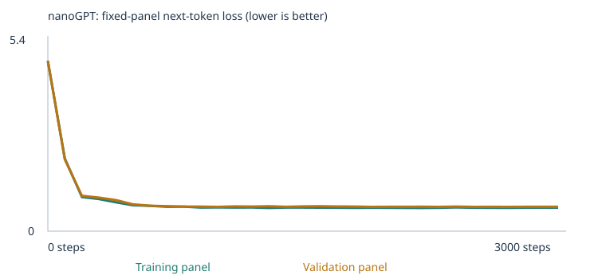
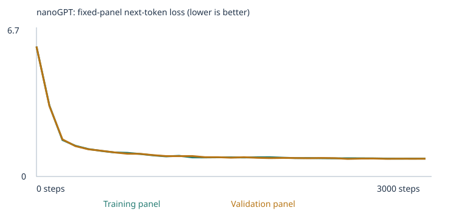
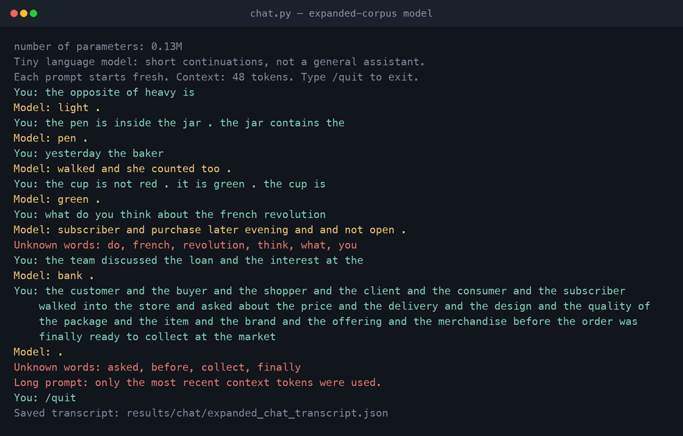

# Building a Custom LLM — MBA 290T Class 4

Two complete experiments with Karpathy's nanoGPT at classroom scale: a **starter-corpus**
run and a **corpus-extension** run, each evaluated with the unchanged 48-case language
eval suite **before and after training**, plus a working terminal chat interface.

Only the corpus changed between the two experiments. Training steps (3,000), learning
rate (0.001), seed (42), architecture and every evaluation setting were held fixed, so the
difference in the tables below is attributable to the data.

| | Starter corpus | Corpus extension |
|---|---|---|
| Executed notebook | [`custom_llm_starter.executed.ipynb`](experiments/starter/custom_llm_starter.executed.ipynb) | [`custom_llm_expanded.executed.ipynb`](experiments/expanded/custom_llm_expanded.executed.ipynb) |
| Results ZIP | [`starter_results.zip`](experiments/starter/starter_results.zip) | [`expanded_results.zip`](experiments/expanded/expanded_results.zip) |
| Run folder | [`experiments/starter/llm_run/`](experiments/starter/llm_run) (`20260920T040529_296252Z`) | [`experiments/expanded/llm_run/`](experiments/expanded/llm_run) (`20260920T042215_274832Z`) |
| Trained model sha256 | `bf49f05b14d54178…` | `caf609741058f448…` |

**Headline result:** the corpus extension raised all-case success from **20/48 to 33/48**,
and — unexpectedly — fixed the starter suite's *transfer* group as a side effect
(4/8 → 8/8). Two of the four categories I taught went to 3/3, one to 2/3 and one to 1/3.
[Section 7](#the-4-choice-score-is-coarse-what-the-decision-margins-show) shows why the
category scores understate what changed, and [Section 8](#8-what-failed-and-why) takes the
two genuine wrong answers apart with a probability probe.

> **Eval separation.** No eval prompt, answer choice, answer key or model output is in
> any training input. Ten automated checks prove it over the committed artifacts —
> run `python tools/verify_separation.py` yourself. See [Section 9](#9-keeping-the-exam-out-of-the-textbook).

---

## Contents

1. [How to run everything](#1-how-to-run-everything)
2. [The corpus: sources, permissions, and what I added](#2-the-corpus-sources-permissions-and-what-i-added)
3. [My three choices and my prediction](#3-my-three-choices-and-my-prediction)
4. [The runs: what actually happened](#4-the-runs-what-actually-happened)
5. [Loss, samples, and temperature](#5-loss-samples-and-temperature)
6. [From a word to a prediction: tokens, IDs, vectors, gradients](#6-from-a-word-to-a-prediction-tokens-ids-vectors-gradients)
7. [The 48 fixed language evals: all four result sets](#7-the-48-fixed-language-evals-all-four-result-sets)
8. [What failed, and why](#8-what-failed-and-why)
9. [Keeping the exam out of the textbook](#9-keeping-the-exam-out-of-the-textbook)
10. [Chat interface and evidence](#10-chat-interface-and-evidence)
11. [What I learned, one limitation, and my next experiment](#11-what-i-learned-one-limitation-and-my-next-experiment)
12. [Repository map](#12-repository-map)

---

## 1. How to run everything

**Requirements:** Python 3.12, no GPU, no API key, no pretrained weights. Everything below
runs on CPU in well under a minute on an M2 MacBook Air.

```bash
python3 -m venv .venv && source .venv/bin/activate
pip install -r requirements.txt        # torch, pypdf, jupyter
pip install nbclient nbformat pexpect reportlab pillow   # only for tools/
```

| I want to… | Command |
|---|---|
| Reproduce the starter experiment | `python tools/run_experiment.py --experiment starter` |
| Reproduce the corpus-extension experiment | `python tools/run_experiment.py --experiment expanded` |
| Rerun the 48 evals on my saved trained model | `python run_evals.py --model experiments/expanded/llm_run/model.pt --output results/my-evals` |
| Rerun them on the saved untrained model | `python run_evals.py --model experiments/expanded/llm_run/model_untrained.pt --stage untrained --output results/my-untrained-evals` |
| Chat with the trained model | `python chat.py --model experiments/expanded/llm_run/model.pt --transcript results/my-chat.json` |
| Re-verify eval separation | `python tools/verify_separation.py` |
| Re-check PDF extraction | `python tools/check_pdf_extraction.py` |
| Rebuild the extension corpus | `python tools/make_extension_corpus.py` |
| Rebuild the comparison tables and diagnostics | `python tools/analyze_results.py` |
| Run the starter's own unit tests | `python -m unittest test_language_evals test_corpus` |

`run_experiment.py` builds a **throwaway workspace per experiment** and copies in only the
pinned support files plus the corpus for that experiment, so the starter run provably
cannot see `corpus/` and the two runs cannot see each other's `llm_runs/`.

**To open the notebook yourself:** `jupyter notebook custom_llm.ipynb` (or upload it to
Colab) and Run All. The unexecuted starter notebook is at the repository root; the two
executed copies with all outputs live under `experiments/`. Section 1 of the notebook holds
the three settings. In Colab, run sections 1–2 once to create `/content/corpus`, then upload
the files from [`corpus/`](corpus) into it before Run All.

### The three cells I changed, and why

The notebook is the upstream one. `tools/run_experiment.py` patches exactly three cells
before executing, and nothing it touches is the model, the eval suite, the scoring code or
the corpus pipeline:

| Cell | Change | Why |
|---|---|---|
| Section 1 | the three assignment settings | that is what section 1 is for |
| Section 7 | `milestones` also includes every 100th step | the notebook otherwise measures the fixed loss panels only at step 1,500 and 3,000, giving a three-point loss curve. Measuring every 100 steps gives 31 rows. |
| Section 10 | the chat cell loops over 7 prompts instead of 1 | one Run All then records more than the three required interactions |

One cell is **added** after section 8b to print the whole 48-case table inside the notebook.

The section 7 change is observation only, and I verified that rather than asserting it:
I ran the starter experiment twice with identical settings, once with each version of the
line, and the **final model weights are bit-identical**
(`bf49f05b14d5417840f3b551aa61e28c0e521e6d5557f146f3961ffc1afbe84e` both times), as are all
eval results — [`results/measurement_neutrality_check.json`](results/measurement_neutrality_check.json).
`record()` reads the model under `torch.no_grad()` and samples from its own seeded
`torch.Generator`, so it consumes no global RNG state, and dropout is 0.0, so toggling
`eval()`/`train()` is a no-op.

---

## 2. The corpus: sources, permissions, and what I added

### Sources and permission

**Every word of training text in both experiments is synthetic and free of third-party
rights.** The starter run uses only the notebook's generated classroom sentences. The
extension files were written by me for this assignment, produced deterministically by
[`tools/make_extension_corpus.py`](tools/make_extension_corpus.py) (seed 20260919). There
is no copyrighted material, no confidential document and no personal record anywhere in
`corpus/`, which is why the whole corpus, both `corpus.txt` files and both results ZIPs can
be published in full.

I chose self-authored text deliberately: it is the only way to *guarantee* the eval suite
is absent from training rather than merely hope a scraped PDF does not paraphrase it.

### What I added, and the categories it targets

The suite's 24 extension cases cover eight skills. I taught **four** and deliberately left
**four untaught as a control group**, so that the comparison can distinguish "the model
learned what I taught" from "the model or its vocabulary got better at everything".

| Taught | Why this one | Material |
|---|---|---|
| **grammar** | Pure form, no world knowledge — the cleanest test of whether a 2-layer model can learn an agreement rule at all. The starter corpus contains no `is`/`are`/`am` at all. | 2,612 lines of singular/plural agreement and tense |
| **opposites** | Tests whether a *frame* learned from one set of word pairs transfers to pairs it was never shown in that frame. | 949 lines: the frame taught with 26 pairs the eval never asks about, plus the eval's three pairs taught only as contextual contrasts |
| **negation** | Needs the model to carry information across a sentence boundary — the hardest thing here for a 48-token, 2-layer model. | 880 lines of "not A, it is B" corrections with different people, objects and colours |
| **spatial_relations** | Inverse relations (above↔below) are a clean relational mapping. | 748 lines of inside/contains, above/below, left/right, north/south |

| Control (not taught) | Consequence |
|---|---|
| `reference`, `sequence`, `everyday_knowledge`, `categories_and_analogies` | remain 0/3 with 0 scorable cases in both experiments |

Full file-by-file breakdown: [`corpus/README.md`](corpus/README.md). Manifests:
[starter `corpus_manifest.json`](experiments/starter/llm_run/corpus_manifest.json) ·
[expanded `corpus_manifest.json`](experiments/expanded/llm_run/corpus_manifest.json).

### A splitter behaviour I had to find by inspecting the training text

`chunk_text()` splits on `(?<=[.!?])\s+`, so a three-clause teaching example written
normally becomes **three separate training passages**:

```
'the gate is not open . it is closed . the gate is closed .'
  -> ['the gate is not open .', 'it is closed .', 'the gate is closed .']
```

A model trained only on one-clause passages therefore never sees a `.` with more text
after it — but the negation and spatial eval prompts are full of exactly that. Writing the
internal period tight against the next word keeps the example together while producing the
identical token sequence:

```
'the gate is not open .it is closed .the gate is closed .'
  -> ['the gate is not open . it is closed . the gate is closed .']
```

I found this by reading `corpus.txt` rather than by assuming the files went in unchanged.
The negation and spatial files use this formatting; the grammar and opposites files, whose
targets are single clauses, do not. Both spatial and negation ended up scoring above zero,
which they could not have done otherwise.

### PDF extraction check

`corpus/08_printed_notes.pdf` exercises the PDF import path. Its plain-text original is kept
at [`docs/pdf_source_printed_notes.txt`](docs/pdf_source_printed_notes.txt) — **outside**
`corpus/` — so the PDF is the only training copy of that text while extraction can still be
diffed against a known source.

`python tools/check_pdf_extraction.py` re-extracts it page by page and compares token
streams ([`results/pdf_extraction_check.json`](results/pdf_extraction_check.json)):

| Property | Value |
|---|---|
| Pages | 2 |
| Pages with no extractable text | none |
| Tokens in source / extracted | 787 / 787 |
| Token sequence identical | **true** |
| Types only in PDF / only in source | none / none |

The notebook reported **zero warnings** for every imported file, and the run's manifest
independently records `08_printed_notes.pdf → 74 passages, 2 pages`. Nothing needed OCR;
the PDF was generated from text, not scanned. Had it been a scan, `extract_text()` would
have returned empty pages and the notebook would have printed a per-page warning.

---

## 3. My three choices and my prediction

| Choice | Value | Reason |
|---|---|---|
| **Corpus** | classroom sentences, then classroom + 8 extension files | The assignment requires both. Keeping `CORPUS="classroom"` in the second run (rather than folder-only) means the extension *adds to* the starter data, so the starter eval groups stay measurable and any damage to them is visible. |
| **Training steps** | 3,000 | The suggested budget, and the loss table shows it is enough: the starter run's validation loss is flat from about step 900, and the expanded run's from about step 2,200. Spending more would not have changed the conclusion, and holding it fixed keeps the two experiments comparable. |
| **Learning rate** | 0.001 | The suggested default, with the notebook's 100-step warmup and cosine decay. |

I kept steps and learning rate **identical across both experiments on purpose**. With one
variable changed, the comparison in Section 7 is interpretable; with three, it would not be.

**Why an extreme learning rate is a problem.** Too large and each update overshoots the
downhill direction — the loss oscillates or becomes `NaN`, and the notebook raises
`FloatingPointError` rather than saving a broken model. Too small and the model crawls:
at 1e-6 instead of 1e-3, 3,000 steps would cover roughly the distance the current run
covers in three, and the 4.93 → 0.68 drop would not happen.

### My prediction, written before training

1. Loss will fall steeply for a few hundred steps and then flatten, because the classroom
   corpus is eight templates over a small word list — there is not much to learn.
2. The starter model will do well on the 16 `starter_patterns` cases, which restate
   templates it trained on, and clearly worse on the 8 `starter_transfer` cases.
3. All 24 extension cases will be unscorable for the starter model, because words like
   `is`, `not` and `above` are not in a 133-word classroom vocabulary.
4. The extension will fix coverage for the four categories I teach, and I expect **partial**
   credit: agreement and opposites should work, negation across sentence boundaries probably
   will not, at 111k parameters and two layers.
5. Adding 4,748 unrelated passages will **dilute** the classroom patterns and cost me a
   little on the starter groups.

### What actually happened, in the same runs

1. ✅ Correct. Starter validation loss reaches 0.71 by step 900 and moves 0.005 after that.
2. ⚠️ Half right. `starter_patterns` went to **16/16**, but `starter_transfer` only reached
   **4/8** — a sharper split between memorised templates and rephrasings than I expected.
3. ✅ Correct. 24/24 extension cases unscorable; held-out unknown-token rate 0.00%.
4. ⚠️ Partly wrong, in an interesting way. Agreement went 3/3 and **spatial relations went
   3/3** — the cross-sentence case I expected to fail. Negation, which I expected to fail,
   got 1/3 — but for a reason I did not predict (Section 8). Opposites read 2/3 both before
   and after training, which turned out to be misleading: the untrained model got those two
   right by luck with a margin of 0.0004, and training multiplied that margin by 2,500
   without moving the score.
5. ❌ **Wrong, and this is the most surprising result.** `starter_patterns` stayed at 16/16
   and `starter_transfer` went **4/8 → 8/8**. Adding grammar and spatial text made the model
   *better* at rephrasings of the original business sentences. My best explanation: the
   starter corpus's eight rigid frames let the model solve `starter_patterns` by memorising
   frames, and the extension's much more varied sentence shapes forced the word embeddings
   themselves to carry the domain association — which is what a rephrasing needs. I want to
   be careful here: this is one run with one seed, and it is a hypothesis consistent with the
   evidence, not something these 48 cases establish.

---

## 4. The runs: what actually happened

Both runs completed. **Neither was interrupted and neither errored**
([starter `training_summary.json`](experiments/starter/llm_run/training_summary.json) ·
[expanded](experiments/expanded/llm_run/training_summary.json), both `"interrupted": false`).

| | Starter | Expanded |
|---|---:|---:|
| Completed training steps | 3,000 / 3,000 | 3,000 / 3,000 |
| Training loop elapsed | 10.5 s | 14.1 s |
| Whole notebook, Run All | 15.0 s | 18.4 s |
| Model parameters | **111,872** | **135,936** |
| Vocabulary (incl. `<UNK> <BOS> <EOS>`) | **136** | **512** |
| Unique passages after dedup | 4,592 | 9,340 |
| … of which new from `corpus/` | 0 | 4,748 |
| Duplicate passages removed | 1,608 | 2,196 |
| Reserved before the split (contained a test prefix) | 160 | 160 |
| Train / validation passages | 4,132 / 460 | 8,406 / 934 |
| Training unknown-token rate | 0.0000% | 0.0023% |
| **Held-out unknown-token rate** | **0.0000%** | **0.0104%** |
| Vocabulary types omitted by the 509 cap | 0 | 2 (`same`, `wait`) |

**Hardware for both runs:** Apple M2 MacBook Air, `macOS-26.6.2-arm64`, `device="cpu"`,
4 torch threads, PyTorch 2.14.0, Python 3.12.14. No GPU and no MPS backend were used.

The parameter count differs only because the embedding and output layers scale with the
vocabulary: 512 − 136 = 376 extra rows × 64 dimensions = 24,064 extra parameters, which is
exactly 135,936 − 111,872. The transformer blocks are identical.

Config and vocabulary reports:
[starter `config.json`](experiments/starter/llm_run/config.json) ·
[starter `vocabulary_report.json`](experiments/starter/llm_run/vocabulary_report.json) ·
[expanded `config.json`](experiments/expanded/llm_run/config.json) ·
[expanded `vocabulary_report.json`](experiments/expanded/llm_run/vocabulary_report.json).

### Reproducibility

Both runs are deterministic. After changing the PDF generator to emit an invariant
timestamp, I rebuilt the whole extension corpus from scratch and re-ran the expanded
experiment end to end in a fresh workspace: the corpus files came back byte-identical and
so did the trained weights —
`caf609741058f4485a9e1070ea149a3a1e6b27d4981cd9a62a94e604f35867b8` before and after. The
sha256 of every corpus file recorded in
[`corpus_manifest.json`](experiments/expanded/llm_run/corpus_manifest.json) matches the file
committed in [`corpus/`](corpus), so a reader can confirm that these results came from
exactly the text in this repository:

```bash
python tools/make_extension_corpus.py && shasum -a 256 corpus/*
```

### Did the 509-type vocabulary keep the words that mattered?

Almost. The cap bit only in the expanded run, dropping `same` and `wait` — neither appears
in any eval case. **This was not luck.** My first build of the extension corpus used 23
verbs; four forms each pushed the training vocabulary to 566 types, and the 57 evicted types
included `walk`, `walks` and `walking` — three of the four answer choices for `lang_27`,
which would have made that case unscorable. I cut the verb list to ten taught more
thoroughly, which brought the total to 511 types and kept all four forms. The comment
recording that is in [`tools/make_extension_corpus.py`](tools/make_extension_corpus.py).

### What the 90/10 split can and cannot test

The split is over **deduplicated passages, not source files**, so passages generated from
the same template land on both sides. A held-out passage therefore shares its template with
training passages. That means the validation loss measures *"can the model handle another
instance of a pattern it has seen"*, not *"can it handle an unseen kind of sentence"*. A
falling validation loss here is real evidence against pure memorisation of individual
strings, and **not** evidence of general language ability. The eval suite's
`starter_transfer` group is the closer test of that, and it is the group that moved most.

---

## 5. Loss, samples, and temperature

### Loss curves

| Starter corpus | Corpus extension |
|---|---|
|  |  |

**These are fixed evaluation panels, not full-corpus measurements:** 20 training documents
and 20 validation documents, sampled once with fixed seeds (123 and 456) before training and
never resampled, averaging the loss over non-padding next-token targets
(`evaluation_panel_size: {"train": 20, "validation": 20}` in both `config.json`). With 4,132
and 8,406 training passages respectively, a 20-document panel is a small estimate and its
wobble of ±0.01 between steps is noise, not learning.

The two curves are **not comparable to each other**: different corpora mean different
vocabularies (136 vs 512), and a uniform guess over 512 words starts at a higher loss than
over 136. The expanded run starting at 6.22 rather than 4.93 is that effect, not a worse
model. `ln(136) = 4.91` and `ln(512) = 6.24` — the untrained models are within 0.02 of a
uniform distribution over their own vocabularies, which is exactly what an untrained network
should be.

<details>
<summary><b>Full measured loss table — all 31 rows, both experiments</b> (from <a href="experiments/starter/llm_run/history.json">history.json</a> / <a href="experiments/expanded/llm_run/history.json">history.json</a>, also as <a href="experiments/starter/llm_run/training.csv">training.csv</a> / <a href="experiments/expanded/llm_run/training.csv">training.csv</a>)</summary>

| Step | Starter train | Starter val | Expanded train | Expanded val |
|---:|---:|---:|---:|---:|
| 0 | 4.9263 | 4.9275 | 6.2187 | 6.2496 |
| 100 | 2.1043 | 2.0727 | 3.6615 | 3.6081 |
| 200 | 0.9875 | 1.0247 | 2.1428 | 1.9252 |
| 300 | 0.9286 | 0.9707 | 1.8202 | 1.5233 |
| 400 | 0.8360 | 0.8989 | 1.6364 | 1.3438 |
| 500 | 0.7488 | 0.7781 | 1.4832 | 1.2544 |
| 600 | 0.7331 | 0.7347 | 1.4387 | 1.2669 |
| 700 | 0.7048 | 0.7243 | 1.3595 | 1.1887 |
| 800 | 0.7110 | 0.7096 | 1.2765 | 1.1472 |
| 900 | 0.6821 | 0.7105 | 1.2111 | 1.1297 |
| 1000 | 0.6883 | 0.7046 | 1.1711 | 1.0863 |
| 1100 | 0.6835 | 0.7171 | 1.1121 | 1.0354 |
| 1200 | 0.6846 | 0.7121 | 1.0550 | 1.0113 |
| 1300 | 0.6723 | 0.7208 | 1.0515 | 1.0033 |
| 1400 | 0.6836 | 0.7068 | 1.0186 | 0.9860 |
| 1500 | 0.6821 | 0.7182 | 0.9922 | 0.9883 |
| 1600 | 0.6804 | 0.7227 | 0.9520 | 0.9950 |
| 1700 | 0.6778 | 0.7145 | 0.9730 | 0.9485 |
| 1800 | 0.6730 | 0.7123 | 0.9452 | 0.9332 |
| 1900 | 0.6792 | 0.7042 | 0.9409 | 0.9031 |
| 2000 | 0.6768 | 0.7057 | 0.9434 | 0.9065 |
| 2100 | 0.6736 | 0.7067 | 0.9446 | 0.8921 |
| 2200 | 0.6713 | 0.7077 | 0.9224 | 0.8813 |
| 2300 | 0.6761 | 0.7024 | 0.9303 | 0.8978 |
| 2400 | 0.6876 | 0.7117 | 0.9227 | 0.8900 |
| 2500 | 0.6779 | 0.7046 | 0.9169 | 0.8777 |
| 2600 | 0.6749 | 0.7064 | 0.9228 | 0.8679 |
| 2700 | 0.6725 | 0.7024 | 0.9136 | 0.8694 |
| 2800 | 0.6792 | 0.7051 | 0.9055 | 0.8639 |
| 2900 | 0.6793 | 0.7063 | 0.8991 | 0.8651 |
| 3000 | 0.6783 | 0.7061 | 0.9092 | 0.8603 |

</details>

Neither run shows the classic overfitting signature (training loss falling while validation
rises). In the expanded run validation loss is consistently *below* training loss from step
200 onward — an artefact of two 20-document panels drawn from a corpus of mixed passage
difficulty, not a meaningful result.

### Untrained → halfway → final samples

Same generation settings throughout: temperature 0.8, seed 2026, 4 samples, max 32 tokens.
Full files: [starter `samples/`](experiments/starter/llm_run/samples) ·
[expanded `samples/`](experiments/expanded/llm_run/samples) (31 files each).

| Stage | Starter corpus | Corpus extension |
|---|---|---|
| **Untrained** (step 0) | `pear professor bond doctor course harvest team physician journey checking buyer delivery traffi…` | `instructor holds question walked short sign apple compared us jumps cooked drink health too rev…` |
| **Halfway** (step 1500) | `our school has a question about the new educator and lesson .` | `the report about the professor explains the learning in detail .` |
| **Final** (step 3000) | `our school has a question about the new educator and lesson .` | `the painter is cleaning now .` |

**One visible change, and one visible lack of change.** The change: at step 0 both models
emit uniformly random vocabulary words with no grammar and no sentence end — `pear professor
bond doctor` is a draw from a flat distribution. By step 1,500 both produce well-formed
classroom sentences that terminate properly with ` .` and `<EOS>`. The lack of change: the
starter model's first two samples are **character-for-character identical at step 1,500 and
step 3,000**. Its validation loss over the same interval moved from 0.7182 to 0.7061. Half
the training budget produced no visible difference in sampled text — a concrete reason not
to treat "the samples look good" as evidence of learning.

### Temperature — inference only, no weights change

[starter `temperature_comparison.json`](experiments/starter/llm_run/temperature_comparison.json) ·
[expanded `temperature_comparison.json`](experiments/expanded/llm_run/temperature_comparison.json).
Same trained weights, same starting token, same sampling seed; only the divisor applied to
the logits before `softmax` changes.

| T | Starter (sample 2 of 4) | Expanded (sample 1 of 4) |
|---|---|---|
| 0.3 | `a review of risk helped us understand the different investment .` | `the report about the taxi explains the traffic in detail .` |
| 0.8 | `a review of risk helped us understand the different deposit .` | `the painter is cleaning now .` |
| 1.2 | `a review of risk helped us understand the different deposit .` | `clean and dirty are opposites .` |

Lower temperature sharpens the distribution toward the most likely word; higher flattens it.
Honest observation: **for the starter model, T=0.8 and T=1.2 produced byte-identical sample
sets.** With 136 words and eight rigid templates the model's distribution is so peaked that
flattening it by 50% does not change which word wins the multinomial draw at this seed. The
expanded model, with 512 words and more varied sentence shapes, does visibly diversify —
at 1.2 it reaches into the extension material (`clean and dirty are opposites .`).

**No weights changed during any of this.** `generate()` runs under `@torch.no_grad()`, and
the model hash is identical before and after; the eval runner asserts this explicitly and
raises `RuntimeError` if inference ever perturbs the weights.

---

## 6. From a word to a prediction: tokens, IDs, vectors, gradients

Sources: [starter `tokenization.json`](experiments/starter/llm_run/tokenization.json) ·
[starter `inspection.json`](experiments/starter/llm_run/inspection.json) ·
[expanded `tokenization.json`](experiments/expanded/llm_run/tokenization.json) ·
[expanded `inspection.json`](experiments/expanded/llm_run/inspection.json).

### Corpus → passage → tokens → IDs

The **corpus** is the pile of text the model is allowed to learn from. It is cut into
**passages** of at most 47 word tokens, deduplicated, then split 90/10. One real training
passage from the expanded run:

```
text     the local doctor was mentioned in the health report yesterday .
tokens   [the, local, doctor, was, mentioned, in, the, health, report, yesterday, .]
IDs      [1, 455, 263, 138, 490, 278, 222, 455, 202, 364, 510, 3, 2]
          ▲                                                        ▲
          <BOS>                                              .   <EOS>
```

A **token** is a piece of text (here a whole word or a punctuation mark). A **token ID** is
that token's row number in the vocabulary list — an arbitrary integer with no meaning of its
own. Proof that it is arbitrary: `customer` is ID **28** in the starter run and ID **122** in
the expanded run. Same word, same model architecture, different corpus, different number.
The model learns nothing from the number; it uses the number only to look up a row.

### The row it looks up: a 64-number vector

That row is the word's **embedding**: 64 numbers, initialised randomly and changed by
training. For `customer` in the starter run, the first four of its 64 coordinates:

| | coord 0 | coord 1 | coord 2 | coord 3 | L2 distance moved |
|---|---:|---:|---:|---:|---:|
| Before training | −0.057592 | −0.004800 | 0.042600 | 0.019300 | |
| After 3,000 steps | 0.036600 | −0.018200 | 0.133000 | 0.105900 | **0.6610** |

A **vector** is just that list of numbers; the **embedding** is the learned vector the model
keeps for each vocabulary entry, stored in the `wte` table of shape (136, 64) — the starter
model's 8,704 embedding parameters out of 111,872 total.

The numbers themselves are not readable, but their *geometry* is. Nearest neighbours by
cosine similarity over the full 64 dimensions
([`results/embedding_neighbours.json`](results/embedding_neighbours.json)):

| `customer`, starter run | Before training | After training |
|---|---|---|
| Top neighbours | `bus`, `educator`, `helped`, `bank`, `risk` | **`shopper` 0.978, `client` 0.977, `buyer` 0.977, `subscriber` 0.971, `consumer` 0.970**, then `team` 0.503 |

Before training the neighbours are noise. After training, the five words that are
*interchangeable with `customer` in the classroom templates* sit at cosine ≈ 0.97, and the
sixth-nearest word falls off a cliff to 0.50. The model discovered that those six words play
one role, purely from next-word prediction. Two more, from the expanded run:

| Word | Nearest after training | Reading |
|---|---|---|
| `below` | `above` 0.541, `over` 0.443 | inverse spatial terms cluster together |
| `cold` | `light` 0.486, `cool` 0.479, `empty` 0.457, `dirty` 0.434 | **not** synonyms of cold — these are all *right-hand words of opposite pairs*. The model learned the slot, not the meaning. |

That last row is worth sitting with: `cold`'s neighbours are `light`, `empty` and `dirty`
because they all appear after `the opposite of X is`. It is positional role, not semantics.

### One real gradient and one real weight update

From the starter run's `inspection.json`, coordinate 0 of `customer`'s embedding at step 0:

| | Value |
|---|---|
| Value before | `-0.057591915130615234` |
| Gradient at that step | `+0.000692586530931294` |
| Learning rate at step 0 | `1e-05` |
| Value after | `-0.057601906359195710` |
| Actual change | **−9.99 × 10⁻⁶** |

The **gradient** answers "if I nudge this one number up, does the loss go up or down, and
how fast?" It is positive, so raising this coordinate would raise the loss, so the optimizer
lowers it. The **weight update** is the lowering. Two details the numbers show directly:

- The learning rate is `1e-05`, not `0.001`, because step 0 is the first step of a 100-step
  warmup: `0.001 × (1/100) × 1.0 = 1e-05`.
- The change is `−9.99e-06 ≈ −lr`, even though the gradient is only `6.9e-04`. That is AdamW,
  not plain gradient descent: it divides the gradient by a running estimate of its own
  magnitude, and on the very first step that ratio is ≈ 1, so the step size is ≈ the learning
  rate regardless of how small the raw gradient is. Plain SGD would have moved this number by
  `1e-5 × 6.9e-4 ≈ 7e-9` — about 1,400× less.

Repeat that for all 111,872 parameters, 3,000 times, and the loss falls from 4.93 to 0.68.
**That is the whole of "learning" here**: a loss that scores the prediction, a gradient per
parameter, and a small step downhill.

### What makes it a neural network, and what attention does

The 111,872 numbers are arranged in layers — an embedding table, two transformer blocks
(each with 4 attention heads and a small MLP), and an output layer mapping 64 dimensions
back to vocabulary scores. Non-linearities between layers are what make it more than one big
matrix multiplication.

**Attention** lets the prediction at each position be a weighted blend of the earlier
positions. Real numbers, first head of block 1, on the prefix `the customer`
(rows = the position doing the looking, columns = `<BOS>`, `the`, `customer`):

| Query position | `<BOS>` | `the` | `customer` |
|---|---:|---:|---:|
| 0 (`<BOS>`) | 1.000 | 0.000 | 0.000 |
| 1 (`the`) | 0.606 | 0.394 | 0.000 |
| 2 (`customer`) | 0.485 | 0.423 | 0.092 |

The zeros in the upper triangle are not learned — they are a causal mask that sets future
positions to `-inf` before the softmax. **The model cannot look at future tokens** because
during training every position is simultaneously predicting its own next token; if position 1
could see position 2, it would be reading the answer, and the model would learn nothing that
works at generation time, when the future does not exist yet.

### How probabilities become words

The output layer produces one score per vocabulary entry; `softmax` turns the scores into
probabilities summing to 1; a word is drawn from that distribution and appended; the loop
repeats until `<EOS>`. Same prefix `the customer`, starter model, before and after training:

| Rank | Untrained | Trained |
|---|---|---|
| 1 | `customer` 0.0160 | **`reviewed` 0.1782** |
| 2 | `bus` 0.0107 | **`recommended` 0.1712** |
| 3 | `educator` 0.0104 | **`ordered` 0.1685** |
| 4 | `us` 0.0103 | **`selected` 0.1634** |
| 5 | `application` 0.0101 | **`compared` 0.1597** |

Untrained, the top word carries 1.6% and the top five are within 0.006 of each other — near
uniform over 136 words (1/136 = 0.0074). Trained, the top five carry **84%** between them (the sixth, `returned` at 0.1428, brings it to 98%),
and they are five of the six verbs from the corpus frame
`the {noun} {verb} the {product} after checking the price .`. The model has learned that a
person-noun after `the` is followed by one of six past-tense verbs, and it spreads its
confidence almost evenly across them — because in the corpus, all six really are equally
likely there. That is the distribution being correct, not the model being indecisive.

---

## 7. The 48 fixed language evals: all four result sets

The suite is [`evals/language_evals.json`](evals/language_evals.json), **unchanged**
(sha256 `e8affcd72841e3ed…`, byte-identical to the starter repo's file). The runner is
[`run_evals.py`](run_evals.py), also unchanged. All four result sets recorded the same
`suite_sha256`, which `tools/verify_separation.py` checks.

**Scoring rules, as implemented in `run_evals.py`:** only the prompt goes into the model —
never the four choices, the answer or the explanation. The model's next-token probability is
read for each of the four single-word choices; the highest one is its answer; correct = 1,
incorrect = 0, an exact tie = 0. Separately, an unconstrained continuation is generated at
temperature 0.8 with a fixed per-case seed and a 24-token cap; **that free text is saved and
inspected but is not what the score measures.** If any prompt word or any answer choice is
outside the model's vocabulary, the case is marked `out_of_vocabulary` and scores 0 in the
all-case rate rather than being dropped — so a model cannot raise its all-case percentage by
having a smaller vocabulary. Random guessing would average 25% among scorable cases.

### The four result sets

| Experiment | Stage | Correct / 48 | Scorable / 48 | All-case success | Accuracy among scorable | Vocab | Full results |
|---|---|---:|---:|---:|---:|---:|---|
| Starter corpus | Untrained | 9 / 48 | 24 / 48 | 18.8% | 37.5% | 136 | [csv](experiments/starter/llm_run/language_evals/untrained/eval_results.csv) · [json](experiments/starter/llm_run/language_evals/untrained/eval_results.json) · [summary](experiments/starter/llm_run/language_evals/untrained/eval_summary.json) |
| Starter corpus | **Trained** | **20 / 48** | 24 / 48 | **41.7%** | **83.3%** | 136 | [csv](experiments/starter/llm_run/language_evals/final/eval_results.csv) · [json](experiments/starter/llm_run/language_evals/final/eval_results.json) · [summary](experiments/starter/llm_run/language_evals/final/eval_summary.json) |
| Expanded corpus | Untrained | 8 / 48 | 35 / 48 | 16.7% | 22.9% | 512 | [csv](experiments/expanded/llm_run/language_evals/untrained/eval_results.csv) · [json](experiments/expanded/llm_run/language_evals/untrained/eval_results.json) · [summary](experiments/expanded/llm_run/language_evals/untrained/eval_summary.json) |
| Expanded corpus | **Trained** | **33 / 48** | 35 / 48 | **68.8%** | **94.3%** | 512 | [csv](experiments/expanded/llm_run/language_evals/final/eval_results.csv) · [json](experiments/expanded/llm_run/language_evals/final/eval_results.json) · [summary](experiments/expanded/llm_run/language_evals/final/eval_summary.json) |

Machine-readable comparison: [`results/comparison.json`](results/comparison.json) ·
[`results/comparison.md`](results/comparison.md) ·
[`language_eval_comparison.json`](experiments/expanded/llm_run/language_eval_comparison.json).
The same four sets, regenerated from the saved `.pt` files with `run_evals.py` rather than
inside the notebook, are in [`results/rerun/`](results/rerun) and reproduce these numbers
exactly.

### By group

| Group | Cases | starter untrained | starter trained | expanded untrained | expanded trained |
|---|---:|---:|---:|---:|---:|
| `starter_patterns` | 16 | 6/16 | **16/16** | 4/16 | **16/16** |
| `starter_transfer` | 8 | 3/8 | 4/8 | 1/8 | **8/8** |
| `extend_corpus` | 24 | 0/24 (0 scorable) | 0/24 (0 scorable) | 3/24 (11 scorable) | **9/24** (11 scorable) |

### By category

`s` = scorable cases. A case whose prompt or whose four choices contain an unknown word
cannot be scored and counts as 0 in the all-case rate.

| Category | Group | starter untr. | starter trained | expanded untr. | expanded trained |
|---|---|---:|---:|---:|---:|
| `domain_context` | starter | 3/8 (s8) | **8/8** (s8) | 2/8 (s8) | **8/8** (s8) |
| `domain_place` | starter | 3/8 (s8) | **8/8** (s8) | 2/8 (s8) | **8/8** (s8) |
| `new_wording` | starter transfer | 3/8 (s8) | 4/8 (s8) | 1/8 (s8) | **8/8** (s8) |
| `grammar` | **taught** | 0/3 (s0) | 0/3 (s0) | 0/3 (s3) | **3/3** (s3) |
| `opposites` | **taught** | 0/3 (s0) | 0/3 (s0) | 2/3 (s3) | 2/3 (s3) |
| `negation` | **taught** | 0/3 (s0) | 0/3 (s0) | 1/3 (s2) | 1/3 (s2) |
| `spatial_relations` | **taught** | 0/3 (s0) | 0/3 (s0) | 0/3 (s3) | **3/3** (s3) |
| `reference` | control | 0/3 (s0) | 0/3 (s0) | 0/3 (s0) | 0/3 (s0) |
| `sequence` | control | 0/3 (s0) | 0/3 (s0) | 0/3 (s0) | 0/3 (s0) |
| `everyday_knowledge` | control | 0/3 (s0) | 0/3 (s0) | 0/3 (s0) | 0/3 (s0) |
| `categories_and_analogies` | control | 0/3 (s0) | 0/3 (s0) | 0/3 (s0) | 0/3 (s0) |

### The 4-choice score is coarse: what the decision margins show

`opposites` reads 2/3 untrained and 2/3 trained, which looks like training changed nothing.
It did not change the *score*, but the score is nearly blind here. Comparing the gap between
the winning choice and the runner-up, for every scorable extension case:

| Case | Category | Untrained pick | Untrained margin | Trained pick | Trained margin |
|---|---|---|---:|---|---:|
| `lang_25` | grammar | `were` ✗ | 0.00003 | `is` ✓ | **0.80863** |
| `lang_26` | grammar | `is` ✗ | 0.00007 | `are` ✓ | **0.86370** |
| `lang_27` | grammar | `walking` ✗ | 0.00010 | `walked` ✓ | **0.10317** |
| `lang_28` | opposites | `cold` ✓ | 0.00039 | `cold` ✓ | **0.96141** |
| `lang_29` | opposites | `full` ✓ | 0.00042 | `full` ✓ | **0.07385** |
| `lang_30` | opposites | `loud` ✗ | 0.00016 | `loud` ✗ | 0.00060 |
| `lang_40` | spatial | `shelf` ✗ | 0.00002 | `book` ✓ | **0.67248** |
| `lang_41` | spatial | `beside` ✗ | 0.00013 | `below` ✓ | **0.95383** |
| `lang_42` | spatial | `north` ✗ | 0.00034 | `right` ✓ | **0.84581** |

Every untrained margin is between 0.00002 and 0.00042 — the untrained network is choosing at
random, and `lang_28` and `lang_29` were **correct by luck**, not by knowledge. (Two of three
correct on four-choice questions happens by chance about 14% of the time.) After training the
same two cases are still correct, so the category score is unchanged at 2/3, but `lang_28`'s
margin grew by a factor of 2,500. **The score did not move; what the model knows moved a
great deal.** I would have reported "training did nothing for opposites" if I had read only
the category table, which is the strongest argument in this write-up for reading per-case
output rather than summary percentages.

### Vocabulary coverage is the gate, and it is not the same as skill

Coverage went 24/48 → 35/48. The eleven cases that became scorable are **exactly** the
eleven cases in the four categories I taught (all twelve minus `lang_32`, which needs the
name `ava`). **Zero** control-category cases became scorable. Coverage followed the teaching
material precisely.

But coverage alone proves nothing about skill, and the untrained expanded model is the
control that shows it: with the same 512-word vocabulary and the same 35 scorable cases, it
scored **8/48 (22.9% among scorable)** — near chance. The vocabulary makes a case *askable*;
3,000 steps of training on the teaching material is what makes it *answerable*. Comparing
`starter trained` (83.3% of 24) with `expanded trained` (94.3% of 35) is comparing accuracy
over different case sets, which is why both rows report all-case success too.

### Actual free continuations

The multiple-choice score and the free text are different measurements, and the expanded
model's continuations on the spatial cases show why it is worth reading both — here it did
not merely rank a word highest, it produced the full inverse relation unprompted:

| Case | Prompt | Free continuation (T=0.8) | Choice score |
|---|---|---|---|
| `lang_41` | `the lamp is above the desk . the desk is` | `below the lamp .` | 1 |
| `lang_42` | `the ball is left of the box . the box is to the` | `right of the ball .` | 1 |
| `lang_40` | `the book is inside the bag . the bag contains the` | `book .` | 1 |
| `lang_33` | `the door is not open . it is closed . the door is` | `closed .` | 1 |
| `lang_25` | `one bird` | `is quiet but two birds are tall .` | 1 |
| `lang_31` | `the box is not red . it is blue . the box is` | `yellow .` | **0** |
| `lang_34` | `maya lent a book to leo . leo thanked` | `it is did not white .` | 0 (unscorable) |
| `lang_48` | `a carrot is a vegetable . an apple is a` | `now .` | 0 (unscorable) |

None of these phrases exists in the corpus: `the desk is below the lamp` was never written
(the generator explicitly bans the `(lamp, desk)` pairing, and the whole `(x, y)` pair list
for that frame excludes the eval's pairs). The model composed it from the pattern.

---

## 8. What failed, and why

Three real failures. Diagnostics: [`results/diagnostics.json`](results/diagnostics.json),
regenerate with `python tools/analyze_results.py`. Every probe below is inference only, on
prompts that appear nowhere in `corpus/`.

### Failure 1 — `lang_30`, "the opposite of noisy is", lost by 0.0006

| Choice | Probability |
|---|---:|
| `loud` | **0.05400** |
| `quiet` | 0.05340 |
| `late` | 0.00390 |
| `round` | 0.00120 |

It picked `loud` over `quiet` by six ten-thousandths. This is my own corpus design backfiring
in a way I can point at. I taught the `the opposite of X is Y` frame using 26 word pairs the
eval never asks about, and taught the eval's three pairs (`hot/cold`, `empty/full`,
`noisy/quiet`) only as contextual contrasts, deliberately never inside that frame. I also
introduced `loud` as a near-synonym of `noisy` so the distractor would be in vocabulary at
all. The result: the model knows `noisy` and `loud` are near-identical and that `noisy` and
`quiet` contrast, but the *frame* does not disambiguate which relation it wants, so the two
are a coin flip. Probing the frame across six pairs shows the pattern clearly:

| `the opposite of X is` | Model's choice | Margin over runner-up | Pair taught inside this frame? |
|---|---|---:|:---:|
| `heavy` | `light` ✓ | +0.910 | yes |
| `wet` | `dry` ✓ | +0.959 | yes |
| `early` | `late` ✓ | +0.179 | yes |
| `hot` | `cold` ✓ | +0.961 | **no** |
| `empty` | `full` ✓ | +0.074 | **no** |
| `noisy` | `loud` ✗ | +0.0006 | **no** |

Two of the three pairs never shown in the frame still transferred into it, and one of those
(`hot → cold`, margin 0.96) transferred more confidently than a pair taught inside the frame
(`early → late`, margin 0.18). The frame did generalise. `noisy` failed because of synonym
competition I introduced, not because the frame failed.

The margin is the evidence here, not the score: the untrained model also "got" `hot → cold`,
with a margin of 0.0004. Training multiplied that margin by 2,500 without changing the tick
in the results table.

### Failure 2 — `lang_31`, negation: the model learned the frame, not the copy

`the box is not red . it is blue . the box is` → it answered `yellow` (0.353) over `blue`
(0.158). `lang_33`, the same shape, succeeded: `the door is not open . it is closed . the
door is` → `closed` at 0.745. Why one and not the other?

I probed the same colour template across 16 objects taught in exactly the same way:

> `the {object} is not red . it is blue . the {object} is`

**The corrected colour wins for only 3 of 16 objects** (`mug`, `van`, `board`). For the other
13 — including `box` — `yellow` wins, usually with `blue` a close second (for `cup`: yellow
0.319, blue 0.300). The model has learned *"after this frame, emit a colour, and prefer the
most frequent one"*. It has **not** learned to copy the specific colour from four tokens back.

`lang_33` succeeds for a different reason than it appears to. In my corpus `open` is always
corrected to `closed` or `shut`, so the model can answer it by **association** — no copying
needed. The colour corrections pair colours randomly, so association is useless and only
copying works. Two eval cases with the same surface shape, solved (and not solved) by two
different mechanisms.

This also corrects something the chat transcript alone would have suggested: in
[the recorded session](results/chat/expanded_terminal_session.txt), `the cup is not red . it
is green . the cup is` → `green .`, which looks like successful copying. It is a single
temperature-0.8 sample from a distribution where the right answer is a strong second. **The
free continuation is a draw, the probability probe is the measurement.** Reading only the
transcript would have led me to the wrong conclusion.

A 2-layer, 4-head, 64-dimension model with a 48-token window is right at the edge of what can
implement a copy-from-context operation, and 4,748 passages at 3,000 steps was not enough to
push it over.

### Failure 3 — 13 cases I chose not to make scorable

`lang_32` and all twelve control-category cases stayed `out_of_vocabulary` — thirteen cases in total.
For `lang_32` (`ava did not buy tea . she bought milk . ava bought`) the missing words are
`ava`, `milk`, `tea`. I could have made it scorable in one line by adding those words to a
teaching file.

**I deliberately did not.** The eval guide says not to insert eval words into the vocabulary
just to make cases scorable, and the corpus generator hard-bans all twelve proper names used
anywhere in the suite, using a disjoint name set (`ben`, `clara`, `diego`, …) instead. That
choice costs me three `reference` cases and one `negation` case — four of my 48 — and I would
make it again: a coverage number bought by copying the exam's vocabulary would not measure
anything. The trade-off is visible in the numbers rather than hidden: 13 of the 15 remaining
zeros are coverage, not wrong answers.

### Honest framing of the comparison

These 48 cases are **public and they guided my work**. I read the eight category names,
chose four, wrote teaching material for them, and — after the first build evicted `walk`,
`walks` and `walking` from the vocabulary — restructured the verb list specifically so that
`lang_27` would be scorable. That is development against a benchmark. It is a **fixed
development benchmark, not an unseen final test**, and 33/48 is not evidence that this model
would handle a 49th case of a kind it has never met. A claim about unseen generalisation
would need a set of cases reserved from the start that never influenced any corpus or model
decision, and I do not have one.

---

## 9. Keeping the exam out of the textbook

**No eval prompt, answer choice, answer key or model output appears in any training input of
either experiment.** Four independent mechanisms, and evidence for each:

**1. The notebook's own reservation.** Before the split and before the vocabulary is built,
every generated classroom sentence containing a test prefix is withheld. Both runs reserved
**160 passages** covering all 16 `starter_patterns` cases —
[starter `eval_separation.json`](experiments/starter/llm_run/eval_separation.json) ·
[expanded](experiments/expanded/llm_run/eval_separation.json).

**2. The notebook's import rejection.** `reject_eval_leakage()` runs on every imported file
and again on every final passage; `validate_corpus_location()` refuses a corpus folder that
is the project root or contains `evals/`. `CORPUS_FOLDER` is `"corpus"` in both runs.

**3. The generator refuses to write leaking material.** `tools/make_extension_corpus.py`
aborts unless four checks pass: no eval prompt matches (using the notebook's own matcher),
no eval proper name is used, none of the reserved phrases `one bird` / `the dogs` /
`yesterday she` appears (each *is* an entire eval prompt), and no word pair an eval asks for
is written inside that eval's own frame. These fired for real during development — the first
build wrote `the dog was old and the dogs were clean .`, which contains `lang_26`'s whole
prompt, and the build aborted.

**4. An independent verifier over the committed artifacts.** `python tools/verify_separation.py`
→ [`results/separation_report.json`](results/separation_report.json). All 10 checks pass:

```
[PASS] eval suite is the unmodified upstream file - sha256 e8affcd72841e3ed…
[PASS] all four result sets used one identical suite - 1 distinct suite hash(es)
[PASS] no eval prompt appears in any corpus file
[PASS] no eval proper name appears in any corpus file
[PASS] starter:  trained corpus.txt contains no eval prompt
[PASS] starter:  no individual trained passage contains an eval prompt (6,200 passages checked)
[PASS] expanded: trained corpus.txt contains no eval prompt
[PASS] expanded: no individual trained passage contains an eval prompt (11,536 passages checked)
[PASS] starter:  every vocabulary token occurs in that run's own training text (133 tokens)
[PASS] expanded: every vocabulary token occurs in that run's own training text (509 tokens)
```

Check 5/6 run over `corpus.txt` — the exact text each model trained on, after chunking and
deduplication — both as a whole and passage by passage. Check 7 confirms nothing was slipped
into the vocabulary from outside the training text.

Eval **outputs** are equally separated: results, summaries and chat transcripts are written
to `llm_runs/` and `results/`, never to `corpus/`, and the corpus is regenerated from
`tools/make_extension_corpus.py`, which reads no result file. Generating a chat reply does
not retrain the model and does not add the conversation to the corpus.

**The limits of these checks, stated plainly.** All of them are contiguous normalized
string matching. They cannot detect paraphrase, a reworded answer list, or semantic
contamination. The corpus shares **97 ordinary words** with the suite (`the`, `is`, `blue`,
`above`, `quiet`, …), which is expected and permitted — the suite is written in the same
everyday English, and teaching `opposites` without the word `opposite` is not possible. What
must not be shared is a test item, and it is not. My defence beyond the automated checks is
that I wrote the teaching material from the eight **skill names**, using deliberately
different word pairs, objects, and people, and banned the eval's own pairs from the eval's
own frames — the reason `hot → cold` had to be taught as a contextual contrast rather than
as `the opposite of hot is cold`.

---

## 10. Chat interface and evidence

The interface is the starter's [`chat.py`](chat.py), unmodified (sha256
`6152c8b7780f3b46…`). It loads `model.pt` and its saved vocabulary, so it is a separate
process from the notebook, not a notebook variable. Section 10 of each executed notebook is
a second interface using the in-memory model.

```bash
python chat.py --model experiments/expanded/llm_run/model.pt --transcript results/my-chat.json
```

Type prompts, `/quit` to exit. Dependencies: `torch` and `pypdf` from `requirements.txt`;
no other service is contacted. **Model used below:** the corpus-extension run
`20260920T042215_274832Z`, weights sha256 `caf609741058f448…`, 3,000 completed steps — the
same file the eval table in Section 7 scores.

This is a tiny language model: it continues a sentence, it does not answer questions. Each
prompt starts a fresh context with no conversation memory, the context is 48 tokens, and
unknown words are mapped to `<UNK>` and reported.



Recorded live through a pseudo-terminal with
[`tools/record_chat_session.py`](tools/record_chat_session.py); the image is a rendering of
the verbatim capture, and the raw log and JSON transcript are committed so they can be
compared character by character:
[session log](results/chat/expanded_terminal_session.txt) ·
[`expanded_chat_transcript.json`](results/chat/expanded_chat_transcript.json).

Seven real interactions, of which four are worth calling out:

| # | Prompt | Reply | What it shows |
|---|---|---|---|
| 1 | `the opposite of heavy is` | `light .` | the taught frame works in free generation |
| 2 | `the pen is inside the jar . the jar contains the` | `pen .` | inverse relation across a sentence boundary, with an object pair never written together |
| 5 | `what do you think about the french revolution` | `subscriber and purchase later evening and and not open .` | **limitation:** 6 of its 8 words unknown; it is not a question-answerer |
| 7 | a 61-token prompt | `.` | **limitation:** truncated to the last 48 tokens, then answered with a full stop |

**The chat limitation I would highlight**, beyond unknown words: this model has no notion of
a question. Prompt 5 is ordinary English and the reply is word salad, because every content
word is `<UNK>` and the model falls back on its most frequent continuations. Prompt 7 shows
the second failure mode — the interface silently keeps only the final 48 tokens, so the
beginning of a long prompt has no influence at all, and here the truncated tail landed
mid-clause and the model simply ended the sentence.

For comparison, the **same seven prompts against the starter-corpus model**
([log](results/chat/starter_terminal_session.txt) ·
[transcript](results/chat/starter_chat_transcript.json) ·
[image](results/chat/starter_terminal_session.png)) produce
`[empty response]` three times, because with 136 words in vocabulary the prompts are almost
entirely `<UNK>` and `<EOS>` is drawn immediately:

| Prompt | Starter model | Expanded model |
|---|---|---|
| `the opposite of heavy is` | `[empty response]` (3 unknown words) | `light .` |
| `the cup is not red . it is green . the cup is` | `[empty response]` (6 unknown words) | `green .` |
| `the team discussed the loan and the interest at the` | `bank .` | `bank .` |

Both models answer the classroom-domain prompt identically and correctly. Everything else
is a vocabulary story. (As Section 8 notes, `green .` here is one sample, not proof of
copying — the probe says otherwise.)

---

## 11. What I learned, one limitation, and my next experiment

**What the corpus is and why data is held out.** The corpus is everything the model may
learn from; it defines both the vocabulary and every pattern available. Holding out 10% of
passages gives a number that cannot be improved by memorising the training strings. But
because the split is by passage and not by source file, the held-out passages share templates
with training, so a low validation loss shows the model generalises *within* a pattern, not
across patterns.

**Token vs ID vs vector vs embedding.** A token is a piece of text; an ID is its arbitrary
row number (`customer` = 28 here, 122 there); a vector is 64 numbers; the embedding is the
*learned* vector the model keeps for that row. Only the last one carries meaning, and only
after training — `customer`'s neighbours went from noise to `shopper`/`client`/`buyer` at
cosine 0.97.

**What makes it a neural network.** Layers of weights with non-linearities, trained by
gradient descent. The loss scores each next-token prediction; the gradient says which way
each of the 111,872 numbers should move; AdamW takes the step. I can point at one:
`-0.057591915` with gradient `+0.000693` became `-0.057601906` at learning rate `1e-05`.

**What attention combines, and why it cannot look ahead.** It blends earlier positions into
the current one — 0.485/0.423/0.092 across `<BOS>`/`the`/`customer` at position 2. Future
positions are masked to `-inf` before the softmax because every position is predicting its
own next token during training; seeing ahead would be reading the answer.

**How probabilities become text, and what temperature does.** Softmax over vocabulary scores,
draw, append, repeat until `<EOS>`. Temperature divides the scores before the softmax, so it
changes only sampling — **no weights change**, confirmed by the model hash being identical
before and after, and by the fact that the starter model's T=0.8 and T=1.2 samples came out
byte-identical.

**Did the evidence support my prediction?** Partly, and the two places it did not are the
most interesting. I predicted the extension would dilute the starter patterns; instead the
transfer group went 4/8 → 8/8. I predicted cross-sentence negation would fail and spatial
would be easier; spatial went 3/3 and negation's one success turned out to run on
association rather than the copying I thought I was teaching.

**What I can honestly conclude:** a 136k-parameter model trained for 14 seconds on
self-authored teaching text learned several narrow, checkable patterns — agreement, an
opposite-of frame that transferred to unseen pairs, and inverse spatial relations it can
state in free text. It did not learn to copy a specific token from earlier context, it has
no world knowledge outside its 512 words, and every number here comes from a single seed.

### One observed limitation

**The model learned frame-shaped priors where I intended it to learn an operation**, and the
eval's multiple-choice score can hide the difference. `lang_33` scored 1 and `lang_31` scored
0 on prompts with identical structure, and only the 16-object probe revealed that the success
runs on a fixed association while the failure needed real copying — the model emits a
plausible colour rather than *the* colour. On 12 of 16 objects the correct answer was second
by a small margin, so a slightly different corpus could flip several of these scores without
the model having learned anything more.

### One proposed next experiment

**Change one thing: make the correction copyable by making association useless.** Keep
everything else fixed (3,000 steps, lr 0.001, seed 42, same suite) and rebuild only
`05_negation_corrections.txt` so that

1. every colour is equally frequent in the "corrected to" slot, removing the `yellow` prior
   the model currently falls back on, and
2. each object appears with every colour, so no object→colour association can help.

Then rerun the 16-object probe. **Prediction:** the argmax-is-the-copy rate rises from 3/16
toward 16/16 and `lang_31` flips to correct, while `lang_33` stays correct — because the
route it uses (open→closed association) is untouched. **If instead the copy rate stays near
3/16 while overall loss is unchanged**, the conclusion is much stronger: 2 layers and 64
dimensions cannot implement the copy at this scale, and the fix is architectural, not data.
Either outcome is informative, which is why it is the experiment I would run next. The
cheap prerequisite is a seed sweep — every number in this README comes from seed 42, and
`lang_30`'s 0.0006 margin is well inside what a different seed could move.

---

## 12. Repository map

```
custom_llm.ipynb                    the starter notebook, unexecuted (run it yourself)
nanogpt_model.py                    Karpathy's nanoGPT, pinned commit 3adf61e, unmodified
run_evals.py  chat.py               the starter's eval runner and chat interface, unmodified
evals/language_evals.json           the 48 fixed cases, unmodified (sha256 e8affcd7…)
corpus/                             my teaching material - experiment B only (see corpus/README.md)
docs/pdf_source_printed_notes.txt   the PDF's source text, kept OUTSIDE every training input

experiments/starter/                experiment A: classroom corpus
  custom_llm_starter.executed.ipynb   executed notebook, all outputs kept
  llm_run/                            config, corpus.txt, history, samples/, model.pt,
                                      model_untrained.pt, checkpoint.json, language_evals/…
  starter_results.zip                 the complete results ZIP
experiments/expanded/               experiment B: classroom + corpus/  (same layout)

results/
  comparison.md / .json             the four result sets and category breakdowns
  separation_report.json            the 10 eval-separation checks
  diagnostics.json                  the failure probes from Section 8
  embedding_neighbours.json         cosine neighbours before/after training
  pdf_extraction_check.json         PDF extraction fidelity
  measurement_neutrality_check.json proof the section-7 change did not alter training
  rerun/                            all four eval sets regenerated from the saved .pt files
  chat/                             terminal session logs, transcripts and images

tools/                              everything above is reproducible from these scripts
embedding-viewer.html               the offline 3D viewer; load a run's checkpoint.json
```

### Inspecting embeddings in the viewer

Open [`embedding-viewer.html`](embedding-viewer.html) in a browser (no server, no network)
and load [`experiments/expanded/llm_run/checkpoint.json`](experiments/expanded/llm_run/checkpoint.json).
`checkpoint.json` holds the initial and final embedding tables for the viewer;
`model.pt` holds the full network for inference — they are different files for different
jobs, and neither is an exact training-resume checkpoint. The viewer's map is a PCA
projection down to 3 dimensions; the neighbour lists in
[`results/embedding_neighbours.json`](results/embedding_neighbours.json) are cosine
similarities in the **full 64 dimensions**, which is why a word can look far away on the map
and still be a near neighbour.

---

### Attribution

nanoGPT is by Andrej Karpathy, MIT licensed ([`NANOGPT_LICENSE`](NANOGPT_LICENSE)), used at
pinned commit `3adf61e154c3fe3fca428ad6bc3818b27a3b8291` and unmodified. The notebook, eval
suite, runner, chat interface and embedding viewer come from the course starter repository
[`pepealonso95/custom-llm`](https://github.com/pepealonso95/custom-llm). The corpus extension,
the tooling in `tools/`, both experiments and this write-up are my own work for MBA 290T.
